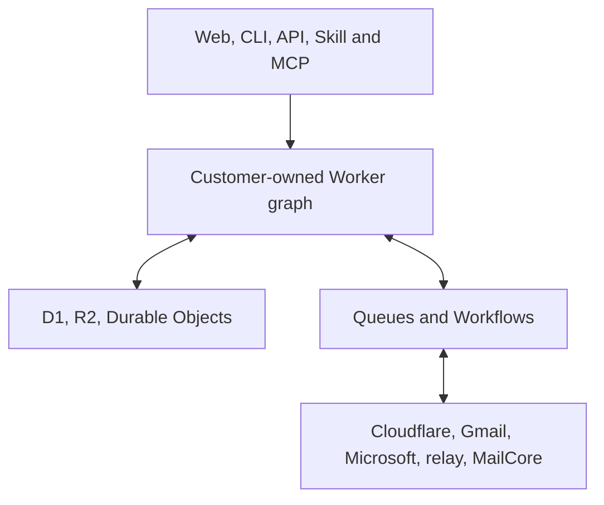
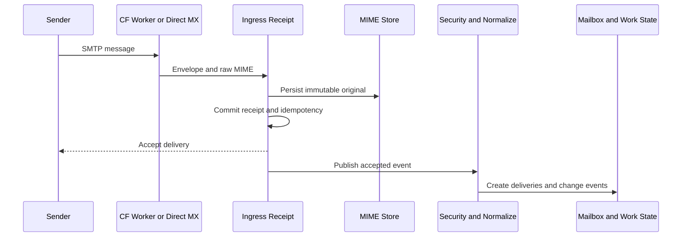
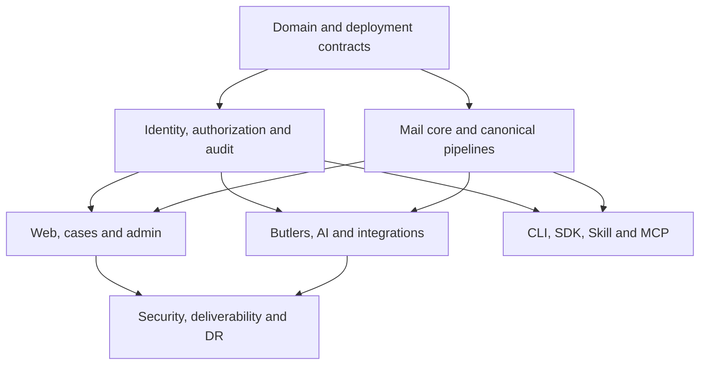
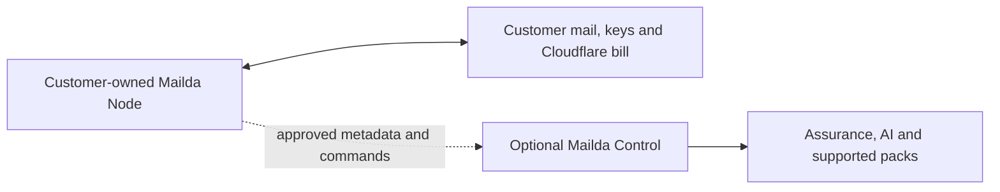

# Mailda — Complete Product Specification and Engineering Blueprint

**Status:** Authoritative target-state build contract  
**Revision:** 2 August 2026  
**Working product name:** Mailda / 迈达  
**Category:** Customer-owned programmable mail and email operations  
**Positioning:** Programmable mail for people, workflows, and agents.  
**Deployment principle:** Open-source, single-organization Mailda Node deployed into the customer's own Cloudflare account.

## Document map

| Part | Sections | Purpose |
|---|---|---|
| Product contract | 1–9 | Scope, objects, personas, UX, onboarding, directory, authorization, authentication and mailbox model |
| Mail and system architecture | 10–15 | Connectivity modes, Cloudflare topology, deployment, data, inbound/outbound and protocol boundaries |
| Automation and governance | 16–22 | Butlers, LLM control, policy, approvals, API/CLI/Skill/MCP, connectors, security and consistency |
| Operations and engineering | 23–29 | SLOs, audit, recovery, stack, workstreams, tests, definition of complete and locked ADRs |
| Commercial and references | 30–31 | Open-source licence, paid operating model, pricing hypotheses, defensibility and technical sources |

---

## 1. Executive decision

Mailda is an **open-source organizational mail operating system**. It turns email addresses into governed work endpoints for people, teams, deterministic programs and AI agents. It is not merely an AI inbox, a forwarding wrapper, a transactional-email dashboard, a cold-email product or a proprietary hosted mailbox service.

The canonical unit is **Mailda Node**:

- One production Mailda Node represents one organization and one primary security/data boundary.
- It is scaffolded and deployed into that organization's own Cloudflare account.
- The organization owns its domains, message data, Cloudflare resources, encryption material, provider connections, model keys and operating bill.
- The Node remains fully functional without a Mailda company account and after disconnecting any paid Mailda service.
- All code required to deploy, operate, secure, back up, restore and extend a Node is open source.

The complete product provides:

- Web/PWA mail for personal, shared, role, Butler, agent, system, archive and quarantine mailboxes.
- Organization directory, users, teams, mailbox ownership, aliases, groups, routing, forwarding, retention and employee lifecycle.
- Shared-inbox collaboration, assignments, approvals, cases, deadlines and source-linked operational state.
- Deterministic rules, event workflows, cron jobs, waits, retries, webhooks and business-system integrations.
- Optional LLM operations only inside explicit, governed workflow nodes.
- A single policy, authorization, approval, idempotency and audit path for humans, administrators, scripts, Butlers and agents.
- Full UI, CLI, API, SDK, Agent Skill and MCP parity over one typed command plane.
- Three mail connectivity modes: Cloudflare-native operational mail, existing-provider connection, and optional standards-mail-core integration.
- Security, deliverability visibility, retention, export, migration, backup and disaster-recovery controls appropriate to the selected connectivity mode.

There is one complete target product. Engineering has a dependency graph and parallel workstreams, but this specification does not define intentionally incomplete V1/V2/V3 products.

The defining invariants are:

- **Customer ownership:** Mailda must not require a proprietary service to keep operating.
- **One governed command plane:** Every action initiated through Mailda Web, CLI, API, Butler runtime, integrations, MCP or Agent Skill requests the same typed operation. A connected provider's native client is an external authority: actions performed there are observed/reconciled after the fact unless the provider/adapter certifies a synchronous enforcement hook. Mailda never describes post-facto observation as pre-execution governance.
- **Determinism by default:** The CLI and Butler runtime are deterministic. AI is invoked only by an explicit LLM step or by an external agent using the deterministic interfaces.
- **Honest mail semantics:** A forwarded copy is not synchronization; Cloudflare operational email is not silently presented as a complete Google Workspace replacement; provider and standards-mail capabilities are declared explicitly.

---

## 2. Product boundaries

### Mailda owns in every deployment mode

- Organization identities, roles, resource relationships and policy.
- Mailda addresses, sender identities, logical mailboxes and work queues.
- Personal and collaborative Mailda web/PWA experience.
- Shared/role inbox assignment, internal notes, collision prevention and SLAs.
- Cases created from one or more email conversations.
- Butler definitions, schedules, templates, tests, runs, approvals and replay.
- Agent/service identities, delegation and programmatic mail operations.
- LLM provider governance, profiles, budgets, evaluations and provenance.
- Sending proposals, approvals, DLP, audit, retention, export and eDiscovery projections.
- Transport/provider capability discovery and truthful source-of-record status.
- Gmail, Microsoft 365, Cloudflare and optional mail-core adapters.

### Deployment-mode boundary

Mailda has **one** deployment mode.

| Mode | Source of truth | Appropriate use | Deliberate limitation |
|---|---|---|---|
| Cloudflare Native | Mailda Node on Workers/D1/R2/DO | Shared, role, operational, Butler, agent and system mail; web/PWA users | No IMAP/JMAP mailbox service; outbound is transactional rather than marketing/bulk, capped at 5 MiB per message to arbitrary recipients and 50 recipients per message |

Amended 3 August 2026. Earlier revisions specified three modes — Cloudflare Native, Provider Connected (Gmail/Microsoft 365) and Full Mail Adapter (a standards mail core behind `MailCoreAdapter`). Both alternatives are withdrawn. The reasoning is recorded at ADR 4 and ADR 5 in §29.

The adapter **seams** remain. `TransportAdapter` and `MailCoreAdapter` stay as interfaces with exactly one shipped implementation each, so an organization can write its own without forking Mailda. Mailda builds, certifies, documents and supports none. An interface is not a promise.

Two consequences are accepted rather than hidden:

- **Adopting Mailda means moving mail to it.** There is no connector that lets an organization keep Gmail and add governance on top, and no import path for existing history. Mailda is for mail that starts in Mailda.
- **Cloudflare is a hard dependency.** §1's ownership guarantee means the organization owns its data, code, keys and bill — it does not mean the Node is portable to another platform. The `TransportAdapter` seam makes portability possible for someone willing to build it; nothing more is claimed.

### Mailda integrates with rather than recreates

| Adjacent system | Mailda's responsibility |
|---|---|
| CRM | Synchronize contacts, account ownership, activities and opportunities; do not become the sales system of record |
| ERP/accounting | Create or update approved records; do not become the financial ledger |
| Help desk | Exchange case and message events where the help desk remains authoritative |
| Files/docs | Attach, request, generate and reference files; do not become an office editor |
| Chat | Notify and request decisions; do not become Slack or Teams |
| Marketing platform | Enforce consent/suppression for operational mail; do not become cold-email or bulk-campaign software |
| Generic automation | Support mail-governed work; do not become unrestricted arbitrary compute |

Calendar and contacts connectors are included because scheduling and operational workflows need them. Mailda does not build a document suite, videoconferencing product, general team chat, bulk-marketing platform or unrestricted arbitrary-compute platform.

### Explicit exclusions

- Cold-email sequencing, list purchasing, mailbox warm-up and reputation evasion.
- Bulk/marketing campaign creation through Cloudflare Email Service while that service is transaction-only.
- Hidden administrator or platform-support content access.
- Autonomous model authority to send, forward, export, grant access, modify policy or invoke arbitrary connectors.
- Claiming that a Gmail-forwarded copy synchronizes read state, deletion, folders or Sent mail.
- Implementing SMTP, IMAP or JMAP protocol servers at all, in Workers or beside them.
- Making Mailda Control, telemetry, a licence server or any hosted service mandatory for a self-deployed Node.

---

## 3. First-class product objects

Mailda is built around explicit objects instead of treating an email account as an all-in-one identity and permission boundary.

| Object | Meaning |
|---|---|
| Organization | Node-level identity, data, region and governance boundary |
| Deployment | One reproducible Mailda Node installation in a customer Cloudflare account |
| Environment | Isolated local/preview/staging/production resource and credential boundary |
| Principal | Human, team, service account, external agent, Butler runtime or system actor |
| Grant | Versioned resource/action/constraint/expiry delegation to a principal |
| Domain | Verified sending/receiving namespace and deliverability boundary |
| Address | Public routing identity such as `sales@example.com` |
| Mailbox | Storage, state, membership, retention and access boundary |
| Sender identity | A From identity a principal may use under policy |
| Message | Immutable parsed representation linked to original MIME |
| Delivery | One message placed into one mailbox |
| Conversation | Standards-linked thread graph with human split/merge controls |
| Draft revision | Editable proposed content; immutable once referenced by approval/send |
| Send intent | Governed request to produce an external email effect |
| Case | Operational work object linking messages, facts, owners, deadlines and actions |
| Butler | Versioned deterministic automation with a capability ceiling |
| Workflow run | Durable execution of one immutable Butler version |
| Operation receipt | Pollable identity and known/`outcome_unknown` result state of an asynchronous command/effect |
| Policy decision | Immutable allow/deny/obligation result and inputs |
| Approval | Time-bound decision bound to an exact action hash |
| LLM profile | Approved model, data, prompt, schema, budget and evaluation configuration |
| Adapter capability | Versioned declaration of provider/mail-core/search/scanner features and limits |
| Butler pack | Source-visible, signed set of workflow/schema/template/policy/test assets |
| Audit event | Append-only actor/action/resource/provenance record |

Critical relationships:

```text
Organization → principal → mailbox → address → permission → policy → action
```

A user may own a private mailbox, respond from `sales@`, review `finance@`, and sponsor an external agent without any of those permissions bleeding into one another.

---

## 4. Complete user-facing surfaces

| Surface | Responsibility |
|---|---|
| Mailda Web/PWA | Personal and shared email, cases, approvals, Butlers and daily work |
| Mailda Admin | Directory, domains, mailboxes, policy, AI, compliance, delivery and operations |
| Mailda CLI | Deterministic access for humans, scripts, CI, cron and AI agents |
| REST API | Stable typed command/query API used by web, CLI and integrations |
| SDKs | Generated TypeScript, Python and Go clients |
| Agent Skill | Safe operating instructions for agents invoking the deterministic CLI |
| MCP server | Typed tools mapped to the same API and OAuth authorization model |
| Webhooks/events | Signed outbound events, retries, replay and integration health |
| Developer portal | API docs, OAuth clients, service accounts, schemas, fixtures and logs |

The UI is an API client. It has no hidden privileged backend unavailable through an authorized CLI/API operation.

---

## 4A. Users and jobs to be done

Roles are composable permissions, not personality labels. One person may be an employee, mailbox manager, Butler builder and approver; the interface adapts to live capabilities.

| User | Primary job | Product obligations |
|---|---|---|
| Organization Owner | Establish and retain ultimate control | Recovery ownership, deployment/data/backup/cost visibility, administrator appointment and conspicuous break-glass procedure |
| Organization Administrator | Operate the organization safely | Account lifecycle, mailboxes, addresses, roles, routing, organization policy, automation limits and health without hidden content privilege |
| Employee | Handle personal and assigned correspondence | Familiar mail, clear identity, search, assignments, due work, approvals and visible automation affecting accessible mail |
| Mailbox Manager | Keep a shared queue consistent and timely | Workload, SLA, assignment, collision prevention, escalation, templates and mailbox-level Butler control |
| Butler Builder | Encode reliable automation | Visual/text round-trip, typed nodes, fixtures, simulation, assertions, versioning, effective permissions, replay and costs |
| Approver | Decide with complete context | Exact effect, content diff, recipients, evidence, policy reason, AI involvement, expiry and revision-bound approval |
| Security Administrator | Prevent and contain abuse | Authentication, policy, DLP, quarantine, credential revocation and incident controls without routine mailbox reading |
| Compliance Supervisor | Conduct governed content matters | Purpose-bound supervised search/read/export, legal hold, dual control and chain of custody |
| Auditor | Verify control behavior independently | Read-only policy/audit evidence without operational or message-content authority unless separately granted |
| Developer/Integration Operator | Connect scripts, CI, cron and business systems | Stable schemas, deterministic CLI, scoped service principals, webhooks, idempotency, dry-run and machine output |
| Agent Sponsor | Delegate bounded email work | Specific/time-bound grant, recipient/data/budget ceilings, approvals, dual attribution and immediate revocation |
| External AI Agent | Work within delegated authority | Separate principal, deterministic Skill/MCP, capability discovery and no ambient human/provider credential |

## 4B. Experience principles

1. **Familiar mail, visible operations.** Reading, writing, replying, forwarding, searching and organizing behave conventionally. Work/case/Butler controls appear where relevant.
2. **Capability-driven navigation.** Users see relevant functions; server authorization remains authoritative. A disabled control explains a missing relation, policy, prerequisite or approval.
3. **Active identity is never ambiguous.** Mailbox and sender identity remain visible, especially when a user switches from a personal identity to `sales@`, a Butler or an agent.
4. **AI never masquerades as deterministic logic.** AI results carry a persistent label and source/model/profile provenance. Ordinary rule nodes never receive an AI badge.
5. **Explain restrictions.** Denials and obligations use plain language and expose a policy-decision ID without leaking sensitive policy internals.
6. **Preview external effects.** Send, forward, export, purge, DNS/routing change, Butler publication and agent delegation show scope and consequences before execution.
7. **Reversible by default.** Archive, pause, unassign and restore precede deletion. Irreversible actions show retention/hold conflicts and require appropriate step-up.
8. **One operational truth.** Mail, Case, Contact, Search and Butler views reference the same message, assignment, approval and evidence objects.
9. **Progressive disclosure.** Daily work remains clean; headers, auth results, policy traces, run inputs and command equivalents remain one level away.
10. **Audit is contextual.** Actor, delegator, sender, Butler version, policy and approval are visible beside the action they explain.

---

## 5. Web application information architecture

### Global shell

- Organization/Node launcher only when the local browser profile stores independent Node bookmarks or optional Mailda Control has authorized metadata for several Nodes. Each Node authenticates separately; switching changes origin/session and never enables cross-organization tokens, content search or shared browser caches.
- Mailbox/sender switcher.
- Global authorized search.
- Command palette.
- Universal create button.
- Approval and notification counters.
- Active identity/sender indicator.
- Test/production environment indicator.
- Policy explanation when an operation is restricted.

### User workspace

```text
Home
Mail
  Inbox
  Sent
  Drafts
  Archive
  Trash
  Spam / Quarantine
  Snoozed
  Follow-ups
  Saved views
Shared mailboxes
Cases
Approvals
Butlers
Contacts
Scheduling
Search
Settings
```

### Home

Home is a work console, not a decorative analytics page:

- Messages and cases requiring action.
- Assigned work and SLA risks.
- Pending approvals.
- Butler exceptions and failed effects.
- Follow-ups and commitments due.
- Delivery/security warnings within accessible mailboxes.
- Personal automation activity and spend.
- Optional AI summary only when the user and organization enable it.

### Mail workspace

Desktop uses a three-pane layout:

```text
Mailbox/views | Conversation list | Thread + work/context panel
```

The context panel contains assignment, case fields, internal notes, contact history, Butler runs, policy decisions, approvals, delivery status, attachments and linked external records.

Core email behavior includes:

- Inbox, Sent, Drafts, Archive, Trash, Spam and Quarantine.
- Threading, reply/reply-all/forward/redirect and resend.
- Rich text and plain text compose.
- Signatures, snippets, templates and approved branding.
- Attachments, inline images, previews, safe download and original `.eml` export.
- Scheduled send, undo-send window and visible outbox.
- Labels, folders, stars, snooze and follow-up markers.
- Full-text/field search and saved views.
- Delivery, bounce, complaint and suppression status.
- Internal notes, mentions, assignments and shared drafts.
- Source headers and authentication results for technical users.
- Offline/PWA draft support and secure push notifications.

### Shared mailboxes

- Membership and scoped permissions.
- Assignment to person, team, queue or Butler.
- Reply collision detection and optional temporary claims.
- Internal notes and mentions.
- Shared or private drafts.
- Team templates and signatures.
- SLA calendars, escalation and handoff history.
- Queue capacity and workload visibility.
- Per-thread approval/sender policy.

### Cases

- Custom case types: lead, enquiry, claim, invoice, application, procurement, incident and others.
- Status, priority, owner, queue, SLA and next action.
- Typed custom fields and validation schemas.
- Multiple conversations/messages per case.
- Source-linked extracted facts and commitments.
- Internal notes, tasks, deadlines and documents.
- Complete timeline of human, Butler, policy, approval and integration actions.
- Board, table, queue and saved-filter views.

### Butler studio

- Personal, team, mailbox and organization Butlers.
- Visual builder and YAML editor for the same canonical definition.
- Trigger/action catalog and typed schemas.
- Capability preview and effective-permission explanation.
- Fixtures, simulation, historical dry-run and expected assertions.
- Version comparison, publication, rollback, pause and retirement.
- Run ledger, retries, failures, replay, costs and kill switch.

### Admin center

```text
Overview
Organization
Directory
Teams and groups
Domains and DNS
Mailboxes and addresses
Delivery, routing and forwarding
Policies and approvals
Butlers and automation
AI providers and profiles
Integrations
Developer access
Security center
Deliverability
Compliance and eDiscovery
Audit
Retention and legal holds
Usage, costs and services
```

### Primary screen contracts

| Screen | Required implementation contract |
|---|---|
| Compose | Persistent From/mailbox/delegator identity; recipient expansion and external-domain warnings; rich/plain body and attachment state; save/revision status; template/AI provenance; policy preflight; exact effect preview; schedule/undo-send; approval/queued/sent/outcome-unknown state; crash/offline draft recovery |
| Approval Center | Queues by reviewer/SLA/risk; immutable evidence snapshot; exact effect and diff; source/classification/AI provenance; policy reason; expiry and separation-of-duty state; approve/reject/request-change; revision invalidation; execution/result link |
| Butler Studio | Overview, visual graph, canonical YAML/JSON, tests/fixtures, capability/effect diff, version history and run ledger as coordinated views; AI nodes visibly distinct; simulation cannot affect production; replay mode named before execution |
| Directory and lifecycle | User/team/service/agent list; identity, auth, sessions, grants, mailbox ownership, cases and Butlers in one detail view; invite/suspend/archive/delete assistants show exact effects, custodianship, retention and tombstones |
| Mailboxes and routing | Address-to-mailbox/workflow/forward graph; owners/members/senders/classification/retention; local and external deliveries shown independently; loop/limit/conflicting-MX simulation; synthetic activation test |
| Access and delegation | Role templates plus resource relations; effective-access explanation; grant creation/revocation; agent sponsor and capability ceiling; high-risk authority diff and distinct-approver state |
| AI control | Provider secret references, immutable profiles, allowed data/tasks/models/regions, budgets, eval suites and usage; no secret reveal; comparison/publish/rollback and degraded-provider state |
| Developer center | OAuth clients, service principals, workload federation, PAT fallback, webhooks, schemas, SDK/Skill/MCP setup, token metadata/revocation, fixture environment and correlated request logs |
| Supervised session | Persistent unmistakable banner with matter, reason, scope, expiry and approvers; every search/view/export stays inside the session; terminate action always visible |
| Audit, delivery and operations | Filterable actor/delegator/resource/effect timeline; delivery/provider attempts; Node/queue/storage/connector/Butler health; policy trace; safe reconcile/retry controls; signed evidence export |
| Notifications | In-app center plus configurable email/push/digests; categories for assignment, mention, approval, delivery, security, Butler and operations; mandatory security/break-glass notices cannot be muted by affected actors |
| Scheduling | Invitation view and connector-backed availability/events when enabled; otherwise invitation parsing/response and connector setup—not an implied native hosted calendar |

Every list, detail and command palette result applies authorization before returning counts, snippets, participants or existence. Capability-limited installations hide unsupported actions while explaining which adapter or permission is required.

---

## 5A. Organization onboarding and deployment experience

Onboarding has one resumable setup state whether installation begins from the Deploy to Cloudflare button or the CLI. A technical operator may deploy infrastructure and hand the same checklist to a business administrator without restarting.

### Entry paths

**Guided installation:** review resources and estimated Cloudflare cost; authorize granular Cloudflare access or use repository deployment; select account/zone/name; provision resources; open the new Node; claim it with the one-time bootstrap secret; create the first owner and passkey.

**CLI installation:**

```bash
npm create mailda@latest
mailda cloudflare login
mailda init
mailda deploy --plan
mailda deploy
mailda doctor --output table
```

Both paths use the same setup-state API. The CLI stores Cloudflare/user refresh credentials only in the OS keychain; the Node never retains an all-powerful account token.

Amended 3 August 2026. `mailda.yaml` is **install-time input, never committed**. The Node's repository is byte-identical to upstream in every installation, because it is also the update channel (ADR 24) — anything customer-specific in it would make every upstream update a potential merge conflict. Bindings are declared in `wrangler.jsonc` without resource ids and linked per-account by Cloudflare. Organization, domains, policy, retention and secrets live in D1 and Cloudflare secrets, set through the UI or CLI, and are restored from the §24 backup manifest rather than from git.

### Prerequisites, stated before installation begins

Checked and reported before the checklist starts, so a prospect can disqualify themselves in
seconds rather than at step 7:

- A Cloudflare account **on the Workers Paid plan** ($5/month minimum). ADR 25 makes this
  mandatory; `mailda deploy` refuses to proceed on Workers Free, naming the plan and why.
- A domain in that account, or a subdomain that can be delegated.
- Willingness to point MX at Cloudflare for whichever name is used.

Cost, so it is not a surprise: $5/month includes 3,000 outbound emails, then $0.35 per
1,000. Inbound is unlimited and free. A 20-person organization sending 10,000 emails a month
is roughly $7.45/month plus storage. Receipt: `docs/receipts/cloudflare-plan-costs.md`.

### Resumable setup checklist

Reordered 3 August 2026 (ADR 26). Someone reaching this point has already evaluated Mailda
on the public demo and decided; what they want now is proof it works with **their** mail,
quickly. The first real message therefore arrives at step 6 rather than step 8, and the five
steps before it are each about a minute.

1. **Organization:** name, locale, timezone, requested region/residency, data/retention defaults and environment label; unsupported placement is shown rather than implied.
2. **Owner security:** passkey/MFA and recovery codes. A **second recovery owner is no longer required here** — at install the operator is frequently alone, and being asked to invent one stops them cold. It moves to step 13 as an unresolved warning. Recovery is still *proven* at this step, so the completion gate below still holds; only the second human waits.
3. **Domain:** prove control of a domain or, by default, a **delegated subdomain** (§10). Note that Email Routing subdomain onboarding has no API and cannot be automated — install hands the operator a dashboard step or falls back to apex. Receipt: `email-routing-subdomain-onboarding.md`.
4. **DNS/transport:** compare current and required records, detect conflicts and state inbound authority.
5. **First mailbox:** create the owner mailbox and one sender identity. Shared mailboxes and additional senders move to ordinary administration.
6. **Inbound test — first value.** Send to a unique test address and show receipt, storage, normalization and routing results. Nothing before this point proves anything to the operator, which is why it is as early as it can be. **The test message must originate outside the Node's own Cloudflare account.** Measured: Cloudflare Email Sending does not deliver to a domain whose MX points at Cloudflare Email Routing in the same account — the send is accepted and reported successful, and never arrives. A synthetic check built on it would pass while proving nothing. Receipt: `email-routing-subdomain-onboarding.md`.
7. **Outbound test:** report `outbound_verified_destinations_only` or `outbound_send_enabled`; validate sender path, policy and delivery event. Cloudflare's own refusal string is never surfaced (§11B).
9. **Policy choices:** explicitly select inspectable defaults for admin content supervision, external sending, AI, forwarding, retention and approval.
10. **Directory:** invite users or connect SSO/SCIM.
11. **Automation test:** run a harmless sample Butler against fixture mail in simulation.
12. **Recovery:** configure a backup target and complete an integrity verification.
13. **Readiness review:** show passed, warning, blocker and consciously deferred checks.

### Safe setup mode

- External sends can be forced to a verified test sink.
- Butlers run in simulation or shadow mode.
- DNS changes produce a plan and rollback instructions before application.
- Fixture/synthetic messages are unmistakably marked.
- Production activation lists every enabled external effect, sender, route, Butler and connector.

Setup is complete only after owner recovery is proven; one inbound path passes end-to-end; one outbound path passes; no deployment-health blockers remain; and content-supervision/AI defaults were explicitly chosen. A missing **second recovery owner** is reported as an unresolved warning at step 13 rather than blocking completion — and it keeps being reported until it is resolved.

The former "or is marked receive-only" escape is withdrawn: ADR 25 requires Workers Paid, so a Node that cannot send is not a supported configuration.

## 5B. Key end-to-end journeys

### Employee onboarding

1. Admin selects or receives a provisioned identity and previews role, personal mailbox/address, teams, shared-mailbox relations, senders, retention and personal-Butler ceiling.
2. Mailda rejects address collisions and tombstone reuse.
3. User completes the selected SSO/local authentication, passkey/MFA/recovery, locale/timezone and notification preferences.
4. The UI offers a capability-aware tour and a test send/receive where permitted.
5. Audit records inviter, generated resources, grants and activation.

### Shared, role, Butler or agent mailbox creation

1. Creator selects a mailbox preset, human owner(s), address(es), members/relations, senders, retention and classification.
2. Routing is configured as local delivery, additional local delivery, verified external copy, Butler trigger, quarantine or reject.
3. Butler/agent mailboxes additionally require an exception queue, capability ceiling, recipient/rate/budget limits, AI-profile allowlist and kill-switch owners.
4. Mailda simulates inbound/outbound examples, detects route loops and explains provider limits.
5. Policy/approval completes; activation waits for route and synthetic health checks.

### Shared enquiry handling

1. A message arrives with security, routing, assignment and SLA state.
2. A Butler may deterministically classify it, create/link a case, extract typed fields and assign work.
3. Assignee sees the thread, source-linked facts and every Butler action; they can correct state without rewriting evidence.
4. Claim/collision indicators prevent duplicate replies.
5. Send is allowed, denied or converted into an approval request by policy.
6. One idempotent send intent drives outbox, provider receipt and delivery/bounce state; the same events update the case/audit timeline.

### Lead-response Butler publication

1. Builder starts from a blank definition or inspectable pack.
2. Deterministic guards reject spam/auto-replies and perform contact/CRM lookups.
3. An explicit `llm.extract` node produces a validated lead schema under an approved LLM profile.
4. Rules route uncertain/high-value leads to a human and render safe drafts for eligible enquiries.
5. Builder defines waits, retries, no-reply follow-up, cost budget and exception queue.
6. Fixture tests and historical shadow runs report coverage, errors, proposed effects, AI spend and behavioral diff.
7. Publication review shows capability/policy/version changes; an authorized approver publishes an immutable version.

### Exact-content reply approval

1. Approver sees source evidence, sender/recipients, exact text/HTML, attachment hashes, AI provenance, policy reason, diff, expiry and SLA effect.
2. They approve, reject, request changes or edit into a new revision.
3. Approval signs only the reviewed revision; any material change returns the send intent to `approval_required`.
4. Execution and delivery receipt link back to the approval.

### Script, cron or CI operation

1. Operator creates a service principal or workload-OIDC trust rather than reusing a human credential.
2. Grant is bound to exact mailboxes/actions/senders/recipients/time and environment.
3. Script validates with `--plan`/`--dry-run`, requests JSON/NDJSON and supplies idempotency keys.
4. Stable exit codes distinguish validation, denial, approval-required, conflict, retryable failure and `outcome_unknown`.
5. Audit attributes the service actor, grant, operation, policy and result.

### AI agent delegation

1. Sponsor selects mailbox, readable data, actions, senders, recipient constraints, budget, expiry and approval requirements.
2. Mailda displays both a natural-language summary and machine grant.
3. OAuth gives the agent a separate principal; it receives no Cloudflare/provider secret or broad human token.
4. The Agent Skill makes the agent inspect capabilities, query before mutation, plan consequential effects and report object/run/audit IDs.
5. Audit records agent and sponsor; revocation removes authority on the next request.

### Supervised content investigation

1. Authorized supervisor chooses an allowed reason, narrow mailbox/person/date/case scope and duration.
2. Mailda previews notification and second-approval obligations.
3. Step-up/approval opens a visually distinct supervised session.
4. Every search, preview, attachment read and export remains within scope and is logged.
5. Expiry closes every content route and generates an access summary.

### Employee suspension and archive

1. Lifecycle assistant inventories sessions, tokens, agents, ownership, cases, approvals, teams, personal Butlers, schedules and senders.
2. Suspension immediately revokes sessions/credentials/delegations, removes assignment eligibility and stops personal Butlers while preserving data/holds.
3. Admin assigns custodians, reassigns work and configures receive-only, forwarding and auto-response policy.
4. Archive makes the identity noninteractive; address tombstones prevent historical-identity reuse.

### Failed or outcome-unknown Butler effect

1. Operator sees affected runs and the last confirmed step/provider evidence.
2. Status distinguishes known failure from `outcome_unknown`, displayed as “Outcome unknown — the provider may have accepted this effect.”
3. Only semantically safe actions appear: reconcile, retry the same unaccepted intent, replay from a safe step, replay with a named version, skip or terminate.
4. Outcome-unknown sends are never blindly duplicated; every intervention records actor, reason and result.

### Personal compose, reply and search

1. User opens their mailbox or an authorized shared mailbox; Mailda keeps the active mailbox, From identity and any delegator visible.
2. Compose autosaves revisions, expands aliases/groups, checks attachments/recipients/classification and previews policy before send.
3. A reply preserves standard thread headers and links the selected case without granting case members extra message access.
4. Search returns only authorized fields/snippets, states its freshness and opens the same canonical message/thread object.
5. Send produces the standard policy/approval/receipt path and the UI distinguishes provider acceptance from remote delivery.

### Local store plus external copy

1. Mailbox manager selects **Store in Mailda** and **Forward a copy**, chooses a pre-verified destination and sees provider limits plus the nonsynchronization warning.
2. They choose `transparent_forward` (original copy after bounded synchronous checks) or `governed_relay` (deep scan/DLP before a reconstructed copy); the effect preview states the security/fidelity difference.
3. Route simulation detects loops, auto-responder hazards and conflicts.
4. A synthetic message proves local persistence and the independent forwarding attempt before activation.
5. Mailda shows local receipt and external-forward status separately; Gmail read/reply/delete state is never inferred.

### Provider connection or migration

1. Administrator grants Gmail/Microsoft OAuth with exact requested scopes and selects mailboxes, sync direction, archive policy and authority mode.
2. Mailda inventories counts, identifiers, labels/folders, aliases and size/feature gaps; a plan explains conflicts and rollback.
3. Initial import and delta sync expose cursor, lag, throttling and reconciliation state without duplicate visible messages/effects.
4. Revocation stops provider actions immediately while preserving locally governed state/evidence according to policy.

### LLM provider/profile publication

1. AI Admin stores an opaque provider secret reference and verifies model/region/retention capabilities without exposing the key.
2. Builder creates an immutable profile specifying data classes, task/schema/prompt, budget, fallbacks and evaluation suite.
3. Redacted fixtures and adversarial tests run before publication; the review shows profile/data/cost/quality changes.
4. Authorized publication makes the profile available only to explicitly allowed Butlers/agents; rollback selects an older immutable version for future runs.

### Policy publication

1. Policy author edits a version against schemas and test fixtures, including allowed, denied and approval-required examples.
2. Simulation reports affected users/mailboxes/Butlers/senders and possible lockout or content-supervision changes.
3. Meta-policy requests distinct approval and step-up where the change adds authority or weakens controls.
4. Publication is atomic/versioned; live commands use the new version, while in-flight external effects recheck stricter current denies before dispatch.

### Owner recovery, upgrade and restore

1. Recovery uses a hardware-backed recovery identity and cannot silently unlock message history.
2. Upgrade plan shows signed release, resource/schema/config diff, compatibility, cost, backup requirement and rollback window.
3. A verified checkpoint precedes destructive migration; health and no-effect synthetic tests gate traffic promotion.
4. Restore plans a clean target, validates manifests/hashes/secrets/DNS and reaches readiness before cutover; all interventions are audited.

### Emergency containment and recovery

1. Authorized operator can pause one Butler, mailbox sender, connector or entire domain external sending without stopping inbound receipt unnecessarily.
2. Scope, affected queued effects and reversibility are shown before step-up confirmation.
3. Recovery requires reconciliation of outcome-unknown effects, root-cause note, policy/definition correction and a bounded test.
4. Unfreeze is a separate governed command; queued items are re-evaluated rather than released blindly.

**What the domain pause taught this list.** Point 1 reads as one act with four scopes and it is not: pausing a
*domain* stops a customer's mail outright, so it takes **two** administrators and a mandatory reason, and the
unfreeze at point 4 takes **one**, alone — the reverse of §22's legal hold, because the harm of a wrongly
paused domain grows every minute it stands while a wrongly placed hold only preserves.

**And a pause of a *Butler* points the other way again, which is what settled that point 1 is four acts rather
than one.** Amended 21 August 2026: it is built, on Layer 4's tables, and it keys on a Butler id exactly so
that republishing a fixed Butler cannot silently clear a pause the machine placed. **No authorized operator
places one** — the machine does, from a windowed count of runs this Butler provoked with its own mail — and
**one** administrator resumes it alone, with a mandatory reason. That is the reverse of the domain's ceremony
because what a wrongly paused Butler stops is *automation* rather than mail: the message still arrives, is
still filed and is still answerable by hand. Point 2's *affected queued effects* is answered by a run record
per Butler run; point 3's *policy/definition correction* is the republish, which deliberately does **not**
resume. §18 carries the mechanism.

Point 4's *re-evaluated rather than released blindly* is what the dispatch-time re-ask already gives every
gated send: a paused domain's queued sends are refused at the hand-over, not released when the pause lifts.

## 5C. Status, edge-state and responsive UX contract

- **Loading:** preserve usable content during refresh; return long-operation IDs; never announce send/publish/export success before authoritative commit.
- **Empty:** distinguish truly empty, no filter/search result, no permission, unconfigured prerequisite and healthy zero. Never reveal that restricted content exists.
- **Errors:** use stable categories for validation, authentication, authorization, policy, approval, conflict, budget/rate, retryable dependency, permanent provider, `outcome_unknown`, offline and internal correlation.
- **Conflicts:** show draft/case field diff and merge; permission revocation clears inaccessible cached content on the next request.
- **Optimism:** reserve optimistic UI for easily reconciled local state. Sending, publishing, approvals, grants, routes, exports and deletion await authoritative confirmation.
- **Offline:** allow policy-controlled encrypted local drafts, never imply offline delivery, and re-evaluate sender, recipients, version, policy and approval on reconnect.
- **Degradation:** distinguish inbound, outbound, connector, automation, search and full-service incidents.
- **Success:** describe committed state such as “approval requested” or “queued,” not vague “done.”
- **High-risk confirmation:** show object count, blast radius, dependencies, retention/hold consequences, reversibility and step-up/dual-control requirement.
- **Mobile/PWA:** prioritize reading, triage, assignment, approval, short reply and alerts; complex policy/Butler editing remains responsive but may recommend desktop without blocking emergency pause/revoke.
- **Accessibility:** WCAG 2.2 AA target, keyboard-complete operation, visible focus, semantic landmarks/headings, screen-reader labels, non-color-only states, reduced motion, zoom/reflow and accessible message/attachment previews.
- **Internationalization:** Unicode addresses/display names, locale-aware date/number/timezone, RTL-safe shell/composer, translated system content and preserved original message language.

## 5D. Visual and content design direction

Mailda should feel like a calm operational console: dense enough for professional daily use, but quieter than a monitoring dashboard.

- Neutral base surfaces keep message content primary; color is reserved for identity, risk, status and action.
- Personal, shared, role, Butler, agent, system, archive and quarantine mailboxes use consistent icons/tokens, always paired with text.
- AI, approval, policy restriction, external recipient, supervised access and production environment each have distinct persistent badges.
- Status language names the actual state: `approval requested`, `queued`, `submitted`, `accepted`, `delivered`, `bounced`, `failed` or `outcome unknown`.
- Product copy uses effect verbs such as **Forward a copy**, **Request approval**, **Publish version** and **Pause external sends**.
- The UI never says Mailda “understood” a message; it says a rule matched, a Butler classified it, or an AI extraction returned a result.
- “Synchronization” appears only for a real bidirectional connector. One-way forwarding is always called a copy or mirror.

Shared design-system components cover mailbox/sender identity, actor/delegator identity, policy decisions, approvals, content classification, AI provenance, effect previews, long operations and every loading/empty/offline/error state. Their semantics remain consistent in Web/PWA, notifications, CLI labels and documentation.

Operational analytics show queue volume/age, first response, resolution, SLA, handoffs, Butler coverage/exceptions, approval latency, AI cost/quality and delivery health. Metric definitions and scope are visible; raw content is excluded by default; estimated/AI-derived values are labeled; drill-through still requires underlying content permission; and Mailda never creates opaque employee productivity scores.

---

## 6. Directory, organization and account lifecycle

### Principal types

- Human user.
- Team/group.
- Service account.
- OAuth application.
- External AI agent.
- Butler runtime identity.
- Integration identity.
- Platform/system identity.

### Directory capabilities

- Manual invites and bulk import.
- OIDC and SAML SSO.
- SCIM 2.0 user/group provisioning and deprovisioning.
- Passkeys, MFA, recovery policy and session/device management.
- Departments, locations, cost centers, managers and dynamic groups.
- External collaborators with time-bound access.
- HRIS and directory synchronization.
- Service-account and OAuth-client lifecycle.

### Self-service and administrative control

| Capability | User self-service | Administrator authority |
|---|---|---|
| Personal mailbox settings | Signatures, views, notifications, permitted aliases/forwarding and delegates | Configure, freeze, receive-only, archive, assign custodian and enforce policy |
| New personal/project mailbox | Allowed within namespace/quota or submitted for approval | Create, approve, reassign, suspend, archive and tombstone |
| Shared/role mailbox | Request or create when delegated as mailbox manager | Create, assign owners/members, change routes/retention and retire |
| Personal Butler | Create/publish inside personal capability and LLM ceilings | Set ceiling, inspect definition and redacted run metadata, pause/kill, archive on offboarding; run content still requires mailbox or supervised-content authority |
| Team/mailbox Butler | Create/manage only with the relevant mailbox/team relationship | Publish, assign service owner, set exception queue and kill-switch owners |
| Organization Butler | No implicit right; request or collaborate if delegated | Create/publish/retire under Automation Admin plus policy/approval |
| Tokens/agent delegation | Create only within own delegable scope, with expiry and policy | Set issuance policy, inspect metadata, revoke and investigate usage |

A user cannot grant a Butler, agent, delegate or token more authority than the intersection of the user's delegable rights and the organization/mailbox policy ceiling. Administrator ability to configure or archive an account remains separate from the supervised process for reading its content.

### User lifecycle

```text
Invited → Active → Suspended → Archived → Pending deletion → Deleted
```

Suspension immediately:

- Ends sessions.
- Revokes refresh-token families, PATs, delegated agent grants and active service delegations.
- Stops personal Butlers.
- Removes the user from assignment pools.
- Preserves mail and legal holds.
- Allows independent receive-only/send-disabled mailbox state.

Offboarding additionally:

- Reassigns open cases and approvals.
- Transfers shared mailbox responsibility.
- Assigns mailbox custodian/manager.
- Applies forwarding, auto-response or receive-only policy.
- Archives personal Butlers and credentials.
- Retains an address tombstone so a future employee cannot inherit historical identity or mail accidentally.

---

## 7. Authorization model

Mailda uses layered authorization:

1. **RBAC** for broad organizational job functions.
2. **ReBAC** for resource relationships such as mailbox owner/responder/viewer.
3. **ABAC** for context such as data class, recipients, device, time, risk and approval.
4. **Policy** for organization/mailbox-specific obligations and explicit denial.

Every request evaluates:

```text
authenticated principal
+ single organization binding
+ token action ceiling
+ sponsoring delegation/capability ceiling
+ live resource relationship
+ environment and adapter capability
+ contextual policy
+ approval state
= allow, deny, or allow with obligations
```

Explicit deny and legal hold win. Long-lived tokens do not contain mailbox ACL state; resource relations are evaluated server-side on every operation. For a Butler, service principal or external agent, effective authority is the intersection of the authenticated principal, sponsoring grant, immutable Butler/version capability manifest, token resource/action ceiling, live relationship, environment, current policy and approval obligations. A broader sponsor role, refreshed token or newly expanded mailbox grant never expands an already-published Butler or delegated agent without explicit republish or renewed consent.

### Stable permission vocabulary

Permissions use `resource.action` names. OAuth scopes are an action ceiling and may carry resource constraints; they are not a substitute for live relationships.

```text
org.read                       org.settings.manage
user.read                      user.lifecycle.manage
team.read                      team.members.manage
domain.read                    domain.verify              domain.manage
address.read                   address.manage              route.manage
forwarding.read                forwarding.manage
mailbox.metadata.read          mailbox.content.read        mailbox.manage
message.read                   attachment.read             message.export
attachment.original.download  message.delete              draft.read
draft.create
draft.edit
send.propose                   send.execute                sender.use
case.read                      case.write                  case.manage
butler.read                    butler.edit                 butler.publish
butler.execute                 butler.kill
policy.read                    policy.manage               policy.publish
approval.request               approval.decide
llm.profile.use                llm.profile.manage          llm.provider.manage
audit.read                     ediscovery.search           ediscovery.export
retention.manage               legal_hold.manage
connector.use                  connector.manage            webhook.manage
quarantine.metadata.read       quarantine.content.read     quarantine.release
security.override
credential.issue               credential.revoke
```

Resource/action/time bindings are stored in the grant/relationship system and re-evaluated. Sensitive facts such as current ACL, legal hold, classification and approval are never trusted from a token claim.

### Administrative roles

| Role | Authority | Content access by default |
|---|---|---:|
| Owner | Ownership, recovery, governance mode, billing and role delegation | No ambient read; may initiate governed supervision if policy allows |
| Organization Admin | Broad operational administration | No |
| Directory Admin | Users, teams, SSO, SCIM and offboarding | No |
| Domain Admin | Domains, DNS, aliases, routes and deliverability configuration | No |
| Mailbox Admin | Create, archive, reassign and configure mailboxes | Metadata only |
| Automation Admin | Publish/manage organization Butlers/templates | Fixtures unless separately delegated |
| AI Admin | Providers, models, profiles, budgets and evaluations | No raw mail by default |
| Security Admin | Authentication, policies, incident response and token revocation | Security metadata/quarantine as policy allows |
| Deliverability Admin | Queues, reputation, bounce/complaint/suppression operations | Envelope/delivery metadata only |
| Compliance Admin | Supervised read, eDiscovery, legal holds and exports | Only through supervised procedure |
| Billing Admin | Usage, budgets, subscription and invoices | No |
| Auditor | Audit/policy evidence without operating authority | No message body unless separately granted |

No built-in role combines unrestricted policy mutation with unreviewed evidence deletion. High-risk organizations can require separation of duties and dual control.

Authorization administration is itself governed by a non-overridable meta-policy. No principal may approve or activate its own net-new high-risk authority, content-supervision eligibility, break-glass eligibility, audit/retention weakening or separation-of-duty bypass. These changes require a distinct currently eligible approver, step-up authentication, immutable before/after evidence and reauthentication before use; the request/session that created a grant cannot silently inherit it. Custom roles cannot remove these platform invariants.

### Organization-wide administrator reading

Mailda supports the requested employer-owned supervision model, but makes it explicit, disclosed and auditable. The owner selects a governance mode during onboarding:

| Mode | Cross-mailbox behavior |
|---|---|
| Supervised organization mail | Named owners/compliance supervisors may initiate governed search/read with reason and step-up |
| Private-by-default | Access requires a time-limited eDiscovery matter and configured approval |
| Regulated dual control | Search/read/export requires two distinct authorized principals and matter/ticket reference |

The employee interface displays the organization's supervision notice. Deployment guidance tells administrators to validate local employment, privacy and sector rules.

```yaml
admin_supervision:
  enabled: true
  roles: [organization_owner, compliance_admin]
  read_reason_required: true
  step_up_authentication: true
  maximum_session: 30m
  private_labels_require_dual_control: true
  user_notification: after_matter_closes
  export_requires_dual_control: true
```

When enabled, authorized supervisors can read received/sent mail across the approved organization scope. Every query, result opened, preview, attachment read and export records the supervisor, purpose/ticket, target, policy/approval, authentication strength, device/IP, manifest and destination. Mailbox administration alone does not imply content access. Platform support receives no content access unless the customer creates a scoped, expiring support grant; domain ownership alone never unlocks historical mail.

A supervised grant is bound to purpose, matter, resource scope, session and time. Expiry or revocation terminates search cursors, event streams, attachment URLs, cached previews, export jobs and API/MCP access; widening scope requires a new approval. Dual approvers must be distinct and currently eligible. Required employee notifications are durable system jobs and cannot be disabled by the investigator.

**Shape (#63, Layer 5).** The paragraph above is now more specific than its prose was, because building it decided things the prose left open, and each of these is a contract clause rather than an implementation note.

A **matter** is a first-class object — a type from a closed set, a description, who opened it, and `closed_at` — and not free text. This was forced, not preferred: the notice above is due *after the matter closes*, and free text cannot close. A grant cites **a matter or nothing**, because the realistic first act precedes any matter; a cited matter must be open, since granting fresh access under a closed one would make its notice untrue about the access it describes. `legal_hold` is one of the types, which is what makes "a matter closed while its hold stands" a computable question rather than a rhetorical one.

**A matter is confidential until its notice is due.** The description names the person being examined, and the notification above is due *after the matter closes* — a contract that only means something if the matter is not disclosed to that person while it is open. A matter listing is therefore scoped: organization administrators see all, and anybody else sees the matters they opened. The people who must read a matter's text are the approvers of a grant citing it, and they read it on the request they are deciding rather than through a general listing.

**Widening is a new grant, never an edit.** Scope and expiry are fixed when the grant is requested — so what the two approvers are shown before they decide is exactly what they authorize — and nothing in the product may move either afterwards. Renewal is therefore a fresh grant needing fresh dual approval, because time is part of the bound scope above and extending it is widening. A denied request never forecloses a later one: the approval's subject is the request, so asking again is a new request with its own approvers.

**Failing closed at expiry is a property of never caching authorization, not a revocation mechanism.** Every request re-evaluates the live relationship (§7's own rule), so the request after the deadline finds the grant over. The enumeration this paragraph demands — cursors, event streams, attachment URLs, cached previews — is satisfied by construction wherever a Node presigns nothing, streams nothing, and authorizes raw-evidence reads per request; a Node that adds any of those owes an explicit termination path and this clause is where it is owed.

**The reader is the requester.** A supervised grant is requested by the person who will read, so the separation-of-duty exclusion that bars the requester from deciding is the same rule that bars a reader from approving their own access. A request on somebody else's behalf would put the reader outside that exclusion.

**Recording is per act, and the record lives inside the authorization decision.** Every query, result opened and attachment read is an entry keyed on the **grant**, not on the message — one entry per act, so a search matching five thousand messages is one record and a realistic session is tens of entries. A query entry carries **the ids it returned**, because a result list renders subject and sender and a count understates what a person saw by exactly that many subject lines; an id list too long for one entry is **split across continuation entries and never truncated**, since a truncated list is a prefix presented as a whole. The record is not a call a read path makes afterwards: a check that authorizes one named object takes the act as a required parameter and appends the entry before it returns, and a check that authorizes a *listing* records once its rows exist, because an entry written at the check could not name them. Both fail closed — a Node that cannot append its trail does not disclose the mail.

**The employee notification is a durable row, and the reason is that a diagnostic can count rows.** It is written in the same transaction as the grant taking effect, so a grant without its obligation is unrepresentable rather than unlikely; a periodic scan delivers it; and the diagnostic reports the overdue ones and compares the count of grants in the tamper-evident trail against the rows. Suppressing a notice therefore requires deleting an audited row, which is a different and much louder act than letting a timer lapse. Delivery is **in-product**: outbound mail is not a dependable carrier for a legal obligation on a platform that can refuse an unverified destination, and the notice is addressed to the mailbox, its audience resolved from standing relations — a supervised grant is not one, so the investigator holds no relation over the feed of the person whose mail they read.

**The notice is held until the reading has stopped.** A matter can close while a grant citing it is still live, because closing does not revoke a grant, so the notice's due date is `max(the close, the grant's own expiry)` rather than the close alone. Refusing the close instead would hand the delay to the investigator, who is the one party with a reason to want it — which is why closing is open to any organization administrator in the first place. A matter left open therefore defers its notices, which is what *after the matter closes* means, and the control is that closing is not the investigator's to withhold.

**What the employee is told is a disclosure decision.** The notice names the reader, the scope, the window, and the matter's **type** — and states what was actually done under the grant: queries run, messages those queries listed, contents opened, raw messages read. It withholds the matter's **description**, which names an investigation and often a third party and which the system cannot vouch for, and the ids, which belong in the trail that whoever may audit can read. A notice that discloses nothing satisfies the letter of this requirement and none of its purpose.

**Mailbox administration alone does not imply content access — but the authority to *grant* relations does, and that is not closed.** An administrator who can grant any relation to any subject can grant one to themselves. Refusing self-grants traps a two-person organization into seeking approval from the person being examined, and an administrator who cannot reach a mailbox they are responsible for edits the database instead, which is auditable nowhere. So the self-grant remains available and is made **conspicuous**: a grant whose actor and subject are the same principal is a diagnostic finding, not an ordinary event. Stated plainly because the alternative phrasing would be a claim nothing enforces — this does not prevent an administrator reading mail; it makes the front door and the back door distinguishable in the record.

**Shape (#65, Layer 5).** The clause above says every *export* records the supervisor, purpose, target, approval, manifest and destination, and that revocation terminates *export jobs*. Building both made this paragraph more specific in six ways, each a contract clause rather than an implementation note.

**There are two grains of export and two permissions, and the catalogue above already said so.** `message.export` governs one message's original `.eml` leaving the Node; `ediscovery.export` governs a bulk copy. The smaller act deliberately takes **no matter and no approval** — requiring a ceremony to forward a message produces screenshots, which is a worse disclosure with no record at all — but it does take a permission and it does produce a record, which it did not before. The larger act takes a matter that is open, a permission an administrator granted, and two approvers who are not the requester.

**An export's approval binds a canonical predicate hash *and* a hard message count.** §18 binds an approval to referenced artifact hashes, and an export's target is a query rather than a versioned object. A predicate can be canonicalised and hashed; what it cannot do is bound what it *matches*, so approving a predicate alone approves an unbounded future disclosure with a recheck that passes cleanly. The count closes that and **fails closed**: a run that would exceed it aborts and needs a fresh approval. It never truncates to the bound, because a partial copy carrying a manifest that reads as a complete account is the only one of the three outcomes that misleads.

**The destination is a sealed object in the Node's own storage, downloaded through a mediated route.** An export at rest is encrypted like every other artifact (§12). The download is a request the Node answers rather than a URL it hands out, and that is what makes *"revocation terminates export jobs"* enforceable rather than asserted: every page of a run and every object of a download re-reads the live permission and the live approval, so revoking either stops the next page and the next object. Already-downloaded bytes stay downloaded, which is the honest boundary — no mechanism un-copies a file.

**The run is a resumable cursor, and a size it cannot serve names its boundary.** §11B already requires export to checkpoint; the consequence worth recording is that a checkpointing run need not know its budget in advance, so the customer's plan changes how many invocations an export takes rather than whether it finishes. What still refuses in advance is a request whose count exceeds what the manifest build will name: that is refused when it is asked for, with both numbers, rather than discovered as a short manifest after a long run. Paging that build to its bound is not the unreliable workaround this clause warns about — the storage API's own cursor is how a listing is finished, and the build is idempotent, so an interrupted one is rebuilt rather than resumed.

**The manifest is its own sealed object; the trail carries its hash.** Per-message identifiers belong in the manifest, whose hash is over its **plaintext** so that anybody holding the export can re-derive it. The audit trail carries two entries for a whole export — what two people authorized, and what was produced — and never one per page, because page progress is not an act anybody could be asked about and one entry per page would put hundreds of rows behind one decision.

**Authentication strength and device/IP are required by the paragraph above and are not recorded anywhere.** Step-up authentication for exports is likewise required and does not exist. Neither is invented here: they are an authentication-subsystem question that supervised reading needs too, and naming them as absent is more useful than half-building them.

### Mailbox relations

- Owner.
- Manager.
- Reader.
- Responder.
- Drafter.
- Assigner.
- Approver.
- Exporter.
- Auditor.
- Butler delegate.
- Agent delegate.

Messages, attachments and threads inherit their base visibility from deliveries/mailboxes, with case and classification restrictions applied afterward.

### Case and approval-scoped access

Cases have `owner`, `member`, `reviewer`, `contributor` and `auditor` relations plus field-level classification. A case relation may reveal case metadata that policy permits—such as status, due date, owner and a restricted-content placeholder—but it never implies `message.read`, `mailbox.content.read` or `attachment.read`. Linked message bodies, snippets, participants, attachment names and extracted sensitive fields are individually authorized from their source delivery and classification. Search, notifications, counters, exports and AI retrieval enforce the same rule, so they cannot leak that restricted content exists.

#### Built (13 August 2026): the rule, not the relations

**Zero of the five case relations exist, and that is sequencing rather than divergence.** Layer 3's
sharing is mailbox-scoped: a case is reached through `send.propose` on the mailbox it sits in, and
`cases.assignee` is a single nullable column whose compare-and-swap is what makes two people able to work
one queue. Per-case granting is a *different capability* — putting one colleague on one shipment issue
without handing them the queue — and nothing built has needed it. Three of the eleven mailbox relations
above exist for the same reason; nobody has called that a conflict either.

Two consequences worth stating rather than discovering:

- `owner` cannot simply be added as a relation while `assignee` remains a column. That would be two
  representations of one truth, which is precisely what §7's relations-not-roles decision refused, so
  whoever builds case relations either migrates the claim into tuples — losing the plain
  `WHERE assignee IS NULL` swap — or excludes `owner` from the five. This is a decision owed, not a
  detail.
- `contributor` and `reviewer` land with approval flows (`approval.decide`), which is Layer 5 governance.
  Building them earlier would mean guessing what an approval is.

**The paragraph's actual rule was being broken, and now is not.** `queueFor` was gated on `send.propose`
alone and selected `messages.subject` and `messages.from_addr`, so anybody who could reply read every
subject line and sender address in the mailbox — case metadata carrying content that nothing separately
authorized, which is what this paragraph forbids. `mailbox.metadata.read` from the catalogue in §7's
permission list is now implemented and grantable, either it or `mailbox.content.read` gates those two
columns, and a responder holding neither is shown the **restricted-content placeholder this paragraph
already specifies** rather than an empty or a fabricated value. The withheld columns are `NULL` in the SQL
rather than read and dropped. `message_count` is deliberately *not* withheld: the caller already knows the
case exists, so a count of items inside it leaks nothing about content.

Approval assignment likewise does not grant whole-mailbox access. Creation materializes an immutable, minimum-necessary **approval evidence snapshot** containing the exact proposed effect, policy explanation and only those source excerpts/attachments the requester is allowed to disclose to that reviewer. The snapshot has its own classification, relation, expiry and revocation state. If policy cannot lawfully disclose enough evidence to decide, Mailda must select a different approver or reject the request; it never grants ambient mailbox access as a shortcut. `approval.decide` is the sole decision permission—draft permissions do not imply approval authority.

---

## 8. Authentication and credentials

Each Node is the authorization server/resource server for its own CLI, SDK, MCP, agents and OAuth applications, and may federate human authentication to Cloudflare Access or a configured enterprise OIDC/SAML identity provider. Cloudflare account OAuth used to install/manage infrastructure is a separate grant and never becomes a Mailda user session.

### Built (4 August 2026): email/password with ES256 tokens

The first authentication that exists. It implements the **Browser** rows below that do not depend
on an OIDC provider, and is deliberately narrower than the full specification. See ADR 27.

- **Email and password**, verified with PBKDF2-HMAC-SHA256 at 600,000 effective iterations.
  Cloudflare Workers **rejects any single PBKDF2 call above 100,000 iterations**, so the work is
  chained across six rounds; local `workerd` does not enforce the ceiling, so this failed only once
  deployed (receipt: `password-hash-cost.md`). Verifiers are self-describing
  (`pbkdf2-sha256$r=6$i=100000$salt$hash`) so cost can rise, or the primitive change, without
  invalidating a user.
- **ES256 access tokens**, ten minutes, carrying organization and user identity and **no authority**.
  Every authorization decision is re-read from `relationship_tuples` per request (§7), so a token can
  only ever be wrong about whether the account still exists.
- **Rotating refresh-token families with reuse detection**, thirty days, DB-backed — this is what
  revocation actually acts on, because a signature cannot be recalled. A rotated token still returns
  its successor for a 30-second replay window, so a lost response or a second browser tab does not
  read as theft and sign the user out.
- **Signing-key rotation** with a `current → retiring → retired` window of 2x the access-token TTL,
  so rotation never invalidates a live session. At most one `current` key, enforced by a partial
  unique index rather than by a check. Private keys are wrapped by the **credential** KEK (ADR 22),
  never the content KEK; public keys are published at `/.well-known/jwks.json`.
- **DB-backed lockout** after 10 failed attempts in 15 minutes. In-memory counters reset whenever a
  new isolate starts, which an attacker can cause at will.
- **Claim sets the owner's password.** The prior flow issued one session against a one-time secret
  and stored no verifier, so losing that cookie meant losing the Node.

### Decided 4 August 2026 (ADR 29). Passkeys and the key escrow are built; the rest is not

**Built since:** passkeys as the way in (#84), and the **key escrow** — ten single-use 128-bit codes carrying
ADR 28's vault, minted at claim (#92). ADR 28 said it *"does not ship without"* that escrow and for a while
nothing satisfied the condition, while three refusals named it as the remedy. `docs/authentication.md` has
the design and what it deliberately does not do.

**Still not built from this decision:** signing in with a recovery code (the escrow uses the same codes but
issues no session), the password-as-per-user-setting change, the insistent second passkey, and step-up.

- **Passkeys are the authentication Mailda builds.** No dependency: verification is an ES256 or
  RS256 signature over `authenticatorData ‖ sha256(clientDataJSON)`, and ES256 already exists for
  tokens. Attestation `none` — a self-hosted first-party relying party has no interest in
  authenticator provenance.
- **Password authentication becomes a per-user setting, default off, switched on by an
  administrator** through a step-up-authenticated, audited action. It was not removed, because a
  shared workstation with no enrollable device is a real case and a named exception an administrator
  accepted is more honest than a blanket fallback.
  **Constraint this creates:** "password authentication is not enabled for this account" must
  collapse to `invalid_credentials` on the wire, exactly as `no_password_set` already does, or the
  setting becomes a user-enumeration oracle.
- **Recovery is ten single-use 128-bit codes, plain SHA-256.** No expensive KDF — the codes are not
  human-chosen, so there is no offline-guessing surface to price. The same codes carry ADR 28's key
  escrow, so recovery and key custody are one artifact the operator can lose, not two.
- **A second passkey is prompted insistently and never blocking** (ADR 26 found blocking on a second
  party stops operators cold).
- **Step-up** via a `userVerification: "required"` assertion for §8's privileged list — cheap once
  passkeys exist, absent entirely today.

**Still not built and additive rather than blocked:** OIDC/SAML federation, SCIM, DPoP, the CLI
device grant. **Until passkeys ship, password authentication is the weakest link in this design** —
the receipt states plainly why Workers leaves no better primitive available.

### Browser

- Authorization Code + PKCE through a standards-compliant OIDC implementation.
- Secure HttpOnly/SameSite session cookies; no refresh token in browser storage.
- Passkeys as preferred native authentication.
- Enterprise OIDC/SAML federation and SCIM.
- Rotating refresh-token families and reuse detection.
- Step-up authentication for domain changes, admin grants, token issuance, policy publication, exports, legal hold, purge and break-glass access.
- State-changing requests require Origin/Fetch-Metadata validation; CORS is deny-by-default. **Amended
  26 August 2026 (#96): the synchronizer-token / signed double-submit requirement is withdrawn, and the
  argument is recorded here rather than the requirement quietly skipped.**

  What is built: exact `Origin` comparison, `Sec-Fetch-Site` refusing `same-site` as well as `cross-site`,
  refusal of the HTML form encodings, `__Host-` on the two cookies that can carry it, and `SameSite=Strict`.
  The load-bearing one is refusing **`same-site`** — same-site is scheme plus registrable domain, so under
  `SameSite=Lax` every sibling subdomain of the customer's own domain could act as the person signed in, and
  on a product deployed into the customer's own account that is the normal configuration rather than an edge.

  Why the token is not built. It has to be exempted for the SDK, the CLI and the MCP server, none of which
  has a document to read one from, and ADR 12 requires parity across exactly those surfaces. The only
  available exemption is "no browser headers present" — which is reachable by omitting a header, and is
  therefore the bypass the token existed to prevent. Meanwhile a browser **always** sends `Origin` on a
  state-changing request, and CSRF is by definition somebody else's user agent attaching somebody else's
  cookies, so exact-origin comparison covers the attack the token was for. Adding a mechanism whose own
  exemption defeats it, to defend something already defended, is the kind of security theatre this project
  refuses elsewhere.

  What is genuinely given up: defence against a script running **on this origin** that can forge a request
  but cannot read a token cookie. That is a same-origin script, which is XSS, and the answer to XSS here is
  the Content Security Policy (#97) and the sanitiser — not a token that an XSS with DOM access could read
  anyway.
- Login/callback handling validates exact redirect URI, state, nonce and PKCE; session identifiers rotate at authentication and privilege elevation.
- Content Security Policy, `frame-ancestors`, secure headers and `Cache-Control: no-store` protect authentication, admin and content surfaces.

### CLI

- Authorization Code + PKCE with localhost callback.
- Device Authorization Grant for headless terminals.
- Short-lived, audience- and organization-bound access tokens.
- Rotated refresh tokens stored in the OS keychain.
- `mailda auth logout --all` and remote revocation.
- DPoP/mTLS sender constraints where supported.

### Service and agent access

- Dedicated service principals; never shared human tokens.
- Workload OIDC federation and token exchange preferred.
- `private_key_jwt` or mTLS client authentication where needed.
- Resource/action/time-bound grants.
- PATs only as expiring, hashed, one-time-display compatibility credentials.
- Cloudflare/provider credentials never exposed to users or agents.

### Agent delegation

Audit retains both identities:

```text
actor = external agent/service principal
delegator = sponsoring human or organization
```

The grant binds organization, mailboxes, actions, sender identities, data classes, recipient constraints, budget, expiry and approval requirements.

### Withdrawn: protocol credentials and sessions

Amended 3 August 2026. Mailda exposes no JMAP, IMAP or SMTP mailbox service (§2, ADR 5),
so there are no protocol credentials to map to principals. Browser sessions, CLI tokens,
service principals and agent grants (above) are the complete set.

---

## 9. Domains, addresses and mailbox types

### Domain capabilities

Every domain feature is labeled `mailda_configurable`, `observed`, `provider_managed`, `mailcore_only` or `unsupported` by the active adapter—never displayed as a universal promise.

| Capability | Cloudflare Native contract | Provider/Full Mail contract |
|---|---|---|
| Root/delegated subdomain, MX/SPF/DMARC/DNSSEC | Plan/apply where authorized; detect drift/conflict | Observe or configure only through the named provider/adapter |
| DKIM, ARC, return path and sending IP | Report Cloudflare-managed state and supported choices; do not imply selector/IP control | Provider-managed or MailCore-configurable per manifest |
| MTA-STS, TLS-RPT and BIMI | Observe and guide/apply DNS/hosting pieces separately | Same, subject to provider support |
| Reputation streams | Separate subdomains/sender classes and report available metrics; Cloudflare owns shared IP behavior | Provider/MailCore capability-specific |
| Synthetic inbound/outbound/bounce tests | Available when the selected receive/send paths are entitled | Adapter conformance required |
| Emergency quarantine/send pause | Mailda policy/routing effect, with provider limitations visible | Named connector/MailCore action where supported |
| Region/residency | Observe/configure only where the Cloudflare plan declares support | Adapter/provider declared; otherwise unavailable |

The Domain detail and `doctor` output distinguish desired, observed and effective state and show the authority that must repair drift.

### Address types

- Primary addresses.
- Aliases.
- Role addresses.
- Distribution groups/lists.
- Catch-all routes.
- Temporary/expiring project addresses.
- Plus addresses.
- Agent addresses.
- System addresses.
- Reserved and tombstoned addresses.

An address is a routing identity; a mailbox is storage/state/access. One address may deliver to several mailboxes and workflows, and one mailbox may have multiple addresses and sender identities.

### Mailbox types

| Type | Purpose |
|---|---|
| Personal | Employee's normal work mailbox |
| Shared | Team-operated inbox with assignment and collaboration |
| Role | Function such as invoices, claims or procurement |
| Butler | Primarily automation-operated address with human oversight |
| Agent | Independent agent/service correspondence identity |
| System | Notifications and application mail |
| Archive | Read-only historical mailbox |
| Quarantine | Security-controlled evidence and inspection mailbox |
| Provider-backed | Gmail/Microsoft/generic source retained as authority |

### Routing graph

Each address has an explicit, versioned policy supporting:

- Store locally.
- Deliver copies to multiple local mailboxes.
- Forward/mirror to verified external destinations.
- Expand a distribution group.
- Trigger Butlers/case routing.
- Quarantine or reject.
- Archive/journal without daily inbox exposure.

Forwarding is a copy, not synchronization. Gmail and Mailda do not share read state, folders, deletes or sent replies unless the full Gmail API connector is enabled.

---

## 10. Mail transport modes

The product presents one Mailda mailbox/work/case experience while declaring which adapter is authoritative for transport and mailbox state.

### Cloudflare Native

This is the canonical scaffold:

- Cloudflare Email Routing invokes the Node's `email()` handler.
- The Node persists raw MIME in its own R2 bucket, canonical normalized metadata in D1 catalog/shards and only rebuildable coordination/projections in Durable Objects.
- Users read and act through the Mailda web/PWA, CLI, API, Skill or MCP.
- Outbound operational/transactional mail uses Cloudflare Email Sending when its policy and capability manifest permit.
- A different outbound adapter is selected when size, recipient, policy or deliverability requirements do not fit.
- External forwarding uses a verified Cloudflare destination only where supported; local storage plus forwarding is recorded as two independent delivery effects.

This mode is optimized for `enquiries@`, `sales@`, `support@`, `claims@`, `accounts@`, project addresses, Butler identities and agent identities. It can also provide personal Mailda web mailboxes, but does not pretend to expose a standards IMAP/JMAP mailbox service.

### Withdrawn: Provider Connected and Full Mail Adapter

Amended 3 August 2026. Earlier revisions specified two further modes:

- **Provider Connected** — Gmail or Microsoft 365 remaining the mailbox, MX and protocol
  source of truth, synchronized through provider delta/history APIs.
- **Full Mail Adapter** — a mature standards mail core such as Stalwart behind
  `MailCoreAdapter`, providing SMTP/ESMTP, JMAP and IMAP.

Both are withdrawn, along with the connector installation contract that supported them
(provider application registration, administrator consent, Pub/Sub topics and `watch`
renewal for Gmail, Entra consent and Graph subscription renewal for Microsoft, cursor
initialization, history-gap recovery, throttling and token rotation).

See ADR 4 and ADR 5 in §29 for the argument. The short version: those two modes carried
most of the product's difficulty — post-facto observation, source-of-truth conflict
semantics, connector lag, dual authority — and all of it existed to tell the truth about
systems Mailda does not control.

`mailda integration` and `mailda mailcore` command families are withdrawn with them.

### Outbound adapter contract

Every outbound adapter publishes a machine-readable capability manifest:

```yaml
kind: TransportCapabilities
name: cloudflare-email
supports:
  raw_mime: supported_legacy
  structured_send: true
  lifecycle_events: true
  status_lookup: limited
  custom_headers: restricted
  provider_assigned_message_id: true
preference:
  submission: structured
limits:
  max_bytes: provider_reported
  max_recipients: provider_reported
policy:
  traffic_classes: [transactional, operational_reply, agent_workflow]
```

Mailda evaluates the manifest before approval and rendering so a user never approves an effect the selected transport cannot execute. Built-in adapters cover Cloudflare Email, Gmail API, Microsoft Graph, SMTP relay, direct MailCore submission and customer-supplied adapters.

### Domain topology

- A new Cloudflare-native installation defaults to a delegated operational subdomain such as `ops.example.com` or `mail.example.com`.
- This leaves an existing Google/Microsoft root-domain MX untouched.
- A root-domain cutover is allowed only after Mailda proves ownership, detects conflicting MX, explains the interruption risk, runs test delivery and captures an explicit administrator confirmation.
- Sending, inbound routing and provider connection are configured and health-checked independently.
- Each domain advertises enabled modes and limitations in the UI and API.

---

## 11. Target system architecture



### One deployable project, one Worker

Amended 3 August 2026, twice in one day. Earlier revisions specified eight Workers; an
intermediate revision reduced that to two — `node` and `effects` — keeping a process
boundary around the credential-unwrapping key. That boundary has been withdrawn. A Node is
**one Worker**. See ADR 18 for the argument and ADR 22 for what replaces the boundary.

**Amended 4 August 2026 (ADR 30).** This section specifies React with TanStack Router/Query
throughout. The surface is now split deliberately: **sign-in, first-run claim and a locked-out
`doctor` carry no framework and stay server-rendered**, because they are the screens an operator sees
when the Node is broken and must work before any bundle loads; **the authenticated application adopts
React at the start of Layer 2**, when the composer introduces client state that outlives a request.
No SSR for the application shell — the message list is authorization-filtered per request. WCAG 2.2
AA is proven by axe-core per screen plus a recorded keyboard-only walkthrough, not claimed.

The short version: the split defended one narrow thing — an attacker who compromised the
Node could not carry the credential material away and reuse it after losing access. It did
**not** prevent an unintended external effect, because the Worker holding the mail also
legitimately triggers sends and therefore held the RPC to do so. It did not defend against
isolate escape, which is not a threat JS presents and which a Worker boundary would not
contain in any case. And the realistic failure — a secret leaking into a log line, an error
response or a stack trace — is better prevented by Secrets Store's async accessor, where a
value never sits on `env` at all, than by a second deployable unit.

What it cost was measured rather than assumed: a single Workers Builds project deploys
exactly one Worker (receipt: `deploy-button-behaviour.md`), so two Workers meant two CI
projects, two install clicks or no one-click install, two update channels under ADR 24, and
a permanent mixed-version window between two independently deployed halves.

| Worker | Responsibility |
|---|---|
| `worker` | Everything. Static Assets and the Web/PWA, OAuth and sessions, the OpenAPI command plane, the Email Routing handler and raw receipt persistence, MIME parsing and normalization, authorized content streaming, cron and Workflow coordination, the run ledger, backup and restore, health, bootstrap, claim, and every outbound transport, webhook and LLM call. Owns D1, the metadata shards, R2 and every Durable Object class. |

Mailda's actual defence against a compromised component causing an external effect is the
**policy and approval plane**, not process isolation: §18's exact-content approval, §14's
recheck of suspension, sender, recipient, suppression, rate and budget immediately before
provider invocation, ADR 10's rule that LLM output is data and never authority, and ADR 11's
binding of an approval to one exact revision. That machinery does the work. Process
isolation was belt-and-braces on top of it, and it turned out the belt carries the load.

### Cloudflare resource map

| Cloudflare service | Mailda use |
|---|---|
| Workers + Static Assets | One Worker, per ADR 18. Service bindings are unused internally; extension Workers may still use them |
| Email Routing | Inbound adapter for Cloudflare-managed/customer domains |
| Email Sending | Transactional/agent/system outbound adapter when capabilities fit |
| D1 | Single-organization relational catalog/control state, message metadata shards, relationships, policy, audit index and transactional outboxes |
| R2 | Immutable raw MIME, attachments, safe derivatives, exports and encrypted backup bundles |
| Durable Objects | Per-mailbox/case serialization, realtime presence, send claims, rate gates and rebuildable counters/FTS projections; not canonical hidden mailbox storage |
| Queues | At-least-once background normalization, security, indexing, connector and effect processing |
| Workflows | Approval waits, wait-for-reply, scheduled follow-up, long-running connector work and bounded retries |
| Worker secrets / Secrets Store | A bounded set of root/signing/adapter secrets where the account capability permits; not a per-user credential database |
| KV | Non-authoritative routing/config/revocation caches only |
| Vectorize/AI Search | Optional organization-filtered semantic projection; never a source of truth |
| AI Gateway | Optional provider routing/observability beneath Mailda's own LLM policy gateway |
| Analytics/Logs/Traces | Redacted operational health, cost and performance telemetry |

### Optional adapters and scale-out

- `MailboxProviderAdapter`: Gmail and Microsoft mailbox synchronization.
- `TransportAdapter`: outbound sending and lifecycle events.
- `ScannerAdapter`: malware, file and URL analysis.
- `SearchAdapter`: local SQLite/FTS by default; external search where scale requires.
- `ControlStoreAdapter`: D1 by default; optional PostgreSQL through Hyperdrive for very large or regulated deployments.
- `ObjectStoreAdapter`: R2 by default; compatible customer object storage where policy requires.

The Cloudflare-only profile is tested and supported as a complete operational-mail product. Adapters expand capabilities without turning the paid Mailda service into a hidden dependency.

### Optional Mailda Control connection

A Node may establish an outbound, mutually authenticated management connection to Mailda Control for fleet health, signed release channels, drift detection, backup verification and support. By default it exports only version/resource/health/error aggregates; it does not export message bodies, attachments, address books or searchable mail metadata.

Control authenticates to each Node as a dedicated local service principal with an administrator-approved capability manifest. Every remote command is signed, nonce/expiry/idempotency protected and enters the ordinary Node command API for live authorization, policy, approval and local audit. Control has no direct D1, R2, Durable Object or Secrets Store path and no implicit content scope. Replayed, expired and out-of-scope commands fail closed; the Node provides a local offline revoke/kill control.

The administrator sees every requested Node and Cloudflare OAuth scope, can revoke either grant locally or in Cloudflare, can disconnect the Node locally and can self-host the same management code. Cancellation removes managed operations, never runtime functionality or data access.

---

## 11A. Deployment, environments, upgrade and rollback

### Canonical scaffold

```bash
npm create mailda@latest my-mailda
cd my-mailda

mailda cloudflare login
mailda init
mailda deploy --plan
mailda deploy --apply
mailda bootstrap-admin
mailda domain add ops.example.com
mailda doctor
```

`mailda init` creates declarative `mailda.yaml`, selects account/zone, identity and mail modes, generates non-secret local configuration and validates prerequisites. Credentials remain in the Cloudflare/Wrangler session or OS credential store, never the repository.

The idempotent deployment plan includes:

- Bootstrap plus least-privilege Worker graph, service bindings, Assets, routes and custom domains.
- D1 catalog/initial shard, R2, DO namespaces, Queue/DLQ, Workflow and Cron bindings.
- Schema migrations and compatibility.
- Email Routing/Sending/domain prerequisites and catch-all behavior.
- Unresolved secret references.
- DNS additions/removals and conflicting MX.
- Current plan/quota incompatibilities.
- Exact Cloudflare permissions needed for apply.

Apply uses revocable Cloudflare OAuth or the user's existing Wrangler session; it never asks for a Global API Key. Infrastructure manifests, migration history and recovery instructions live in the generated Git repository so the customer can reproduce the Node independently.

### One-click equivalence

The public repository exposes a Deploy to Cloudflare entrypoint that clones the source into the customer's Git provider, provisions supported bindings, deploys a bootstrap build and opens the same setup wizard. Any resource not safely provisioned by the repository build is created by the open-source planner after granular OAuth consent.

**There is one installer.** `mailda deploy` is authoritative, and the Deploy button's `deploy` script invokes it — so one-click and CLI paths are the same code rather than two implementations compared by a gate. An earlier revision specified two paths tested for equivalence, which was correct while the button deployed one application and a Node was nine Workers; with one Worker (ADR 18) both paths are a single `wrangler deploy`, and maintaining two implementations of the operation most likely to leave a Node half-created is not defensible. The repository reproduces the **code**; configuration is reproduced from the §24 backup manifest, not from git (ADR 24). The installer offers a delegated operational subdomain (the default) or a root-domain cutover, and refuses to imply that two independent root MX authorities can coexist deterministically.

### Environments

- Local, preview, staging and production use different resources, secrets, routes and keys.
- Preview cannot receive production mail or access production D1/R2.
- Tokens, events, audit, webhooks and object prefixes carry environment identity.
- Production-to-test data import is minimized/redacted and requires policy.
- Promotion operates on versioned definitions/configuration, not copied live credentials.

### Release and upgrade contract

Each release publishes source, reproducible-build metadata, SBOM, checksums, signed manifest, supported schema range, adapter matrix and migration classification.

```bash
mailda upgrade --check
mailda upgrade --to 1.8.0 --plan
mailda backup create --reason pre-upgrade
mailda upgrade --to 1.8.0 --apply
mailda verify
mailda rollback --to 1.7.3
```

- Schema compatibility is checked before commands/effects run.
- Migrations are forward-only, checksum-verified, resumable and protected by a lease.
- Expand/migrate/contract keeps old code compatible through a documented rollback window.
- Destructive contraction is delayed and requires a verified backup plus explicit confirmation.
- Backfills run as cursor-based maintenance jobs, not within request lifetime.
- New Worker versions receive health and synthetic no-effect tests before traffic promotion.
- The release manifest declares handler/queue/event/Butler ABI, Workflow interpreter and Durable Object class versions. Every queued event and run pins the compatible runtime ABI that must remain available through its retention/wait window or pass an explicit migrator.
- HTTP traffic canary does not imply safe non-HTTP promotion: Email Routing targets, Queue consumers, Cron triggers and Workflow dispatchers change only through an explicit trigger map. Incompatible consumers/schedules are paused and drained or dual-read with versioned events before activation.
- Durable Object migrations follow declared class/version migration rules; static assets pin a compatible API contract; service bindings and resource configuration are versioned and included in rollback/compensating plans.
- Rollback restores a compatible Worker version; after destructive schema change it means restoring a new Node from the pre-upgrade backup, which the plan states plainly.
- Email routes/provider subscriptions/DNS changes include compensating actions and deployment audit.
- Unsupported version jumps are refused unless every required migration is included and certified.

The updater/verifier is open source. Mailda Control may automate it, but is never required.

---

## 11B. Platform limits, cost visibility and failure containment

Cloudflare/provider limits are adapter data, not assumptions scattered through application code. The Node snapshots observed quotas and provider capability versions, displays them in Admin and `mailda doctor`, and blocks an effect predicted to exceed a hard limit before approval when possible.

These are now **product** limits rather than adapter limits, because there is one transport (§2). Measured 3 August 2026 and recorded in `docs/receipts/cloudflare-email-service-limits.md`: 25 MiB inbound; **5 MiB outbound to arbitrary recipients**, 25 MiB only to pre-verified destination addresses; 50 recipients per message; 998-character subject; 16 KB of custom headers; 200 routing rules per domain; 200 destination addresses per account; 30 domains per zone. Sending is intended for transactional and operational mail, not marketing or bulk.

The 5 MiB outbound ceiling is the sharpest of these and must be stated plainly to prospects: a Node can *receive* a 25 MiB attachment and be unable to forward or reply with it.

Amended 3 August 2026, and corrected the same day. Cloudflare Email Service no longer carries a beta designation, and sending to arbitrary recipients requires only that the sending domain be onboarded and verified. Daily quota starts conservative on a new account and scales with observed deliverability.

**But outbound is gated by plan.** Email Sending is *not available at all* on the Workers Free plan; it requires Workers Paid, at a $5/month minimum, which includes 3,000 emails per month. Inbound Email Routing is unlimited and free on both plans. An intermediate correction claimed the `unavailable` state and the receive-only path could be withdrawn because entitlement gating had ended — that was wrong. Gating by beta status ended; gating by plan did not.

Amended again once ADR 25 made Workers Paid mandatory. Two outbound states remain, and `doctor` must distinguish them:

- `outbound_verified_destinations_only` — the sending domain is not yet onboarded and verified. Sends to previously verified destination addresses succeed; arbitrary recipients are refused. Measured behaviour, not inference: receipt `free-plan-node-capability.md`.
- `outbound_send_enabled` — domain verified, arbitrary recipients permitted.

The former plan-gated `unavailable` state is withdrawn, because a Node on Workers Free is no longer a supported configuration (ADR 25). The plan is checked at install and refused there, not surfaced as a runtime state.

**Amended 4 August 2026 (ADR 34).** The plan is not the only gate, and treating it as one was wrong.
Cloudflare permits sending to **arbitrary recipients** only after a **sending domain is onboarded**
(SPF and DKIM records); before that, a Node may send only to verified destination addresses in its own
account. A Node can therefore be on Workers Paid and still unable to reply to a customer. Both gates
are checked by `mailda deploy` with an account token, recorded in D1 with the date checked, and
surfaced by `doctor` — neither is visible from inside a Worker. Receipt:
`cloudflare-email-sending.md`.

**Cloudflare's own refusal must never be surfaced.** Attempting an unverified recipient returns `destination address is not a verified address`, which names neither the plan nor domain verification and leaves the reader with nothing to act on. The send path translates it into the state above together with the actual remedy.

Receipts: `docs/receipts/cloudflare-email-service-limits.md`, `docs/receipts/cloudflare-plan-costs.md`.

Scale and isolation rules:

- One Node begins with a D1 catalog/control database plus one metadata/search shard. The planner treats the current D1 per-database size ceiling as adapter data and forecasts rows/bytes at mailbox, shard and Node level.
- **Sharding relieves the per-database ceiling only.** D1 also imposes an account-wide storage ceiling (1 TB on Workers Paid) that no amount of sharding relieves. The planner forecasts against both, and a Node approaching the account ceiling must select the PostgreSQL `ControlStoreAdapter` rather than add another shard. Receipts: `d1-platform-limits.md`, `message-metadata-bytes.md`.
- Immutable message metadata is assigned by stable mailbox hash plus time bucket through a cataloged shard map; control/identity/policy/outbox data stays in the catalog. Shard creation is a planned binding/deployment change, never an implicit runtime Cloudflare-admin call.
- At 70% forecast/usage the Node warns and plans the next shard or external store; at 85% it stops optional bulky projections/backfills; at 90% it routes future eligible metadata to a new shard and blocks nonessential imports. Inbound raw evidence is never silently discarded because a search/index shard is full.
- Cross-shard query uses fan-out cursors with stable sort/tie-break keys and live ACL recheck; SearchAdapter may maintain a rebuildable global projection. Rebalancing copies immutable ranges, verifies counts/hashes, atomically flips the catalog generation and retains the old shard through rollback/backup expiry.
- Backup/restore inventories every shard and catalog generation. A Node expected to exceed practical D1 shard/query limits must select PostgreSQL `ControlStoreAdapter` during planning rather than discover the boundary in production.
- Raw MIME and attachments never live in D1; preview and search representations are bounded.
- Mailbox/case Durable Objects prevent racing assignments, unread state, reply claims and send claims without serializing unrelated mailboxes.
- Inbound, security, automation, outbound, webhook and maintenance work use independent queues, DLQs, concurrency and circuit breakers.
- Butler fan-out has organization/Butler budgets so a runaway workflow cannot starve receipt, login or another mailbox.
- Search, export, retention, reindex and migration use resumable cursors/checkpoints.
- A stuck Gmail/Microsoft/transport connector cannot stop Cloudflare-native mailboxes.
- Queue age, R2 growth, D1 rows/size, DO hot spots, Workflow steps and LLM/provider spend have forecasts and configurable budget alerts.

Workers-only deployment is not appropriate for every workload. Very large archives, jurisdiction requirements not met by the customer's Cloudflare plan, native antivirus/sandbox binaries, persistent protocol connections or standards-client hosting require the relevant external store/scanner/MailCore adapter. Mailda exposes that boundary rather than building an unreliable workaround.

---

## 12. Data architecture and invariants

### Core schemas

```text
identity:
  organizations, deployments, environments, users, identities, memberships, teams, roles,
  relationship_tuples, service_principals, oauth_clients, delegations, sessions

mail:
  domains, dns_checks, addresses, aliases, groups, routes, sender_identities,
  mailboxes, mailbox_memberships, message_blobs, messages, body_parts,
  attachments, deliveries, mailbox_items, conversations, thread_edges,
  drafts, draft_revisions, submissions, send_attempts, delivery_events,
  forwarding_rules, relay_attempts, suppressions, quarantine_items

work:
  contacts, companies, cases, queues, case_fields, tasks, commitments,
  assignments, sla_clocks, internal_notes, external_record_links

automation:
  butlers, butler_versions, triggers, schedules, workflow_runs, step_runs,
  action_intents, connectors, secret_references, templates, webhook_subscriptions

governance:
  policy_sets, policy_versions, policy_decisions, approvals, legal_holds,
  retention_rules, exports, dlp_findings, security_findings

ai:
  llm_providers, llm_profiles, prompt_versions, model_runs, usage_ledger,
  evaluation_suites, evaluation_runs

evidence:
  audit_events, outbox_events, reconciliation_findings, incident_records

operations:
  resource_inventory, schema_migrations, release_manifests, health_checks,
  backup_sets, restore_runs, cost_snapshots, support_grants
```

### Invariants

1. A production Node is claimed by exactly one organization; every object is bound to that organization and one environment unless explicitly deployment-level.
2. Raw inbound MIME, canonical outbound composition manifests and any materialized provider-submission representation are immutable evidence; parsed/search/AI forms are rebuildable derivatives.
3. A message may have many deliveries; access is evaluated per delivery/mailbox.
4. No cross-organization raw-content deduplication, including in optional Control, search, scanner or AI services.
5. Every mailbox mutation advances a monotonic change/version number.
6. Every draft edit produces a revision; approval and send bind one exact revision.
7. Every external effect has an internal intent and idempotency key before execution.
8. No `outcome_unknown` provider submission is blindly retried.
9. Policies, Butlers, prompts, templates, connectors and LLM profiles are immutable by version.
10. AI output is data, never authority.
11. Every connected provider/mail core declares its source-of-truth fields and conflict semantics.
12. Every customer-visible mutation is reachable through the command API and produces a policy decision plus audit correlation.
13. Export and restore are tested product paths; no canonical state exists only in an opaque cache or commercial control plane.

### Storage

- D1 catalog plus declared D1 metadata shards are the canonical relational source of truth for organization, control, workflow, governance, receipt metadata, mailbox items and outbox state in a Cloudflare-native Node.
- Durable Objects serialize narrow high-contention resources and hold only reconstructable presence, counters, rate state and FTS/cache projections. A canonical mutation commits to D1/outbox before the DO acknowledges it; loss of every DO can be recovered from D1/R2/events.
- R2 keeps original MIME, attachments, safe renders, exports and encrypted backups.
- Provider-backed mailbox content retains its declared provider authority while Mailda stores governed projections, evidence pointers and optionally an organization-approved archive copy.
- Optional PostgreSQL/search adapters are supported for deployments that exceed the default storage profile or require different residency/operations.
- Original, parsed and presentation forms are stored separately.
- Search is a projection and may be rebuilt.
- No public buckets; every blob fetch receives a live authorization check and short-lived URL/stream.
- Every supported adapter implements export, backup, restore, integrity-check and migration contracts so customer ownership is operational, not merely a licensing claim.

### Encryption and search disclosure

- Cloudflare's platform encryption at rest protects D1/R2 by default. Mailda additionally envelope-encrypts raw MIME, attachments, exports, OAuth refresh tokens and provider/model credentials with authenticated encryption before storage where the selected security profile requires it.
- A small root KEK lives in a scoped Worker secret, Secrets Store when entitled, or a customer `SecretManagerAdapter`. Per-object/per-credential DEKs and ciphertext live in R2/D1. The effects broker alone can unwrap connector/model credentials; Secrets Store's current account limits are never treated as a per-user token database.
- Key rotation rewraps DEKs without rewriting every object where possible. Restore requires the external/root KEK or deliberate credential rotation; backups never pretend encrypted data is recoverable without it.
- Default local full-text search requires normalized subject/body/search tokens to be plaintext to the Mailda runtime in D1/DO (while still protected by Cloudflare at-rest encryption, isolation and live ACL). Admin explicitly sees this leakage boundary.
- A high-confidentiality profile application-encrypts body/subject derivatives and disables local body FTS, retaining only approved blind metadata fields, or selects an external SearchAdapter with its own declared encryption/query threat model. Mailda never claims application ciphertext and ordinary FTS over the same field simultaneously.
- Optional customer KMS/HSM integration is a named adapter capability; Mailda does not imply Cloudflare supplies a generic KMS primitive where none is configured.

---

## 13. Inbound mail pipeline



Synchronous acceptance performs only:

- Recipient/address resolution.
- Size and basic abuse checks.
- Durable spool/raw MIME persistence.
- Receipt and idempotency commit.
- An adapter-supported accept/reject/deferral outcome. Cloudflare Email Workers expose documented permanent rejection through `setReject()` but no assumed portable temporary-deferral primitive; storage failure, Worker exception and timeout behavior must be integration-certified before Mailda advertises deferral semantics.

Cloudflare Native receipt details:

- Resolve recipient, mailbox lifecycle and immutable routing version before processing content.
- Allocate `ingress_receipt_id`; record provider event identity, envelope, recipient and timestamp.
- Persist the lossless MIME to R2 and its hash/size/pointer in D1 before treating the receipt as durable.
- Because R2 and D1 are not one transaction, orphan-blob and missing-blob reconcilers cover each partial order; a D1 outbox ensures queue publication can resume.
- A Cloudflare `transparent_forward` must be requested while the original Email Worker event is available. Mailda persists first, performs only bounded synchronous envelope/size/loop checks, calls `message.forward()` and discloses that asynchronous deep attachment scanning/DLP did not precede the copy. Local storage and each destination have independent outcomes; forward failure never deletes the local copy.
- The queue receives only receipt/blob references, never the full MIME payload.

Asynchronous processing performs:

- Strict-resource MIME/RFC parsing.
- Unicode/international-address/header decoding.
- Multipart, nested message, inline content, TNEF and calendar extraction.
- Trusted SPF/DKIM/DMARC/ARC result capture.
- HTML sanitization and isolated rendering.
- Attachment hashing, file-type detection, archive-bomb defense and malware scan.
- Spam, phishing, impersonation, link and DLP classification.
- Thread graph resolution.
- Contact/case matching and mailbox routing.
- Search projections.
- Butler events only after delivery state is finalized.

Workers-native checks include size/type/signature, archive recursion/bomb limits, HTML/link hygiene and configured rules/models. Mailda does not falsely label that as full antivirus or advanced sandboxing: suspicious files remain quarantined until a configured `ScannerAdapter` supplies the required verdict. Parsing failure preserves original evidence and creates a visible exception rather than silently losing the message.

Quarantined messages remain evidence but cannot feed attachments/content into a Butler or LLM without a separate security decision.

### Threading

1. Exact `In-Reply-To`.
2. Exact `References` ancestry.
3. Internal `Message-ID` map.
4. Conservative subject/participant/time heuristic.
5. Explicit human split/merge.

Heuristic relationships remain reversible and visible as such.

---

## 14. Outbound pipeline

Every UI, CLI, API and Butler draft follows:

```text
draft revision
→ sender authorization
→ recipient/contact resolution
→ DLP and risk scan
→ policy evaluation
→ exact-content approval if required
→ immutable send intent
→ MIME render/sign
→ provider selection
→ provider attempt
→ delivery reconciliation
```

Per-recipient/provider state:

```text
queued → submitted → provider_accepted → delivered
                   ↘ deferred → submitted
                   ↘ bounced | complained | failed | outcome_unknown
```

Mailda guarantees one local send intent/Sent item per idempotency key. Internet email cannot guarantee exactly-once remote delivery. If a provider may have accepted a message but its response was lost, the attempt becomes `outcome_unknown`; reconciliation occurs before any new send.

Before dispatch, Mailda stores an immutable **composition manifest** — for **every** send, not only approved ones (ADR 35) — containing envelope, From/Reply-To, To/CC/BCC, subject, normalized text/HTML, attachment hashes/filenames/disposition, approved custom headers and template/signature versions. It advances the send intent plus D1 outbox in one transaction and later claims one effect key in the queue consumer. The consumer rechecks time-sensitive suspension, sender, recipient, suppression, rate and budget obligations immediately before provider invocation.

Each adapter materializes and stores its provider-submission representation separately. Structured Cloudflare/Gmail/Graph adapters may rewrite MIME boundaries/encodings, protected headers and provider identifiers, so Mailda calls the approved semantic content exact but claims byte-for-byte wire identity only when a raw-MIME adapter contract guarantees it. Provider-owned fields such as Cloudflare's Message-ID are stored from the provider result; Mailda's internal trace/idempotency identity is separate and never assumes it can override provider headers.

The default product injects no open-tracking pixel and performs no covert link rewriting. Optional analytics require an explicit organization policy, disclosure and adapter capability.

### Transport adapter capabilities

Each adapter declares:

- Maximum bytes and recipients.
- Structured versus raw MIME support.
- DSN, ARC, custom header and return-path support.
- Lifecycle events and status lookup.
- Regions and data handling.
- Cancellation/idempotency capabilities.

Built-in adapters:

- Cloudflare Email Service — Workers binding, REST API and authenticated SMTP submission.

No other adapter ships. `TransportAdapter` remains an interface an organization may
implement itself (§2); Mailda supplies, certifies and supports exactly one.

The router selects an adapter before sending based on domain, stream, message size, recipient count, region, reputation and policy.

### Forwarding and mirroring

- Store locally before an external copy by default.
- `transparent_forward` preserves the original provider forward where supported; only bounded synchronous checks precede it, and its UI/policy must permit that risk explicitly.
- `governed_relay` persists, parses, scans and applies DLP asynchronously, then reconstructs/submits a new copy through a TransportAdapter; it is not represented as a transparent original forward.
- Track each destination and relay attempt.
- Use SRS/ARC/loop protection where required.
- Never present a forward copy as bidirectional synchronization.
- Cloudflare `message.forward()` is one bounded adapter; large-scale forwarding uses the relay abstraction.

---

## 15. Mail protocols and clients

Protocol availability is mode-specific and always visible to administrators and users.

### Cloudflare Native clients

- Mailda web/PWA is the complete human client.
- The OpenAPI/SDK/CLI surfaces provide programmatic mailbox and work access.
- Remote MCP and Agent Skill provide governed agent access.
- Cloudflare's authenticated outbound SMTP endpoint is an infrastructure adapter and its account token is never distributed as an employee credential.
- Mailda does not advertise an IMAP/JMAP endpoint in this mode.

### Withdrawn: provider and standards clients

Amended 3 August 2026. Mailda advertises no IMAP, JMAP or CalDAV/CardDAV endpoint and
hosts no standards mailbox service. The web/PWA, CLI, SDKs, MCP and Agent Skill are the
complete set of clients.

Cloudflare's authenticated SMTP submission endpoint is an outbound infrastructure adapter,
not a user-facing mail client: it sends, it does not read, and its account token is never
distributed as an employee credential.

### Calendar and contacts

- Calendar invitation parsing, safe preview and response work in every mail mode.
- Google/Microsoft calendar and contact actions use named connectors.
- Optional CalDAV/CardDAV/JMAP calendar/contact hosting is supplied only by an installed adapter with its own capability declaration.
- Mailda does not emulate EWS or Exchange ActiveSync.

---

## 16. Butler automation system

A Butler is a versioned, policy-bound deterministic program. It is not automatically an AI agent.

AI can enter Mailda in exactly two declared ways:

1. A Butler contains an explicit typed `llm.classify`, `llm.extract`, `llm.summarize`, `llm.draft` or `llm.evaluate` node bound to an approved LLM profile.
2. An external AI agent uses the deterministic CLI/API through OAuth plus the Agent Skill/MCP and receives no authority beyond its live grant.

The CLI never decides to invoke AI on its own. A cron job or ordinary program can rely on stable deterministic commands without installing an Agent Skill or model provider.

### Ownership

| Butler | Ownership/lifecycle |
|---|---|
| Personal | Derives from user; stops on suspension |
| Mailbox | Owned by shared/role mailbox |
| Team | Owned by team and independent of an individual |
| Organization | Dedicated service identity and admin governance |
| Agent | Runs under explicit agent/sponsor delegation |
| System | Security/delivery/lifecycle use only |

### Triggers

- Message received/sent/delivered/bounced/complained/replied.
- Thread, case, attachment or security state change.
- Approval decision.
- Manual UI/CLI/API invocation.
- Signed webhook or connector event.
- Cron/schedule.
- No reply/no action after a duration.
- Aggregate thresholds such as complaint rate.

### Deterministic nodes

- Guard, switch, bounded map/foreach, join, wait and stop.
- Typed transforms, schema validation and lookups.
- Label, route, archive, quarantine and assign.
- Draft/template/render/send-proposal/forward.
- Case create/update/task/note/SLA.
- Named connector, CRM/database/document action.
- Approval request.
- Child workflow/event emission.
- Explicit LLM classify/extract/summarize/draft/evaluate.

No unrestricted JavaScript, shell, `eval`, arbitrary URL or ambient secret exists in the normal DSL. Advanced signed extensions run in isolated organization/deployment sandboxes with declared capabilities, dependency lock, egress policy and resource budgets. A signature establishes provenance, not trust: extension code runs in a memory-safe Wasm/isolate sandbox with no ambient network, filesystem, clock, randomness, secrets or direct Cloudflare bindings. Every egress/effect uses a metered capability handle that re-enters the command plane; deterministic termination and resource limits are mandatory.

### The AST, and the shape Layer 4 fixes

Amended 20 August 2026 (#49). The node list above and the DSL example below describe the target; this
subsection is the contract, because the implementation is both **narrower** and **more specific** than the
prose and the two must not be left to disagree. Full reasoning in `docs/butler-ast.md`.

**The node set is closed over storage that exists today**, and it is a **generated discriminated union**
rather than an open string, so adding a node without teaching the checker is a compile error. Fourteen
nodes ship: `guard`, `switch`, bounded `map`/`foreach`, `join`, `wait`, `stop`; typed `transform`, schema
`validate`, `lookup`; `case.assign`, `case.close`; `draft`; `mail.send.propose`.

Fifteen are **reserved in the AST and refused by the checker** with a reason naming what is missing:
`llm.classify`, `llm.extract`, `llm.summarize`, `llm.draft`, `llm.evaluate`, `label`, `route`, `archive`,
`quarantine`, `case.upsert`, `case.task`, `case.note`, `connector.call`, `approval.request` and
**`template.render`**. Reserved means *representable and refused*, not omitted: a Butler naming
`llm.classify` parses and is then declined with a reason, because an author writing tomorrow's node deserves
an answer rather than a parse error.

**So the DSL example below does not currently compile**, and that is recorded rather than left to be
discovered by whoever tries it. Its `llm.extract`, its `case.upsert` with typed fields and its
`mail.template.render` are all on the reserved side. There is no `templates` table and no template
subsystem at all — found by measurement, not assumed — so the automation this layer ships is *"assign the
case and draft a reply, awaiting release"* rather than *"send the standard acknowledgement"*. A template
subsystem is fog: it needs a versioned immutable object (invariant 9 applies to it exactly as to a Butler),
a substitution language, and a decision about whether substitution is a taint sink, which it obviously is.

**Typed case fields are deliberately unsettled.** `case.upsert` is reserved because typed fields interact
with Layer 5's proof line — editing an approval-bound field invalidates the approval — so settling them
inside an AST decision would decide Layer 5's shape as a side effect. An untyped JSON bag was rejected: the
taint rule's *"validated against trusted organization state"* cannot mean anything without a schema.

**`mail.received` is the only trigger**, because it is the only one `ingress.ts` produces. The rest of the
trigger catalogue above is fog; a trigger enum admitting `mail.bounced` today would be a Butler that
publishes and never fires, which is the failure §18's absent policy dimensions are named absent for.

**Butler versioning is publication**, in the same words §18 uses for a policy and from the same decision. A
Butler has a draft; publishing mints the version whether or not the AST changed; **a published version
freezes both the AST and the source text**, which is invariant 9 read plainly; and a publish that changes
nothing is refused. The canonical serialization that makes "changes nothing" decidable is ADR 35's, applied
to a tree: key order derived from the names, arrays ordered, null and absent identical, integers only. Two
digests are stored rather than one — over the AST and over the source text — so *"did the program change, or
only its formatting"* is answerable from the columns. Frozen is enforced by two database triggers rather than by
discipline: an update touching a published version's content is refused by the schema itself, and so is one
that walks its lifecycle state backwards, which was the two-statement way round the first.

**A bound that is exceeded fails; it never truncates.** Every `map`/`foreach` declares `maxItems`, and at
runtime a collection larger than the declared limit fails the step and processes nothing. *"Replied to 100
of 340 customers and reported success"* is a system reporting something untrue about work owed to customers.

**Whether a declared bound is affordable is a second refusal, at publication, over the whole graph.** Built.
It sums the fixed cost of every non-loop node, adds `maxItems × per-item cost` for each loop, and refuses a
Butler whose total exceeds **one Workflow instance's subrequest pot** — one pot for the entire run, not one
per step. Three things about it are decisions rather than mechanics:

- **The pot is plan-scoped and a Node cannot detect its own plan**, so the row is chosen rather than looked
  up: it divides the **Workers Paid** figure, because on the Free figure a `foreach` of 200 sending items is
  refused four times over and a limit an ordinary Butler touches is a product limit rather than a tripwire.
  ADR 25 already requires Workers Paid. Every refusal nonetheless prints both rows and the affordable
  `maxItems` under each, because the one-click install verifies no plan.
- **A loop is priced by its body, and a loop's own cost is zero.** So a loop over nodes that perform no I/O
  is affordable at any bound. That is true of subrequests, which is the only currency here with a
  measurement; CPU cannot be metered from inside a Worker at all, so which of the two binds first is
  unestablished and is not claimed.
- **The two failures are different and both refusals say which is which.** An exceeded `maxItems` fails the
  step and processes nothing. An overspent pot is the platform killing the invocation wherever it has got
  to, after the effects it already performed — which is why it has to be refused before the Butler can run
  rather than handled when it happens.

The refusal names the arithmetic, not just the verdict: which nodes outside a loop, which loop, its bound,
its per-item cost, the product, and the bound that would have fitted. Costs come from
`docs/receipts/butler-step-cost.md` through the generated `@mailda/budgets`, so the AST package divides
measurements rather than literals.

**Cycle detection is a checker pass, not a schema constraint**, because JSON Schema cannot express
acyclicity and pretending otherwise would put the guarantee somewhere it does not hold. Iteration and
acyclicity are compatible: a loop body's return to its own loop is implicit rather than an edge, so the
declared graph is a DAG and every cycle in it is a mistake.

**Identifiers are `btl_` and `btv_`**, typed-prefix ULIDs, from a registry both the contract and the runtime
read.

**A Butler executes**, on Cloudflare Workflows, and the shape is more specific than the prose above so it is
written down here rather than left to be inferred (#50; `docs/butler-engine.md` carries the argument).

- **One generic `ButlerRun extends WorkflowEntrypoint`** interprets whatever `ast_json` it reads, so a
  Butler stays runtime data and publishing one needs no deploy. A class per Butler would also have left one
  orphaned account-level workflow per published Butler, because a workflow outlives the Worker that declared
  it (measured).
- **The run's id is `<butlerVersion>-<triggerKey>`**, so the same delivery cannot start two runs and §16's
  `forbid` overlap policy is free: `create({ id })` throws on a duplicate. The run id is **not** an effect
  key — it dedups the trigger, and every sending step still mints its own. The dedup window is 30 days,
  being the instance retention.
- **A Butler's principal is the Butler**, a `btl_` id holding only the relations an administrator granted to
  it, re-read per call. Its audit entries carry `actor_kind = butler`. This is the *runtime* identity and is
  a different question from `metadata.owner`, whose six ownership kinds are still unbuilt.
- **A Butler cannot choose who mail goes to.** No shipped node has a `to`, `cc` or `bcc` parameter, and the
  node set is closed and strict, so an undeclared parameter under any spelling is refused at publication.
  The Node derives a Butler's recipients from the **parent delivery** — the envelope sender of the message
  that triggered the run, RFC 5321's return path — and a delivery with a null reverse path (`MAIL FROM:<>`)
  is refused rather than defaulted, per RFC 3834 — as is a return path equal to the address the delivery
  arrived at, which is a one-hop mail loop and is what RFC 3834 §2 forbids by name. The `From:` and
  `Reply-To:` headers are deliberately not used: a header is content, so honouring one would be the sink
  under another name. This is the sink sentence
  above closed **by construction** rather than by analysis, for the reason in the next bullet, and it costs
  something real: **a Butler cannot CC a colleague, add a supervisor, or forward.** Each of those needs a
  trusted recipient, and no contacts, allowlist or suppression store exists. It also does not make the
  envelope sender trustworthy — a spoofed reverse path aims a reply at whoever it names, which the release
  gate below bounds and the missing store is what would close (#52).
- **Static taint tracking is deferred to the layer that has a sink, and that reverses part of Layer 4's
  shape.** With no shipped node exposing one of the eleven sinks, a dataflow checker at this layer would have
  nothing to refuse, so no test could prove it refuses — a green suite would establish only that the analysis
  never fired. What is built instead is structural and testable today: reserved nodes are refused by name, a
  parameter no node declares is refused, and a tripwire pins the whole parameter surface of the shipped set so
  a sink parameter cannot be added without a test failing and naming this sentence. The analysis lands with
  `connector.*` or `llm.*`, both Layer 6, where there is something to refuse (#52).
- **A Butler cannot put mail on the wire.** Every send it proposes is sealed `awaiting` with
  `butler_release_required` and the run parks on `step.waitForEvent`; a person holding `send.propose` on the
  mailbox releases it. That gate ranks between the policy gates and the rate gate in §18's total order: below
  `require_approval`, which is already a human gate, and above a rate gate, which needs time rather than a
  person.
- **`wait` is `step.sleep`.** The Node declares no `workflows[].schedules`: schedules are deploy-time config
  while Butlers are published at runtime, so scheduling multiplexes through the Node's own cron.
- **Expressions resolve `event.*`, `steps.<binding>.*` and `butler.*`**, with `==`, `!=` and `contains` and
  nothing else. The example below is §16's original and predates the shipped node set: `llm.extract` and
  `mail.template.render` are reserved, so `steps.<id>.output.<field>` has no shipped node that produces it —
  a shipped node binds its result directly under its own `as`.
- **Step state lives in the Workflow and the run record is separate D1** (`butler_runs`,
  `butler_run_effects`), because instance state is retained 3 days Free / 30 Paid and is therefore not a
  record. That record is deliberately *not* the run ledger: complete provenance and the four replay modes
  below are still owed.
- **A Butler that re-triggers itself off its own mail is stopped, and the pause is on the Butler.**
  `butler_pauses` is keyed on `butler_id`, so **republishing a fixed Butler does not clear it** — that is the
  decision rather than a consequence, because a version-keyed pause would let a comment-only edit re-arm a
  Butler the machine stopped. It is placed by the machine and resumed by one administrator with a mandatory
  reason. What counts is a **self-provoked run**: one whose triggering delivery is a reply to a manifest this
  Butler's own run sealed, which the run record and `send_manifests.rfc_message_id` make a join. §18 carries
  the breaker's half of it.

- **The capability ceiling is `capabilities:` in the document, checked at publication and intersected at
  runtime.** Layer 4's shape decision 4 makes a step's effective authority
  `pinned ceiling ∩ live tuples of the Butler ∩ live tuples of the sponsor`, and the sponsor is the version's
  **publisher** — `butler_versions.published_by`, frozen with the AST. That is not the identity #50 rejected
  for the principal: the actor is still the `btl_`, and an intersection can only ever subtract, so capping is
  safe exactly where identifying was not. Publication proves the ceiling's **action set is exactly what the
  graph needs** — an action a node needs and the ceiling omits is refused, and so is an action the ceiling
  declares that no node needs, because a padded ceiling does not bind. It cannot prove the *resource*: a
  node's mailbox is an expression, so that half is enforced per step. Two queries, not three — the ceiling
  rides on the version row the run already loaded, and both tuple terms come back from one statement that
  selects **which** subjects hold the relation rather than *whether any does*, because an `IN` list is an OR
  and the intersection needs an AND.

Still unbuilt and named here rather than implied: the run ledger's remaining modes, simulation, and every
trigger except `mail.received`. Static taint tracking is not on that list and was not built — see the bullet
above for the reversal and what stands in for it. The **capability preview** — the surface that shows an
author *"you never declared it"*, *"nobody granted it"* and *"the sponsor no longer holds it"* before a run
rather than after one — is also unbuilt: the three reasons exist and are recorded per effect, and nothing
renders them, because there is no authoring channel at all.

### DSL example

```yaml
apiVersion: mailda/v1
kind: Butler

metadata:
  name: sales-enquiries
  owner: team:sales

capabilities:
  - action: mailbox.content.read
    resource: mailbox:enquiries@example.com
  - action: send.propose
    resource: mailbox:enquiries@example.com

trigger:
  event: mail.received
  mailbox: enquiries@example.com

steps:
  - id: security_guard
    type: guard
    when: event.security.malware != "clean"
    action: stop

  - id: extract
    type: llm.extract
    profile: sales-intake@3
    source: "${event.message_id}"
    outputSchema: schemas/lead.v4.json

  - id: lead
    type: case.upsert
    caseType: sales_lead
    fields:
      name: "${steps.extract.output.name}"
      company: "${steps.extract.output.company}"

  - id: acknowledgement
    type: mail.template.render
    template: lead-acknowledgement@4

  - id: send
    type: mail.send.propose
    message: "${steps.acknowledgement.message}"
```

The send node above carries `message:` and no `to`, and that was already true of this example before anybody
noticed it was load-bearing: a Butler names no recipients (#52). Read it as the shape rather than as an
omission.

**The `capabilities:` block is amended, and three entries went (#51).** `send.propose` was written against
`sender:enquiries@example.com` and **the resource is the mailbox**: `addresses` is unique on
`(org_id, address)` and not on `mailbox_id`, `send_manifests` carries a `mailbox_id`, and ADR 36 makes `From`
the mailbox. A per-sender grain is more expressive and is deferred knowingly — it moves `maySend`'s signature
and every call site — rather than diverged from silently. `case_type:sales_lead` and
`llm_profile:sales-intake@3` are **refused by name** at publication, because neither grain names an object
that exists in this schema; and `case.write` and `draft.create` are not relations this Node confers, so the
example's five entries become the two the shipped node set can actually require. A ceiling entry that
publishes and bounds nothing is the failure a ceiling exists to prevent.

### Compiler and runtime guarantees

- Canonical JSON AST generated by visual/YAML editors.
- Schema/type validation, cycle detection and bounded iteration.
- Capability ceiling **declared** in the document and **checked** at publication: its action set is proved
  exactly equal to what the node types require, in both directions. Not computed — the resource half is not
  derivable, because a node's mailbox is an expression, and it is enforced per step at runtime instead. The
  resource grain is `mailbox:<address>` (#51); `case_type:` and `llm_profile:` are refused by name.
- Published versions immutable.
- New grants do not silently expand a published Butler; republish is required.
- Revocation or stricter policy applies immediately at runtime.
- Static taint tracking marks email, attachments, webhooks and LLM output untrusted.
- Untrusted content cannot select or construct policy, sender identity, To/CC/BCC or forwarding destination, attachment, integration/egress URL, connector operation/target record, financial/account identifier, secret reference, model profile or permission. Moving an untrusted value into an effect sink requires validation against trusted organization state or exact-effect human approval.
- Durable step ledger and idempotency key per external effect.
- Simulation is structurally unable to send or mutate production systems.
- Retries, timeouts, backoff, concurrency, budgets, circuit breakers and DLQ.
- IANA timezone/DST/missed-run/overlap semantics for schedules.
- Complete run provenance and replay.

Replay modes are explicit: `inspect` executes nothing and performs no effect; `simulate-recorded` reuses immutable recorded LLM/connector outputs and suppresses every external effect; `re-run` creates a new run under current policy and may re-invoke dependencies; `retry-effect` hands a send to dispatch again under its **original** idempotency key and is offered **only where a recorded outcome proves non-acceptance**; `resend-may-duplicate` is the differently-named act for the case where nobody can prove it, and it mints a **new** key deliberately. A replay never reuses an old approval or idempotency key for a materially new effect, and *materially new* is decided by **content** — the normalized body's SHA-256 plus the envelope — never by identifier.

Four sentences in that paragraph are amendments made in the same change as the code, and each is here because the sentence it replaces named something that does not exist or read in a direction that is unsafe:

- **`retry-effect`'s precondition is a recorded outcome, not a reconciliation result.** This said *"offered only when reconciliation proves non-acceptance"*. The only reconciler this system has reconciles R2 evidence against ingress receipts and has nothing to say about a send, so the four things that can actually be proven are outcomes the Node wrote down when it learned them: `refused`, `throttled`, `suppressed`, and an authored manifest whose submitted-bytes key is still NULL, because the bytes and that column are written before the first submission. A recipient row's attempt count is **not** a proof — it is updated only after the call resolves, so a dead isolate leaves it at zero with the bytes already gone — and provider observation can only ever *disprove* non-acceptance.
- **The unprovable case keeps its own name.** `outcome_unknown` is the default for anything unrecognised, so the unprovable population is the one that grows, and one act with a flag would put the safe case and the duplicate-risking case behind one button. `retry-effect` is therefore **absent — not failing** — where the proof is missing, and `resend-may-duplicate` is human-only, requires the risk to be accepted explicitly, requires a reason, and is audited under an action of its own.
- ***Materially new* is content, not identity.** A manifest id is a time-and-random ULID and nothing constrains content uniqueness, so *same id implies same content* is true and its converse is not. Read backwards it is dangerous in the one direction that matters: a replay reproducing a message byte for byte always gets a new id, so an id-based rule would call it materially new, mint a fresh key and hand the same message over twice. Same envelope and same normalized body therefore means the same effect, the old key is reused and nothing is sent; different content means a new key, and any approval bound to the old content is moot because approval binds an id.
- **`rerun-current` is `re-run`.** The suffix distinguished it from nothing built or planned, and what it promises — a new run under current policy — is what the mode does by construction.
- **`inspect` "writes nothing" is narrowed to "performs no effect", and the narrowing is §7's requirement rather than a concession.** A run's recorded input is the `event.*` root, which carries the triggering message's subject line and sender — mail content by the fact set's own declaration. So the mode is authorized per mailbox and not by `org.admin` alone, and where a **supervised grant** is what authorizes it, §7 requires the disclosure to be recorded before the bytes are shown. That entry is a precondition of the read rather than an effect of the run: the mode still creates no run, seals no manifest, writes no evidence and touches no state. An ordinary holder of the mailbox's metadata or content relation produces no entry at all, matching every other metadata read in the product, so the per-glance frequency the trail is sized against is unchanged.

A replay **inherits its input and re-asks its judgement**, and the split is exhaustive: the trigger facts are frozen on the run record and replayed unchanged, because re-deriving them would describe the present rather than the moment; policy, authority, approvals, rate breakers, the domain pause, the Butler pause and the publication state of the version are all re-asked, so a replay can never do what the live path would now refuse. A legal hold is not in either list, deliberately: it governs destruction rather than sending, so it neither stops a replay nor is inherited by one. The hold **window** is not inherited either — a replayed send gets a fresh one, and is therefore still cancellable.

Cloudflare Queues provide at-least-once delivery; Mailda's own run/effect ledger provides idempotency. Workflows handle waits and retryable long-running execution; Durable Objects serialize only critical claims/races.

### Cron and schedule semantics

Every schedule declares an IANA timezone, calendar/cron expression, start/end window, missed-run policy (`skip`, `run_once`, `catch_up_bounded`), overlap policy (`forbid`, `queue_one`, `parallel_bounded`), maximum lateness, optional jitter and owning principal. The UI shows the next executions including DST transitions before publication. Organization/team/mailbox schedules survive individual offboarding; personal schedules pause immediately on suspension. A scheduled trigger creates a normal workflow run and gains no extra authority from time or ownership.

---

## 17. LLM control plane

AI is optional and explicit. Butlers and Mailda-hosted AI operations never call model providers outside the governed LLM gateway. An external agent's own model/runtime is outside Mailda; every Mailda action it takes still uses the deterministic command plane and its delegated grant.

### Provider support

- OpenAI, Anthropic, Google, Cloudflare Workers AI.
- OpenAI-compatible endpoints.
- Private/VPC/self-hosted endpoints.
- Customer-managed keys or Mailda-managed usage.
- Provider health, region, retention, latency and cost tracking.

### LLM profile

An immutable profile pins:

- Approved task classes.
- Provider/model/revision/fallback.
- Prompt version and decoding controls.
- Input/output schemas.
- Allowed message classes, attachments and connectors.
- Redaction/minimization policy.
- Region and provider retention requirement.
- Per-call, per-Butler and monthly budgets.
- Rate/concurrency/token/latency limits.
- Confidence threshold and deterministic/human fallback.
- Evaluation suite and minimum acceptance score.

### LLM request lifecycle

```text
authorized AI node or agent request
→ resolve immutable LLM profile
→ recheck message/case ACL and data classification
→ minimize/redact/scan input
→ reserve token/cost budget
→ invoke named provider adapter with profile-enforced parameters
→ validate structured output and confidence
→ store sources, model/profile/prompt/schema version, usage and concise rationale
→ deterministic branch or human fallback
```

Provider secrets are created/rotated by an AI Admin and stored as envelope-encrypted credential records or in a customer secret adapter under opaque references; a small fixed root may use a Worker secret/Secrets Store. They cannot be read back through UI, CLI, workflow input, logs or MCP. A Butler cannot override the selected profile's provider, region, retention, budget or tool policy.

### Safety invariants

- Raw email is untrusted data, not instruction.
- The model has no direct send, role, token, policy or secret authority.
- Tool access is off by default; any enabled tool calls the same command API.
- Structured output must validate before entering workflow state.
- AI-generated content is a draft/send proposal, never a policy bypass.
- Store model metadata, structured output, sources and concise rationale—not chain of thought.
- No cross-organization caching; sensitive-content caching is disabled by default.
- Retrieval applies live mailbox/case ACL before results reach the model.
- Budget is reserved before invocation and reconciled afterward.
- Provider keys remain encrypted and non-exportable.

Cloudflare AI Gateway may implement routing/limits/observability, but Mailda's LLM Gateway remains the policy authority.

---

## 18. Policy and approvals

All consequential sources follow one path:

```text
command or action proposal
→ authentication/authorization
→ DLP/security/risk
→ policy decision
→ approval if required
→ immutable effect intent
→ execution
→ result and audit
```

Outcomes:

- Allow.
- Allow with obligations/redaction/rate limit.
- Require approval.
- Quarantine.
- Hold.
- Deny.

Policy dimensions include actor/delegator, mailbox, data class, sender identity, internal/external recipients, contact trust, attachment/link/DLP state, time/geography/device, velocity, budget, reputation, Butler autonomy and LLM profile.

Every approval binds a canonical effect envelope: command type, target resource and expected version, normalized parameters, referenced artifact hashes, actor/delegator, policy version/result, expiry and idempotency key. This covers connector writes, forwarding, export, domain/routing changes, policy/Butler publication, grants and destructive administration as well as mail. Immediately before execution, Mailda rechecks approval validity/revocation, current actor/sender authority, approver eligibility, deny/hold/suppression/DLP policy and every bound object hash. Stricter policy, lost authority or changed evidence fails closed.

### Exact-content approval

Mail approval is a specialized single-use effect envelope that additionally binds the canonical composition manifest:

- From, To, CC and BCC.
- Subject, rendered text and HTML.
- Attachment hashes and filenames.
- Draft/Butler/template/prompt versions.
- Allowed header set and adapter capability/version.
- DLP and policy results.
- Approver, expiry and idempotency key.

Any material edit invalidates approval. Separation-of-duty policies prevent self-approval and support sequential/parallel/dual review.

### Separation of duty, and the shape Layer 5 fixes

Amended 20 August 2026 (#61). The sentence above names three review shapes; this subsection is the contract,
because the implementation expresses them with **one** mechanism and is narrower in one specific way that must
not be left to disagree with the prose.

**Ordered stages with a count.** A `require_approval` policy version carries stages: an ordinal and a count of
distinct decisions. Parallel review is one stage of count 2; sequential review is two stages of count 1; dual
control is whichever of those an organization means. The order is on the **stages**, not on the people — which
is what makes an order expressible over authority defined by a relation, since each stage's membership stays
derived from the relation while only the stages are sequenced. A version with no stages means one stage of
count 1.

**The eligible set** for a stage is the `approval.decide` holders on the approval's mailbox, minus the actor —
the person whose act is being approved — minus everybody who has already decided in that approval.
`approval.decide` is a relation on the mailbox and is implied by nothing: not by `org.admin`, not by
`send.propose`.

**An approval decides on a subject, and a mail manifest is one of two.** Amended 20 August 2026 (#64). The
section above describes mail approval, and the list of things this section says an approval binds —
*"connector writes, forwarding, export, domain/routing changes"* — was always wider than one subject kind. The
implementation therefore keys an approval on `(subject_kind, subject_id)`, unique over the pair, and ships two
kinds: a **send manifest**, whose completion releases the send, and a **legal-hold lift**, whose completion
re-permits destruction. Everything above holds for both: the stages, the eligible set, the distinctness rule,
the withdrawal asymmetry and the races. Three consequences are contract rather than implementation detail.

*The actor, not the author.* The excluded person is whoever performed the act being approved — the author of a
send, the requester of a lift — because separation of duty is a rule about that person and not about authorship.

*The subject of a lift is the request, not the hold.* Asking again has to be representable: a send re-seals into
a new manifest, and a refused lift is asked again as a new request. Keying a lift on the hold would make one
denial permanent, which is precisely the trap §18's dual control exists to avoid creating.

*A subject kind with no mailbox is not yet answered.* Domain and routing changes are named above as approval
subjects and they name no mailbox, so their eligible set needs either a mailbox or a second source. A nullable
mailbox would make eligibility a question nothing validates, so the kind that needs it brings the answer.

**Distinctness is on the user, not on the relation tuple.** A principal authorizes as themselves plus every
team they belong to, so a relation may be held through a team and the holder set is a set of tuples while a
decider is a person. One person in two holding teams must not satisfy a count of 2. Enforced twice: the
eligible-set query resolves teams to people and de-duplicates, and a UNIQUE index on
`(approval, decider)` holds under concurrency.

**Checked at publication and again at evaluation.** A policy whose stages cannot be satisfied is refused at
publication, naming the mailbox, the stage and the shortfall; a policy with no mailbox condition is checked
against every mailbox. It is re-checked at the seal, where an unsatisfiable stage set produces **`withheld`**
with a reason naming which stage and how many short. Both checks are required: publication does not know the
author, and a grant revoked afterwards would otherwise make a live policy unsatisfiable in silence.

**Withdrawable while incomplete; a denial is terminal.** An approver may take back their own approval while any
stage remains unsatisfied, because the only other remedy — persuading a colleague to deny — records somebody
else's judgement as the reason a message was stopped. A denial lands in `withheld` and is not reversible;
re-sealing is the remedy, which is the invalidation mechanism §29's revision binding already rests on.
Withdrawal is terminal for the withdrawer, so no oscillation lets one person fill two slots.

**A team-scoped stage is built (#73, 21 August 2026), and the substrate it needed came with it.**
`{count: 1, team: finance}` is the constraint separation of *duty* actually wants. It was absent because
`team_members` was read-only in this implementation and there was no `teams` object at all — so a team-scoped
stage would have been expressible and unusable, and publication could not verify that a named team exists. A
team is now a first-class object with a name unique in the organization, `team_members` has a writer, and the
two shipped together because a subsystem with no consumer and a constraint with no subsystem are the two
halves of one mistake.

The constraint is an **intersection** and therefore strictly narrowing: naming a team can only remove people
from the eligible set, never add one, so this section's may-narrow-never-widen rule is untouched. A team id
naming nothing resolves to the empty set, which is the restrictive answer rather than the permissive one. It is
checked **three** times — publication verifies the team exists and can fill the stage, the seal re-checks
against live membership, and the decision itself re-reads the open stage's roster, because membership is
authority and §7 makes authority live. A team emptied under a live policy therefore reaches the same answer as
a revoked relation: `withheld` with `approval_unsatisfiable`, naming the stage, the team and the shortfall,
rather than parking in `awaiting`.

**Two different teams at one ordinal is refused at publication**, not folded. *"A member of Finance and a
member of Legal"* is a conjunction one stage cannot carry, and choosing either would silently drop half of a
rule somebody wrote; the refusal applies only where the two rules could provably gate the same send. That is
the one part of separation of duty this shape still cannot express, and it is named rather than approximated.

### The policy object, and the shape Layer 5 fixes

Amended 20 August 2026 (#60). The outcome list and dimension list above describe the target; this subsection is
the contract, because the implementation is both **narrower** and **more specific** than the prose above and
the two must not be left to disagree.

**Four outcomes, totally ordered.** `allow < hold < require_approval < deny`, and the outcome of a decision is
`max` over every matching policy. There is **no priority field**: a priority lets a narrow `allow` beat a broad
`deny`, which is how a policy system fails open, and it makes *"why was this allowed"* unanswerable from one
row. The order between the two gates follows from who may clear them — any `send.propose` holder releases a
hold, only an `approval.decide` holder approves — so a hold is the *less* restrictive gate.

`quarantine` is **not** an outcome. §21 gives it a five-way access split plus a rule that a Butler may
quarantine an item and never release its own, which makes it a subsystem rather than a value. `allow with
obligations` is not an outcome either, and one part of it is an unresolved contract tension rather than an
omission: *redaction* rewrites content while ADR 35 binds an approval to exactly the bytes that will be sent,
so redaction after approval means the approver reviewed something else and redaction before it means the
manifest is not what the author wrote. *Rate limit* is a circuit breaker.

**Five conditions.** `mailbox`, `actor`, `recipient_external`, `is_reply` and `org_daily_volume`. Each is
answerable from a stored column or one derivation over storage that exists, and every other dimension listed
above is **absent with its reason** rather than stubbed, because a condition backed by no data is a policy that
silently never fires — which reads as governance and is not. Volume is org-wide and daily, which is all the
counter is; per-user, per-mailbox, per-Butler and per-domain volume are circuit-breaker subjects, and the
breakers took the org-wide one on a **sliding window over rows** rather than on that counter — a maintained
cell can drift from what it summarises, and a calendar day forgives a spike at 23:00 and punishes one at
01:00.

`recipient_external` is exact rather than heuristic, and its exactness is a **platform** property: Email
Routing only accepts addresses on domains in the customer's own account, so every domain a Node has an address
on is one the customer controls, and the internal set derives from those with no domains table.

**Policy versioning is publication.** A policy has a draft; publishing mints a version; a published version
freezes; a publish that changes nothing is refused. Same discipline as Butler publication, and the canonical
serialization that makes "changes nothing" decidable is ADR 35's.

**A decision produces a state, at seal.** The policy decision runs where the pipeline above places it —
between authorization and the effect intent — which is when the composition manifest is sealed, because the
outcome determines the manifest's state and the state must exist when the manifest does. `allow` seals `held`;
`hold` and `require_approval` seal `awaiting` with distinct reasons; `deny` seals **`withheld`** with a policy
reason. A denial must not park in `awaiting`: there is no act that clears a denial, so denied sends would
accumulate in a state that reads as pending.

**Binding and deciding are separate.** An in-flight send *binds* the policy version set it was evaluated under
and the result, for the record. The *decision* immediately before execution uses the **current** policy, which
is what makes "stricter policy fails closed" above operative — and stricter is computable rather than a
judgement, because the outcomes are totally ordered: `max(current) > max(bound)`.

### The recheck before execution, and which envelope members exist

Amended 20 August 2026 (#62). *"Every approval binds a canonical effect envelope"* and *"immediately before
execution, Mailda rechecks …"* above describe the target. This subsection is the contract, because the
implementation is **more specific** in three ways that would otherwise be left to disagree with the prose.

**The recheck runs on the approved path only, and that is deliberate.** An approved send gets the whole of it —
approval validity and revocation, current actor authority, approver eligibility, policy re-evaluated, and every
bound object hash. An **unapproved** send keeps the authority re-read §7 and §28 already require, and nothing
else. An approval is a request for assurance and is what pays for the assurance: the recheck is a **measured
8 subrequests**, 9 on a Node running the shipped adapter, which is a 50% increase on what a dispatch costs
(`docs/receipts/dispatch-recheck-cost.md`). Spending it on every send buys a guarantee nobody asked for. The
two paths are therefore contract, not an optimisation somebody may unify later.

**Failing closed is `withheld` plus a reason, symmetric with `awaiting`.** *"Stricter policy, lost authority or
changed evidence fails closed"* does not say into what. It is `withheld` — *this Node declined; nobody
cancelled it and the mail service was never asked* — with a machine reason: `authority_lost`,
`approval_revoked`, `approver_ineligible`, `policy_stricter`, `approval_expired`, `evidence_changed`. That
keeps the state machine's two halves symmetric — **gates are `awaiting` plus a reason, refusals are `withheld`
plus a reason** — so §5C's distinctness lives in the reason rather than in five new states.

**`evidence_changed` additionally raises**, and it is the one reason that is not the system working. The others
are a decision or a deadline; a hash mismatch means the archive differs from its own record, which is
corruption or tampering. It gets an operational log entry and a `doctor` finding as well as an outbox row.

**An expired approval is terminal.** Re-sealing is the invalidation mechanism, so the author composes again and
gets a new manifest and a fresh approval. Returning an expired send to `awaiting` would make expiry mean
nothing — the same manifest could be re-approved indefinitely — and would create a queue that never drains.
Expiry is a duration constant with a receipt rather than a per-policy field: the policy object has no expiry
condition, and adding one would be a governance dimension backed by no interface, which is the failure the
five-condition list above exists to avoid. Per-policy expiry is a named refinement, folded by minimum.

**Every member of the exact-content list above is either bound from a column that already carries it or named
absent with the reason it cannot be bound. Nothing is stubbed.** Bound: the
manifest id as target resource, expected version *and* idempotency key, because the manifest **is** the
revision and §29's effect key is already that id; From/To/Cc/Bcc and subject; both body hashes; the actor; the
policy version set and result; the approver, expiry and idempotency key; the allowed header set, which is fixed
and enumerable — From, Subject, Message-ID, Date, MIME-Version, Content-Type, plus To and Cc when present and
In-Reply-To and References on a reply; and the adapter's capability.

Absent, each with the reason recorded in code and carried on the envelope itself: **rendered HTML** (only a
typed body exists), **attachment hashes and filenames** (no attachment representation in the outbound path),
**template and prompt versions** (neither object exists), **Butler version** (Layer 4), **delegator** (no
delegation), **DLP results** (no DLP), and the adapter's **version** (the binding exposes none, so the honest
binding is its name plus the date the capability was verified). The code's own list is `ENVELOPE_ABSENT` in
`src/outbound/recheck.ts`, which enumerates the same absences plus `submitted_sha256` from the paragraph below,
and carries the adapter's missing version on the field rather than as a member of its own.

**Only two of the three body hashes can be re-verified, and that is structural rather than a gap.**
`submitted_sha256` is written *during* dispatch, immediately before the transport is asked, so at recheck time
it does not exist. The submitted bytes are derived from the normalized body, so verifying the input verifies
what the output is built from. Recorded because *"every bound object hash"* reads as three and is two.

### Circuit breakers

**Two kinds, and the split decides every other question.** A **rate** breaker is not a latch, it is a question
re-asked on every send — *too much, too fast, and the mail is still wanted* — so it gates to `awaiting` with a
reason and goes when the window clears. An **abuse** breaker means *this must not be sent at all*, so it
refuses to `withheld`. Collapsing them either discards mail somebody still wants or queues mail that must
never leave: all-hold lets a runaway build a backlog somebody releases in bulk, and all-refuse throws away
good mail whose only remedy is composing it again into the same breaker. **The classification is per breaker
and explicit in code**, not inferred from a severity or a threshold.

| Breaker | Kind | Substrate | Outcome |
|:--|:--|:--|:--|
| Volume, per organization per window | rate | hand-overs in `send_recipients` | `awaiting` + reason |
| Bounce rate | rate | attributed `send_recipient_events` | `awaiting` + reason |
| Complaint rate | rate | attributed `send_recipient_events` | `awaiting` + reason |
| Domain-wide send pause | abuse | `domain_pauses`, dual control | `withheld` + reason |
| Butler pause on a causal loop | abuse | `butler_pauses`, machine-placed | the Butler starts **no run** |

**The counter is a windowed `COUNT(*)` over rows that already exist**, the shape the sign-in limiter already
has. Nothing to increment, so nothing to contend on, no compare-and-swap, and no cell that can drift from the
events it summarises — **the number is derived, not maintained**. A Durable Object is permitted by §12 for
*"presence, counters, rate state"* and is refused here: it adds a subrequest to every send, it is opaque to
`doctor` in a way a table is not, and a timer-based reset would inherit the alarm's absorbing failure state
inside the one component whose job is to notice things.

**Nothing resets, because nothing is armed.** Recovery happens because failures age out of the window, so
there is no timer, no cron dependency and no state machine anybody must keep advancing. `retryAfter` is
derived from the oldest row still inside the window — exact for a count, and a **lower bound** for a rate,
because the denominator ages out with the numerator. Two costs, accepted: a windowed breaker can flap at the
boundary, which is tolerable for a gate whose effect is a short delay and intolerable for a refusal — which is
why the pause latches instead; and because nothing persists, **the trip leaves no row**, so it is audited
explicitly (`send.rate_limited`) or it never happened.

**Every rate counts attributed events only.** `send_recipient_events` has a second writer: an inbound delivery
report about another system's mail lands there with `terminal = 1` and a NULL manifest id. A naive count trips
this Node's breaker on somebody else's bounces, which is the read-a-wrong-number inversion a breaker exists to
prevent. There are two kinds of foreign row and each is excluded by a different predicate — a forwarded report
by the event-type filter, an unattributable provider event by `manifest_id IS NOT NULL`.

**Evaluated at seal and again at dispatch.** The seal sets the state and produces the error carrying budget,
limit and remedy; the dispatch re-asks and fails closed. Because `awaiting` is otherwise never dispatched, the
sweep admits it for **rate-gate reasons only** — the one family of reasons that clears with no act by anybody.
Policy gates stay closed, and a rate gate is never written over one.

**A domain pause inverts §22's hold asymmetry, for the same reason it holds there.** Placing a hold only
preserves, so it is one administrator; placing a domain pause **stops a customer's mail**, so it takes **two**
administrators and a mandatory reason, and **one** administrator lifts it alone — because the harm of a
wrongly-paused domain grows every minute it stands. It is the fifth approval subject and the first with no
mailbox: its eligible set is `org.admin` on the organization, and `approvals.scope_id` is named for the object
whose relation-holders may decide rather than for the mailbox four of the five happen to have.

**`doctor` refuses to arm a breaker with no observations.** A bounce-rate breaker reading 0% because the
delivery channel is dead is the silent failure this section exists to prevent, so it reports
`armed: false, reason: no_observations` — and calls that a *fault* only when the Node is sending and hearing
nothing, which is the blindness predicate `delivery_visibility` already computes. Failing closed on no
observations is refused: a Node that has never sent would refuse to send.

**The Butler pause is the second abuse breaker, and it stops a *Butler* rather than a send.** Amended 21
August 2026: the paragraph below named it absent for want of Layer 4's tables, and those exist now, so the
design is implemented as it was written. A pause is a latched row keyed on **`butler_id`, never on a
version** — because a published version is frozen and, more decisively, because republishing a fixed Butler
must not silently clear a pause the machine placed. It is evaluated at trigger time, so a paused Butler starts
no run at all, and again once per invocation of every live run, so a pause reaches an instance that was already
sleeping when it was placed. Both questions ride on statements already being issued, so asking costs nothing.

**Its asymmetry is the domain pause's, inverted a second time and for the same kind of reason.** The
**machine** places it, automatically, with no human path at all, because a breaker that waits for a person is
not a breaker. **One** administrator resumes it, alone, with a **mandatory** reason: one, because an automatic
pause nobody can resume is an outage and placement needed no administrators; `org.admin` rather than anybody,
because one anybody can resume is not a pause; and mandatory, because this resume is the only human judgement
anywhere in a machine-placed pause. What a wrongly paused Butler costs is *stopped automation*, not stopped
mail — the message still arrives, is still filed and is still answerable by hand — which is exactly why the
ceremony sits on the resume here and on the placement for a domain.

**The loop it detects is the causal one, and the link was already in the schema.** A **self-provoked run** is a
run of a Butler whose triggering delivery is a reply to a manifest that Butler's own run sealed — a join from
`messages.in_reply_to` to `send_manifests.rfc_message_id` to `butler_run_effects.subject` to
`butler_runs.butler_id`, all of it stored since Layer 2 and checked rather than assumed. A windowed count of
those, over a threshold, latches the pause. `doctor` reports a paused Butler, a Butler that has stopped
producing runs while mail was arriving at the address its trigger names, and whether the detector can see
threaded replies at all rather than reporting a reassuring zero.

**Named absent, with the reason rather than stubbed.** *A runs-per-window breaker on a Butler* — and **not**
for want of substrate, which is the point: `butler_runs` supports it in one `COUNT(*)`. It has no defensible
threshold, because a Butler's legitimate run rate **is** its trigger mailbox's inbound mail rate and nothing
has measured that. *An unthreaded reply* and *a loop through two Butlers* are outside the causal count, the
first because there is no link back and the second because each Butler counts only what it sealed itself.
*New-recipient and new-domain throttles* need a first-contact record this Node does not keep. *Suppression
enforcement* is the transport's own list, surfaced as the `suppressed` submission state rather than
re-implemented here.

*Superseded, kept for the reasoning:* **auto-disabling an offending Butler** and **loop detection using trace
headers, causal depth and route history** both needed a per-Butler-run causal record, and nothing recorded
per-run outcomes at all — Layer 4 was unbuilt, and a breaker needs a denominator. A pause keyed on a
`butler_id` would have been expressible and unusable: no Butler could be created, so nothing could ever write
the row. That is the same failure the eight absent policy dimensions above are absent for.

---

## 19. API, CLI, SDK, Agent Skill and MCP

### API

Publish an OpenAPI 3.1 contract. Consequential actions use explicit command endpoints rather than ambiguous CRUD.

```text
POST /v1/commands/user.suspend
POST /v1/commands/mailbox.archive
POST /v1/commands/draft.create
POST /v1/commands/send.propose
POST /v1/commands/approval.decide
POST /v1/commands/butler.publish
POST /v1/commands/butler.kill
POST /v1/commands/domain.send-freeze
```

Every mutation accepts:

```text
Idempotency-Key
If-Match
X-Request-ID
X-Mailda-Reason
```

Every response returns request/correlation, policy decision, audit event, resource version and—where asynchronous—a command/operation receipt.

### CLI families

```text
mailda auth
mailda org
mailda user
mailda team
mailda role
mailda domain
mailda address
mailda mailbox
mailda message
mailda draft
mailda send
mailda case
mailda butler
mailda workflow
mailda approval
mailda policy
mailda llm
mailda integration
mailda oauth
mailda token
mailda webhook
mailda logs
mailda audit
mailda doctor
mailda deploy
mailda upgrade
mailda backup
mailda restore
```

CLI requirements:

- Deterministic behavior and stable exit codes.
- Human, JSON and NDJSON output with stable schemas; result to stdout and diagnostics to stderr.
- `--dry-run`, `--plan`, `--wait`, `--timeout`, `--if-match` and `--idempotency-key` support.
- `--no-input` CI/cron mode that never prompts and fails explicitly on missing input.
- Pagination, streaming and filtering.
- Explicit, always-visible organization/environment context and immutable-ID targeting.
- Keychain/vault credential use; no secret in command arguments.
- Shell completion and generated reference docs.

Stable exit categories:

| Code | Meaning |
|---:|---|
| 0 | Success or replay of an already successful idempotent command |
| 2 | Local usage/schema validation error |
| 3 | Authentication required or expired |
| 4 | Authorization or policy denial |
| 5 | Resource not found |
| 6 | Version, conflict or precondition failure |
| 7 | Approval required or pending |
| 8 | Rate, quota or budget limit |
| 9 | Remote operation failed with known outcome |
| 10 | `outcome_unknown`; the provider may have accepted the effect—inspect/reconcile the receipt before any retry |

```bash
mailda mailbox list --json
mailda message search --mailbox mbx_sales --query 'after:2026-08-01' --ndjson
mailda send propose --from sales@example.com --draft drf_01J \
  --idempotency-key crm-lead-728-ack --json
mailda butler validate sales-enquiries.yaml --json
mailda butler test sales-enquiries.yaml --fixture fixtures/prompt-injection.eml
mailda butler publish sales-enquiries.yaml --plan --json
mailda butler kill but_sales --reason incident-4821 --wait
```

### SDKs

- TypeScript, Python and Go generated from OpenAPI.
- Shared error, pagination, receipt and webhook types.
- Provider/connector SDK for extensions.

### Agent Skill

The skill teaches the agent to:

1. Inspect its identity/scopes.
2. Query current state and explicit resource IDs.
3. Plan/dry-run consequential operations.
4. Create drafts/send intents rather than bypass approval.
5. Respect classifications, denials and required reviewers.
6. Use idempotency keys.
7. Verify command receipts/result state.
8. Never request, print or paste provider secrets.

The skill grants nothing. OAuth/delegation supplies authority.

### MCP

The remote MCP server maps narrow typed tools such as `search_messages`, `create_draft`, `propose_send`, `get_approval` and `run_butler` onto the same API. It does not expose a general shell/`execute_cli` tool. It uses its own audience/scopes, OAuth protected-resource metadata and normal authorization discovery. There is no upstream token passthrough, content-size bypass or separate authorization semantics.

### Surface-parity contract

Every material mutation maps to a named operation in one generated command catalog. The operation defines organization/environment, authenticated principal, target and expected version, typed input/output, required capability, idempotency behavior, plan mode, policy obligations, approval semantics, audit correlation and whether its result can become ambiguous.

| Behavior | Web/PWA | CLI/API/SDK/agent surface |
|---|---|---|
| Discover capability | Available/disabled control with explanation | Capability query with action, resource and constraints |
| Preview mutation | Effect/blast-radius preview | `--plan` or dry-run result from the same command |
| Execute mutation | Governed command | Same governed command and schema |
| Await approval | Status, reviewer context and notification | Stable `approval_required`, approval ID and poll/event route |
| Explain denial | Plain language plus decision ID | Structured code, obligations and decision ID |
| Track long operation | Progress/run view | Operation/run ID plus polling or event stream |
| Retry safely | Contextual retry/reconcile action | Declared idempotency and typed retry/reconcile semantics |
| Inspect evidence | Linked policy/audit/run records | Query by correlation and immutable IDs |

The Web application may offer a richer composition flow, but it has no private privilege or mutation endpoint. Each consequential confirmation can reveal its command name and a redacted CLI equivalent. Conversely, every CLI command used in production has an authorized Web/Admin location for status, cancellation/revocation where possible, and audit investigation. A contract test enumerates the catalog and fails release qualification if a material UI operation lacks CLI/API coverage or any programmatic operation lacks an administrative visibility path.

---

## 20. Search, contacts, cases and connectors

### Search

- D1 for organization metadata and relational filters.
- D1/DO SQLite FTS projection in the default Node; optional external SearchAdapter for larger deployments.
- Optional organization-filtered semantic projection.
- ACL filters injected server-side before query and rechecked on fetch.
- Boolean, phrase, field, date, address, attachment, label, delivery and case filters.
- OCR/extracted attachment text subject to policy.
- Search is rebuildable and never authoritative.

### Contacts

- Person/company and address books.
- Known/verified/trusted correspondent status.
- Relationship owner/team.
- Consent, suppression and do-not-contact state.
- Communication history and CRM external IDs.
- Automation eligibility and risk flags.

### Connectors

- CRM, help desk, ERP/accounting, storage, chat and scheduling.

Mail connectors are withdrawn (§2). There is no Gmail, Microsoft Graph or IMAP import
path; mail arrives in Mailda or it does not exist in Mailda.
- Named, organization-owned OAuth/service grants.
- Field/action/data-class allowlists.
- Secret rotation, health, rate limits, retries, audit and environment separation.
- Signed webhooks with replay protection and delivery history.

Each outbound webhook has a fixed verified destination, event allowlist, payload schema, data-class/content scope, owning principal and DLP policy. Payloads default to opaque IDs and minimum metadata; bodies, addresses, attachment material or download URLs require explicit authorization. Destination changes require re-consent and cannot be populated from an email, webhook or LLM value. Redirects and DNS resolution are pinned/validated to prevent SSRF and rebinding.

Provider-backed mailboxes explicitly declare whether Mailda is mirror, migration target, archive or authority. Conflict and source-of-truth status are visible in the UI.

---

## 21. Security, abuse and compliance

### Message security

- SPF/DKIM/DMARC/ARC handling.
- Spam, phishing, impersonation, BEC, malicious-link and malware detection.
- HTML sanitization in sandboxed separate-origin iframe.
- No scripts/forms/storage; remote images blocked or privacy-proxied.
- Unicode/confusable domain warning.
- MIME nesting/decompression/parser time limits.
- Attachment quarantine and safe preview.
- DLP labels and egress controls.
- Auto-reply and forwarding loop protection.

Quarantine access is split into metadata read, content read, original download, release and security override. Release/override requires reason, step-up authentication and audit according to policy. A Butler may quarantine an item but can never release its own item, override a scanner verdict or download an original attachment merely because it triggered the quarantine.

### Organization and deployment isolation

- Organization and environment ID on every row/event/object/index key, even though one production Node is claimed by one organization.
- Per-organization/deployment cache and index namespaces plus encryption hierarchy.
- No public object access.
- Separate regulated/dedicated deployment options.
- Cross-organization authorization/fuzz tests for Control, imports, restore targets and every optional shared service.

### Compliance

- Retention by org, mailbox, label, case, geography and data class.
- Legal hold overrides deletion. Placing it is one administrator, alone and immediate, because placing only
  preserves; **lifting it is dual control with a mandatory reason**, because lifting re-permits destruction, and
  the lift is an approval subject rather than a mechanism of its own (§18, #64).
- eDiscovery matter with purpose/scope/approval.
- Read/export audit at message and attachment level.
- Evidence export with hashes, manifest, reason and chain of custody.
- Customer-managed keys where required.
- Data residency and external-processor restrictions.
- Immutable/tamper-evident audit export and SIEM integration.

### Break glass

- Hardware-backed recovery identities.
- Time-limited access with reason/ticket and owner/security notifications.
- No standing platform-support content access.
- Private/regulatory content requires two distinct recovery principals unless the organization has explicitly adopted and recorded a lawful alternative.
- Domain ownership proof alone never unlocks historical mail.
- Break-glass cannot edit/delete its own audit, eligibility or expiry and is revoked automatically at the bound deadline.

---

## 22. Eventing, consistency and reliability

Mailda uses at-least-once events with idempotent consumers.

```text
domain transaction + outbox row
→ event publisher
→ queue/event bus
→ consumer idempotency record
→ internal or external effect intent
→ result/reconciliation
```

Representative events:

```text
mail.ingress.accepted
mail.message.normalized
mail.security.completed
mail.delivery.created
mail.mailbox.changed
mail.thread.resolved
mail.butler.triggered
mail.approval.requested
mail.submission.queued
mail.provider.accepted
mail.delivery.status_changed
mail.forwarding.status_changed
mail.retention.action_due
```

Rules:

- Data and outbox commit in one transaction.
- Every consumer records `(consumer, event_id)`.
- Every external effect has a stable effect key.
- Failed work retries with bounded backoff then enters visible DLQ.
- Projections rebuild from canonical data/events.
- Reconciliation compares receipt, blob, message, delivery, send attempt and index state.

Critical failure controls:

- Duplicate/out-of-order events: idempotency and version checks.
- Partial DB/blob/queue write: durable receipt/outbox plus sweeper.
- Provider accepted but response lost: `outcome_unknown` and reconciliation, no blind resend.
- Search lag: visible freshness; message remains available by canonical lookup.
- Queue backlog: per-organization/Butler/mailbox quotas, circuit breakers, DLQ and health alerts.
- Model outage: deterministic route/human review.
- DNS drift: continuous check, staged cutover and rollback.

---

## 23. Observability and audit

Every flow carries:

```text
trace_id
receipt_id
message_id
delivery_id
mailbox_change_number
submission_id
provider_attempt_id
butler_run_id
policy_decision_id
actor_id
delegator_id
```

Operational dashboards cover:

- Inbound accepts/rejects/deferrals and ingress latency where the active adapter exposes them.
- Parser/security failure and quarantine rates.
- Queue depth/age/DLQ.
- Search/index freshness.
- Outbound acceptance, bounce, complaint and delivery.
- Domain/IP/stream reputation.
- Forwarding success and loop suppression.
- Butler run status, approval waits, spend and circuit breakers.
- Storage, API, integration and LLM cost by organization, deployment, environment and cost center.

Audit records are append-only and hash-linked per organization, with periodic roots in independent immutable storage. Ordinary operational logs contain opaque IDs and redacted metadata, not bodies, addresses or attachment names.

### Service objectives

| Capability | Target |
|---|---|
| Accepted inbound becomes visible | 99.9% within 60 seconds |
| Mailbox command availability | 99.95% |
| Node mailbox/work command latency | p95 below 500 ms excluding external providers |
| Search projection freshness | 99% within 60 seconds |
| Approved outbound handoff | 99.9% within 60 seconds |
| Protected-command audit persistence | Synchronous with command |

Remote delivery finality remains provider/recipient dependent and is shown per attempt.

---

## 24. Backup and disaster recovery

- A backup manifest covers the D1 catalog and every metadata shard, raw MIME, attachments, policies, relationships, Butler versions, connector metadata, audit roots, event watermark and resource/trigger configuration. Durable Object state is reconstructable and is exported only for diagnostics—not required for canonical restore.
- Backup establishes a cut event/watermark, records D1 Time Travel bookmarks where supported, snapshots or logically exports every D1 shard and captures the post-cut event range needed for replay. If the selected D1 method cannot provide a compatible online cut, protected mutations enter a visible maintenance window rather than claiming false consistency.
- D1 FTS/search virtual tables are excluded/recreated when platform export cannot handle them; they are verified as rebuildable projections. Restore orders catalog, shards, R2 evidence and event replay before rebuilding DO/search state.
- R2 objects are content-addressed in the signed manifest with version/delete-marker information. A same-account R2 bundle is a local checkpoint, not independent disaster recovery. The DR objective requires a customer-selected independent account/provider target with versioning/Object Lock or equivalent immutability.
- Encrypted, signed bundles carry schema/adapter/release compatibility and can be restored by open tooling without Mailda Control.
- Raw MIME and attachment objects are reconciled against message/blob rows and content hashes before a backup is marked verified.
- Search and semantic indexes are disposable projections and rebuild from canonical content.
- Secrets are not copied into ordinary backups. The recovery package records secret references and requires the administrator to restore or rotate secret values deliberately.
- The CLI supports `mailda backup create|verify|list|export` and `mailda restore plan|run|verify` with dry-run, integrity checks and explicit target environment.
- Upgrades take or verify a recoverable checkpoint before destructive migrations.
- Message-level, mailbox-level, organization-level and clean-account restoration are tested.

| Failure | RPO | RTO |
|---|---:|---:|
| Worker process/deployment | 0 canonical data loss | Under 15 minutes with configured rollback operator/Control; otherwise documented manual Cloudflare/CLI rollback |
| Queue consumer/backlog | 0 accepted-event loss | Under 30 minutes after recovery |
| Accidental logical deletion without legal hold | Under 15 minutes | Under 2 hours |
| Customer Cloudflare account/region incident | Latest verified external backup | Under 4 hours to a clean account target |
| Search/index | 0 canonical loss | Rebuild asynchronously |

These are target objectives only when the required Time Travel/change journal, external backup destination, credentials, tested capacity and rollback operator are configured. Admin and `mailda doctor` calculate the actual achieved protection window from last verified backup/bookmark/replication/restore drill instead of displaying aspirational numbers.

The most dangerous mail failure is “accepted but absent.” Raw-message persistence, receipt/idempotency state, outbox reconciliation and recurring count/hash accounting are built specifically to detect and prevent it. Mailda must never claim a stronger RPO/RTO than the selected Cloudflare/provider/adapter services can actually support.

---

## 25. Engineering stack and repository

### Selected stack

| Layer | Choice |
|---|---|
| Web/PWA | React + TypeScript, TanStack Router/Query and an accessible Mailda component system |
| Node runtime | One Cloudflare project deploying least-privilege Hono/TypeScript Workers, Static Assets and typed service bindings |
| API/contracts | OpenAPI 3.1 + JSON Schema, generated clients and runtime validation |
| Default control data | D1 plus repository layer and transactional outbox |
| Contention/realtime | Durable Objects with narrow ownership and rebuildable presence/counters/rate/FTS state |
| Blob/evidence | R2 object storage, encrypted export/backup and optional object-store adapter |
| Async | Cloudflare Queues + transactional outbox |
| Durable orchestration | Cloudflare Workflows + Mailda run ledger |
| Search | D1/DO SQLite FTS projection + optional external/semantic SearchAdapter |
| Policy conditions | CEL or equivalently pure typed expression engine |
| CLI/scaffolder | TypeScript npm packages with optional signed standalone binaries; generated against OpenAPI contracts |
| SDKs | TypeScript, Python and Go |
| Optional scale store | PostgreSQL through Hyperdrive behind `ControlStoreAdapter` |
| Observability | OpenTelemetry, metrics/log/traces, SIEM export |
| Infrastructure | Wrangler + Deploy to Cloudflare metadata; OpenTofu/Pulumi modules for advanced adapters |

### Monorepo

```text
apps/
  node/                    # self-contained scaffold, planner and Worker graph
  control/                 # optional, open-source hosted fleet service
  docs/
  developer-portal/

apps/node/worker/          # one Worker. HTTP, email handler, D1, R2, Durable Objects,
                           # queue consumers, cron, bootstrap, claim, and every
                           # external effect (ADR 18, ADR 22)

apps/node/shared/
  identity-authorization/
  directory-domain-mailbox/
  mail-work-cases/
  butlers-approvals/
  llm-connectors/
  compliance-operations/

packages/
  api-contract/
  domain-model/
  authz-model/
  policy-dsl/
  butler-dsl/
  event-schemas/
  ui-system/
  sdk-typescript/
  sdk-python/
  sdk-go/
  cli/
  agent-skill/
  mcp-server/
  test-fixtures/
  create-mailda/

adapters/
  cloudflare-email/
  gmail/
  microsoft-graph/
  smtp-relay/
  mailcore-stalwart/
  scanners/
  search/

infra/
  cloudflare/
  mailcore/
  postgres/
  enterprise/

packs/
  reference/
  certified/

skills/
  mailda-agent/
```

`api-contract`, `domain-model`, `authz-model` and `event-schemas` are foundational. They generate or validate UI/API/CLI/SDK/MCP behavior so channel-specific powers cannot drift. `apps/node` is one independently deployable project even though it provisions several least-privilege Workers; the Cloudflare deploy-button path cannot assume installation of the rest of the monorepo.

---

## 26. Engineering workstreams

These are parallel ownership tracks for one complete product, not reduced releases.

| Workstream | Full ownership |
|---|---|
| Product foundations | Domain model, contracts, design system, localization and organization/deployment boundaries |
| Identity/governance | Auth, RBAC/ReBAC/ABAC, policy, approval, audit, lifecycle |
| Mail connectivity | Cloudflare Native transport and capability declaration |
| Ingress/security | Receipt, MIME, scanning, quarantine, rendering, threading |
| Outbound/deliverability | Draft/send intents, relays, bounces, complaints, reputation |
| Web/PWA | Personal mail, shared inboxes, cases, approvals, admin center |
| Butler runtime | DSL, visual editor, scheduler, execution, replay, extensions |
| AI control | Providers, profiles, redaction, budgets, evals, model observability |
| Developer platform | OpenAPI, CLI, SDKs, Agent Skill, MCP, webhooks, sandbox |
| Connectors | CRM, ERP, files, chat and calendar business systems |
| Compliance/reliability | Retention, hold, eDiscovery, DR, SLOs, operations |

### Dependency graph



Teams can build in parallel after contracts and invariants are ratified. Production traffic is enabled only when the complete acceptance gates for the relevant organization/deployment mode pass.

---

## 27. Test and certification program

- Authorization matrix tests for every action/resource/principal/relation/condition.
- Cross-organization property and fuzz tests for Control/shared services plus wrong-environment/resource-confusion tests inside a Node.
- OAuth PKCE, redirect, token-reuse, audience/confused-deputy and revocation tests.
- Browser CSRF/login-CSRF, malicious Origin/CORS, session-fixation, clickjacking/CSP and cached-content revocation tests.
- OpenAPI contract tests shared by UI, CLI, SDK and MCP.
- Butler compiler tests for types, taint, capabilities, cycles, budgets and dependency locks.
- Adversarial taint tests for recipient/forward redirection, attachment exfiltration, connector/CRM/ERP target mutation and secret/model-profile selection. **Recipient redirection is tested against the shipped node set today** and the test is not a dataflow test, because there is no dataflow to test: a message arrives with a spoofed `From:` and an address in its subject, and the reply reaches the envelope sender and nobody else (`test/butler-run.test.ts`), while a tripwire pins the parameter surface so a recipient parameter cannot return (`packages/butler-ast/test/sinks.test.ts`). The rest of this line waits on the nodes that have those sinks — all Layer 6.
- Extension isolation tests for sandbox escape, SSRF/DNS rebinding, secret/binding probing and CPU/memory exhaustion.
- Frozen-clock deterministic simulation/replay.
- MIME corpus: Gmail, Outlook, Apple, Exchange, Unicode, nested MIME, TNEF, signed/encrypted, invites, malformed and large messages.
- MIME/parser/HTML/attachment fuzzing and archive-bomb tests.
- Cloudflare Email Service integration and limit tests.
- Duplicate queue, provider timeout, retry storm, DB failover and object-store chaos tests.
- Prompt-injection/data-exfiltration evaluations for every approved LLM profile.
- Replay-mode tests proving recorded simulations cause no provider/model/effect call and retries cannot duplicate mail or connector writes.
- DLP quality/exception measurement.
- Deliverability sink accounts across major mailbox providers.
- Migration reconciliation by counts, IDs and attachment hashes.
- SAST, DAST, dependency/secret scanning, SBOM and signed build provenance.
- Penetration tests and periodic third-party review.
- Key rotation and full restore drills.

### Release qualification gates

#### Deployment and ownership

- A clean Cloudflare account reaches equivalent healthy Nodes through one-click and CLI paths.
- `deploy --plan` identifies resources, permissions, costs/prerequisites, DNS/MX conflicts and known limits before mutation.
- Production binding inspection proves every credential that authorizes an external effect is a **Secrets Store** binding rather than a plaintext secret or `vars` entry, and that no plaintext credential appears on `env` (ADR 22).
- The credential store falls back safely when Secrets Store is unavailable/at quota; per-user/provider OAuth credentials remain envelope-encrypted rather than consuming one platform secret each.
- UI, mail, API, Butlers, CLI/MCP, backup and source-based upgrades work without a Mailda-operated account, licence server or telemetry endpoint.
- Disconnecting Mailda Control changes no local authority or data availability.

#### Cloudflare Native mail

- A real internet message reaches Email Routing, is stored losslessly in R2, canonically indexed/delivered in D1, coordinated through rebuildable DO state and appears only in authorized views.
- Unknown, suspended, archived, catch-all, alias, group and Butler recipients follow explicit tested routes.
- Local storage plus verified forwarding exposes two independent outcomes and labels the external copy nonsynchronized.
- `transparent_forward` discloses bounded synchronous checks, while `governed_relay` proves deep scan/DLP before reconstructed submission; neither is mislabeled as the other.
- A permitted human/script/Butler can propose, satisfy policy/approval, send through the selected adapter and see the exact accepted/rejected/`outcome_unknown` state plus Sent evidence.
- A receive-capable clean account passes in receive-only state when Email Sending is unavailable; `doctor` distinguishes entitlement states and an alternative adapter can be selected without source changes.
- Bulk/marketing intent is rejected by product/provider policy rather than silently submitted through Cloudflare.

#### Governance and automation

- Equivalent UI, CLI, REST, MCP, Butler and service-principal actions produce equivalent authorization, policy, approval and audit.
- Organization/Mailbox Admins without supervised-content grants cannot read messages, search-result snippets or attachments.
- Case/approval relations cannot reveal unauthorized body, snippet, participant, attachment-name, count, notification or search-result data.
- A creator cannot self-grant content/supervision/break-glass authority, weaken audit/retention or activate its own high-risk role/policy change.
- A broader sponsor role/token/mailbox grant cannot expand an existing Butler or agent capability without republish/re-consent. The sponsor is the version's publisher, and the *narrower* direction is live too: revoking the sponsor's relation stops the Butler on its next node, visibly, with a refusal that names the sponsor rather than a silence.
- Editing any approval-bound field invalidates approval.
- Tightened policy, approval revocation or lost approver eligibility after approval but before dispatch prevents execution.
- Replaying events cannot duplicate deliveries, cases, runs, webhooks or external effects.
- `inspect`, `simulate-recorded`, `re-run`, `retry-effect` and `resend-may-duplicate` have distinct certified side-effect behavior: no effect (and no record beyond the supervised disclosure a grant-authorized read owes), nothing, a new run, the original key, and a new key with the duplicate risk accepted in writing.
- `inspect` discloses a run's recorded input only to a reader authorized on the mailbox the delivery landed in, and withholds the fact set's content fields visibly rather than silently; a replay whose send was withheld or cancelled records a refusal naming the decision rather than reporting success.
- LLM output cannot directly send, forward, export, delete, grant or invoke a connector.
- Every run traces Butler/profile/prompt/model/input/source/approval/effect/cost versions.
- Supervised-session expiry/revocation closes cursors, streams, previews, attachment URLs, exports and API/MCP access; dual reviewers are distinct and notification jobs cannot be suppressed by the investigator.
- JMAP/IMAP/SMTP suspension or ACL revocation affects an already-connected session before its next protected operation; SMTP cannot bypass the send-intent path.
- Replayed/expired/out-of-scope Mailda Control commands fail; local Control revocation leaves the Node operable.

#### Experience and accessibility

- All daily/admin operations are keyboard-complete and pass the WCAG 2.2 AA automated plus manual test matrix, including compose, approval, Butler graph/YAML, supervision and error recovery.
- Core reading, triage, approval, reply, pause and revoke flows work at 320 CSS pixels and across supported mobile/PWA breakpoints without hidden required controls.
- Loading, empty, permission-hidden, validation, conflict, offline, degraded, retryable, permanent and `outcome_unknown` states match the shared contract and never claim premature success.
- Draft revisions survive refresh/crash and policy-controlled offline editing without losing recipients, attachments or provenance; reconnect revalidates the whole effect.
- Supervised access and production/test context remain visibly persistent and are not conveyed by color alone.
- English, Simplified Chinese and RTL stress fixtures render without clipped controls or logic dependent on translated text length.
- The command-catalog parity test proves every material UI mutation has CLI/API coverage and every programmatic production operation has Web/Admin status and audit visibility.

#### Operations and recovery

- Admin UI and `mailda doctor --json` expose decomposed Node/provider/queue/storage/Butler health.
- Poison mail and runaway Butlers are isolated from unrelated receipt/login/queues.
- Compatible code rollback succeeds; destructive migration cannot begin without a verified restorative backup.
- Mixed-version tests cover Email Routing, Queues, Cron, Workflows, Durable Object migrations, service bindings and static asset/API affinity—not only HTTP traffic.
- Backup restores into a clean account, accepts newly supplied secrets, verifies hashes/row counts and reaches readiness before DNS cutover.
- Actual RPO/RTO shown in Admin derives from verified bookmarks/external backups/restore drills and degrades visibly when prerequisites lapse.
- Export produces original `.eml`, documented metadata, attachments, Butler definitions, policy/audit and signed manifests appropriate to scope.

---

## 28. Definition of complete

The **Mailda distribution** is complete when every surface promised by this document passes its certification suite. There is one connectivity mode (§2), so a Node is production-ready when its enabled capabilities pass their applicable readiness gates.

Mailda is complete when an organization can, without hidden manual platform intervention:

1. Create an organization, choose from placement/residency capabilities actually supported by its plan/adapters, configure SSO/SCIM and establish recoverable admins.
2. Scaffold/deploy a Node into a customer Cloudflare account, reproduce it from the generated repository and operate it without a Mailda commercial account.
3. Add a domain/subdomain or provider connector, pass DNS/security/deliverability tests and cut over safely without misrepresenting MX authority.
4. Create, suspend, archive, restore and offboard employees with full mailbox lifecycle. **Team membership is
   built (#73, 21 August 2026)** and is the part of this that authorization depends on: a team is a first-class
   object with a unique name, `org.admin` creates it, renames it and moves people in and out of it, and every
   one of those four acts is audited — because a relation held by a team is held by every member, so a
   membership change is an authority change that would otherwise leave no entry anywhere. A team is never
   deleted or archived: it is a tuple subject, so removing the row would leave grants conferring nothing while
   still reading as grants. Emptying it and revoking its tuples are the two acts that withdraw its authority.
   A **Butler may not be a member of a team**, enforced by requiring the subject to be a person, because a
   capability ceiling intersected with a set a third party can edit is not a ceiling (ADR/#51). What remains
   unbuilt here is the employee lifecycle itself — suspend, archive, restore, offboard — and nested teams.
5. Create personal, shared, role, Butler, agent, system, archive and quarantine mailboxes.
6. Use the web/PWA as the complete human client, with no IMAP, JMAP or SMTP mailbox service advertised or implied.
7. Receive, scan, store, search, reply, forward, organize and export email within the selected adapter's declared capabilities.
8. Configure local delivery plus external mirrors with honest synchronization semantics.
9. Assign shared work, use internal notes, SLAs, queues and email-native cases.
10. Create personal/team/org Butlers through visual and YAML editors that round-trip to one AST.
11. Run deterministic event, cron, wait, webhook and integration workflows safely.
12. Configure model providers/profiles/budgets/evals and invoke AI only at explicit nodes.
13. Enforce identical authorization/policy/approval behavior across UI, protocol adapter, CLI, API, Butler, MCP and Agent Skill.
14. Give admins the chosen level of organizational supervision with attributable, time-bound content access.
15. *(Withdrawn.)* Earlier revisions required certified Gmail, Microsoft 365 and mail-core adapters. See ADR 4 and ADR 5.
16. Diagnose delivery, bounce, complaint, suppression, workflow, storage and connector failures without blind retries.
17. Apply retention, legal hold, eDiscovery and evidence export.
18. Revoke a user, token, Butler or agent and have authority disappear immediately.
19. Upgrade, migrate, roll back, back up and restore a message, mailbox and whole Node using open tooling.
20. Disconnect Mailda Control and continue local mail, administration, Butlers, schedules, API/CLI and recovery.

---

## 29. Architectural decisions to lock

1. **The canonical product is Mailda Open: a complete, single-organization Node deployed into the customer's Cloudflare account.**
2. **The Node has no mandatory Mailda account, licence server, content export or hosted control-plane dependency.**
3. **Cloudflare Native is an operational web/API mail system, not falsely advertised as a standards-complete Google Workspace replacement.**
4. **Reopened and reversed, 3 August 2026. Mailda supports no external mail provider. There is no Gmail or Microsoft 365 connector.** The previous decision kept employee mail in Gmail/Microsoft behind connectors. Reversed because the connector modes carried most of the product's difficulty while delivering none of its distinctive value: post-facto observation (ADR 20), source-of-truth conflict semantics, connector lag and cursor recovery, dual authority, and an entire class of honesty problem that exists only because Mailda would not control the other system. Gmail's own access path compounds it — its full-access scopes are *restricted*, requiring per-customer Google Cloud projects, an OAuth client per organization, Pub/Sub for push, and an annually renewed CASA security assessment for anything not internal-only. Accepted cost: adopting Mailda means moving mail to it, there is no import path for history, and the "keep Gmail, add governance" adoption wedge is gone.
5. **Reopened and reversed, 3 August 2026. Mailda hosts no standards mail core and advertises no IMAP, JMAP or SMTP mailbox service.** The previous decision placed Stalwart or an equivalent behind `MailCoreAdapter`. Reversed for the same reason and one more: it required infrastructure outside the Workers scaffold, with its own hosting, TLS, monitoring, upgrade and disaster-recovery burden, which contradicts the one-deployable-project premise of ADR 1 and ADR 18. Authenticated SMTP *submission* to Cloudflare Email Service remains as an outbound adapter — it sends, it does not serve mailboxes. Accepted cost: no Outlook, Apple Mail or Thunderbird; the web/PWA is the only way to read mail.
6. **D1/R2/DO/Queues/Workflows are the default BYOC data plane; optional store/search/mail-core adapters extend rather than replace the product contract.**
7. **One authorization and command plane governs every surface.**
8. **Admin content supervision is explicit, configurable and audited—not an accidental consequence of mailbox administration.**
9. **Butlers and the CLI are deterministic; AI exists only in explicit nodes or an external agent using deterministic commands.**
10. **LLMs have data access but no intrinsic authority.**
11. **Approval binds exact content/effect and any material edit invalidates it.**
12. **UI, CLI, SDK, Skill and MCP parity is generated from shared contracts.**
13. **Raw MIME is immutable evidence; indexes and AI outputs are derivatives.**
14. **Unknown external-send outcomes reconcile instead of blindly retrying.**
15. **Superseded 21 August 2026 by ADR 4, ADR 5 and ADR 23. Forwarding is not synchronization — and there are no provider connectors to implement the alternative.** The original decision drew a real distinction and then rested it on a mechanism this contract has since removed: ADR 4 reversed to *"Mailda supports no external mail provider"*, ADR 5 withdrew the mail core, and ADR 23 states *"no provider connector"* in as many words. The second clause therefore locked a component that cannot exist, and it survived three reversals without being amended — a silent divergence of exactly the kind §29's own rule forbids, found by auditing the locked set against the tree rather than by anybody reading it.

**The first clause survives and is load-bearing.** Mailda receives mail routed to it and never claims to mirror a mailbox held somewhere else, which is why §13 keeps raw MIME as evidence of *this* delivery and why nothing in the product reconciles against an external folder state. What is withdrawn is only the promise that a connector would do better where one was selected: no connector ships, `TransportAdapter` is the single seam ADR 23 preserves for an organization building its own, and if one is ever built it arrives with its own decision rather than inheriting this one.
16. **Security, deliverability, compliance, backup and recovery remain in the open installation.**
17. **Paid products sell managed responsibility, maintained outcomes and assurance—not basic safety or permission to use customer-owned data.**
18. **Amended twice on 3 August 2026. One Mailda Node is one deployable project containing exactly one Worker.** The original decision required "least-privilege Workers" and §25 listed eight with no derivation. Applying the test *"name what crossing this boundary prevents"* eliminated seven; the eighth — a boundary around the credential-unwrapping key — survived a first review and then failed a second. It prevented exactly one thing: an attacker who compromised the Node could not carry credential material away and reuse it after losing access. It did **not** prevent an unintended external effect, because the Worker serving mail must also trigger sends and therefore held the RPC that causes them. It did not defend against isolate escape, which JS does not present and a Worker boundary would not contain, since service bindings run on the same thread of the same machine. And the realistic failure mode — a secret reaching a log line, an error response or a stack trace — is better prevented by Secrets Store, whose binding is an async accessor (`await env.KEY.get()`) so no value sits on `env` to be serialized, than by a second deployable unit. Against that narrow residual, the measured cost was two CI projects, two install clicks or no one-click install, two update channels under ADR 24, a permanent mixed-version window, and an RPC per credential use.
19. **D1 catalog/shards plus R2 are canonical in Cloudflare Native; Durable Objects serialize and cache only rebuildable state.**
20. **Superseded 21 August 2026 by ADR 4, ADR 5 and ADR 23. There are no provider-native actions to observe.** The decision was a sound rule for a world with provider connectors in it — an action taken in Gmail or Microsoft 365 is learned about afterwards, not transacted with — and the reversals at ADR 4 and ADR 5 removed that world. Like ADR 15 it was never amended, so §29 has been locking a certification path for adapters the same section forbids shipping.

**What survives is the epistemic habit, and it is used elsewhere under its own name.** "Do not claim an outcome you did not observe" is the rule behind `outcome_unknown` (ADR 14), behind the outbox never saying *sent* (ADR 39), and behind refusing automatic retry where a send may have left (ADR 40). Those three are the live statements of it and they are enforced by tripwires; this one described a subject that no longer exists. Recorded as superseded rather than deleted, because a numbered decision that vanishes leaves every citation of it dangling.
21. **Exact approval binds a canonical semantic effect/composition manifest; byte-exact wire identity is claimed only for a guaranteeing raw-MIME adapter.**
22. **Amended 3 August 2026. External credentials live in Secrets Store and are read only at the point of use; content keys are separate from credential keys.** This replaces a rule that gave a second Worker sole custody of the credential-unwrapping key, which ADR 18 has withdrawn. Two things stand in its place. First, every credential that authorizes an external effect — transport tokens, model API keys, webhook signing secrets — is a **Secrets Store** binding, never a plaintext Worker secret and never a plain property of `env`. Access is `await env.NAME.get()` at the moment of use, so serializing `env` discloses nothing and a value has no lifetime beyond the call that needs it. Second, §12's single root KEK is split by purpose: a **content key** wraps per-object DEKs for raw MIME, attachments and exports, which the Worker must be able to unwrap because serving mail is its job; a **credential key** is not used for content at all. Conflating them was an unresolved ambiguity in the earlier design, which promised that only a broker could unwrap credentials while also requiring the mail-serving code to unwrap content with the same key. **Amended again 4 August 2026, superseded in part by ADR 28: both keys are generated per Node into Durable Object storage rather than held in Secrets Store.** The `await env.NAME.get()` rule survives intact and is the part that mattered — no sensitive value is a property of `env`, so serializing `env` still discloses nothing — but the *store* changed, because Secrets Store bindings proved not to be account-portable and #7 had already established that Secrets Store never protected against the platform in the first place.
23. **Mailda supports one transport and hosts no mailbox protocol.** Added 3 August 2026, consolidating the reversals at ADR 4 and ADR 5. One deployment mode, one shipped `TransportAdapter`, no IMAP/JMAP/SMTP mailbox service, no provider connector, no mail-core. The adapter interfaces survive so an organization can build its own; Mailda ships, certifies and supports exactly one implementation.
24. **A Node keeps itself patched through the customer's own repository, and its repository contains nothing customer-specific.** Added 3 August 2026. Mailda is self-hosted and holds an organization's most sensitive data, which means Mailda cannot patch it — and unpatched self-hosted software is the default outcome, not the exception. The update channel is the customer's own fork plus their own Workers Builds CI: upstream is public, their fork pulls from it, their CI builds and deploys. No Mailda-operated service, no licence server, no phone-home, and no durable admin token in the Node — the alternative, a Worker rewriting itself through the Cloudflare API, requires exactly the all-powerful account token §5A forbids retaining. **Amended 6 August 2026, after a real install. Updates are one merge, not a fast-forward — and the exception this decision recorded was the wrong one.** Three of its claims were measured and two were false.

**The fork is not byte-identical, and never can be.** `wrangler.jsonc` *is* byte-identical — no resource ids are written into the clone at all, so the exception this ADR recorded does not exist and the "resolve conflicts in `wrangler.jsonc` to upstream" rule protects against nothing. What diverges instead is the root `package.json`, whose `name` Workers Builds rewrites to the project name, and `.github/workflows/`, which is **stripped entirely** — so an installed Node ships with no CI and nothing indicating CI ever existed.

**There is no fast-forward, because there is no fork.** The button *imports*: the clone is a single squashed `source repo import` commit, and `git merge-base` between it and upstream exits 1. No common ancestor exists, so a pull can never be a fast-forward, whatever the file contents are.

**What replaces the guarantee is bounded and one-time.** Measured: the first update is `git merge upstream/main --allow-unrelated-histories`, which conflicts in exactly one file — `package.json` — because with no ancestor git treats every file as add/add and any difference conflicts. Every other file is identical and merges silently, and **the merge restores `.github/workflows/`**. That merge commit creates the ancestor the import lacked, so every subsequent update is an ordinary three-way merge with no conflict. One conflict, once, in a file whose only divergence is the Node's own name.

So the mechanical rule is replaced, not deleted: **on the first update, conflicts in `package.json` resolve to the customer's side** — their `name` is the correct value, and it is the only field that can differ. `test/node/update-path.test.ts` fails if a second file joins it, because that is the moment this procedure stops being one line of documentation. **Verified by live test** (receipt: `binding-relink-on-id-removal.md`): redeploying with both the id and the resource name removed reports `env.CATALOG (inherited)`, leaves exactly one database, and the Worker continues to read pre-existing data. Wrangler resolves the binding server-side against the Worker, not from the config file. The fork can therefore be returned to upstream's exact content with no risk of orphaning a catalog, which restores the guarantee as a platform property rather than a discipline. Tested for D1 only; R2, KV and queue bindings are unverified. Auto-update is **on by default**: patch and minor releases apply themselves when the migration is additive (§10 expand/contract) and `doctor` passes afterwards, rolling back automatically if it does not. Major releases and any destructive migration hold and notify, requiring the Time Travel bookmark gate. Release commits are signed and verified before deploy; this does **not** cover dependencies, and that residual supply-chain exposure is documented rather than implied away. Blast radius is limited without a coordinator — which would itself be the hosted dependency ADR 2 forbids — by a per-Node randomized delay derived from the Node's own identifier, and by a `stable` channel lagging `latest`.
25. **A Mailda Node requires the Workers Paid plan. There is no free tier.** Added 3 August 2026. Measured, a free-plan Node is not merely limited — it can lose mail. Cloudflare Queues retention on the free plan is **24 hours and non-configurable**, and §22 requires retention to be set explicitly precisely because the default silently deletes unread messages; on free that requirement cannot be met, so any message stuck in a queue for a day is gone. Free also caps a D1 database at 500 MB with 100,000 row writes per day, and restricts outbound to previously verified destination addresses, so an organization cannot reply to a customer. Against that, $5/month is not a barrier: the real commitment a prospect makes is pointing MX at Cloudflare, and anyone willing to do that will pay $5. Supporting a free tier would mean a second capability profile to build, document, gate in §27 and explain in every outbound state — solving a problem we would be choosing to have. `mailda deploy` and `doctor` therefore detect the account plan and refuse to proceed on Workers Free, naming the plan and the reason rather than failing later at the outbound test.
26. **Evaluation happens outside the product, on a demo Mailda operates. Installing always requires DNS, and the product says so.** Added 3 August 2026. Two questions were being conflated: *"do I want this"*, which any realistic data can answer, and *"does it work for my mail"*, which **cannot** be answered without pointing MX at Cloudflare. Two candidate answers were burned trying to solve the second without DNS — provider connectors (ADR 4) and a free-plan trial (ADR 25) — because the question is unanswerable as posed. So the first question is answered by a **hosted public demo**: one Node that Mailda runs, seeded with realistic mail, reset periodically, requiring no install, no account and no DNS. This does not conflict with ADR 2, which forbids a *Node* depending on a Mailda service; a demo is marketing, and nothing in a customer's Node reaches for it. **Fixture mail is therefore built once and deployed to the demo, never seeded into a customer's Node** — which also removes the lifecycle problem of fabricated records living in a compliance-scoped system, and the sixth "nothing here" state they would have added to every surface (§5C). Installing requires DNS, unavoidably, and §5A states that in its prerequisites rather than revealing it at step 4.
27. **Authority lives in a short-lived signature and revocation lives in the database. They are deliberately two different objects.** Added 4 August 2026. A signed token cannot be recalled — that is what a signature *is*, not a flaw to engineer around — while §7 and §28 require withdrawn authority to stop working immediately. Rather than choose, the two properties were split: a ten-minute **ES256** access token that verifies with no database read, and a thirty-day **DB-backed rotating refresh token** that can actually be killed. The access token's TTL is therefore not a comfort setting, it *is* the size of the revocation hole, and it is written in a receipt rather than picked. ES256 over HS256 because verification then needs only the public key, so verification can move out of this Worker later — to §25's client, to an auditor — without ever handing out the ability to mint. Two consequences were only visible once built and are recorded because both were nearly shipped wrong. **First**, rotating refresh tokens make a *lost response* indistinguishable from a *stolen token*: two browser tabs, or one dropped connection, present the same token twice, and naive reuse detection revokes the family and signs the user out for having wifi trouble. The resolution is a 30-second replay window in which the parent row hands back the successor it already issued, wrapped under the credential KEK so the window costs a database dump nothing. **Second**, a client that refreshes only when the *clock* says the token is stale cannot recover from a token rejected for any other reason — a withdrawn key, a key aged past its verification window, a restored backup. That bug was found by withdrawing a signing key against the live deployment: the page short-circuited its own refresh, retried with the dead token, and rendered "you are not signed in" above a session countdown that was still ticking. A rejected token requires a *forced* refresh, and the only safe reason to skip one is evidence that another tab already replaced the token.
28. **Resolved 4 August 2026. Both KEKs are generated per Node into Durable Object storage. Mailda uses no Secrets Store binding.** Recorded first as an unresolved collision: ADR 22 required credentials in Secrets Store so nothing sensitive sits on `env`, while ADR 24 required the Node's repository to be byte-identical because the repository *is* the update channel — and a `secrets_store_secrets` binding needs an account-specific `store_id` **in committed configuration**. **Measured, and it eliminated the cheap answer:** removing the block and redeploying does *not* relink the binding the way D1 and R2 do (`env.CATALOG (inherited)`); the secret binding is **silently absent**, exit code 0, no warning (receipt: `binding-relink-on-id-removal.md`). So ADR 24's mechanical rule — conflicts in `wrangler.jsonc` resolve to upstream unconditionally because the ids are decorative — cannot apply, and the id cannot be made decorative. The decisive argument came from **ADR 7's own honesty constraint**: with the KEK in a Worker secret or Secrets Store, Cloudflare holds ciphertext *and* key, so Secrets Store was never protecting against the platform. The only threat it defended was a **D1 dump or configuration leak** — and Durable Object storage sits outside D1, defending exactly that. A DO binding is declared by class name with no id, so the fork stays byte-identical, one installer serves both paths (ADR 13 holds), and ADR 22's real mechanism is preserved because the key arrives by RPC rather than as a property of `env`. Three consequences, all accepted deliberately. **The development-KEK fallback is deleted, not merely refused:** a Node generates its own keys on first use, so "encrypted under a constant published in the public repository" stops being a representable state rather than one `doctor` has to catch. **Operator-supplied credentials follow the root key** — transport tokens, model API keys and webhook secrets live in D1 wrapped under the DO-held key, because putting each of them in Secrets Store would reproduce this exact `store_id` problem once per credential. **The Durable Object's storage becomes the crown jewels:** losing it makes every message permanently unreadable, where Secrets Store would have allowed re-provisioning. This decision therefore does not ship without key escrow at claim, which is why it is bound to ADR 29's recovery codes rather than sequenced independently. **Amended 27 August 2026 by #107, and the amendment narrows a claim rather than adding one.** The argument above turns on a single sentence — the only threat Durable Object storage defends is *"a D1 dump or configuration leak"* — and a full-text index over message **bodies** puts something derived from those bodies into D1, which is exactly that threat. So the claim is restated: a D1 dump discloses **which words occur in which message**, and not the messages. `message_body_search` is a **contentless** FTS5 index (`content=''`), measured to store no copy of the document — `SELECT body` returns `null` for every row, and the table has no `_content` shadow table at all, which is asserted in the suite because it is the cheapest available proof that the option is in force. What an attacker with a dump gains is the ability to **confirm a guess**: they can learn that a given word appears in a given message, and with a dictionary and patience they can learn a great deal that way. That is a real loss and it is stated rather than minimised. What they do not gain is the text, the order of the words, or anything about a message whose words they cannot guess. The bodies remain in R2, encrypted under the DO-held content key, which is where this decision put them. **Two constraints follow and are enforced rather than described.** Body search requires `mailbox.content.read`; `mailbox.metadata.read` — sold to administrators as *"See that mail exists — senders, subjects, when. Not the message itself"* — reaches the subject index only, because answering *"the word demurrage occurs in message X"* discloses the message itself one word at a time even though the row returned carries only metadata. And there are no body excerpts in a result list: `snippet()` on a contentless table returns `null` rather than failing, so showing a matching line means fetching the message from R2 and decrypting it, which is a `content.read` operation and authorized as one. The subject and sender index (`message_search`, added at the same time) needs none of this reasoning — `subject` and `from_addr` have been plaintext columns of `messages` since migration 0002, so indexing them discloses nothing a dump did not already disclose.
29. **Passkeys are the authentication Mailda builds; password authentication survives as a per-user setting an administrator must switch on.** Added 4 August 2026. §8 named passkeys preferred and the first implementation shipped email and password, which `password-hash-cost.md` records plainly as the weakest link and a deliberate interim — Workers has no native Argon2id, so the primitive cannot be improved and the answer is to stop depending on an offline-attackable verifier. WebAuthn needs **no dependency**: verification is an ES256 or RS256 signature over `authenticatorData ‖ sha256(clientDataJSON)`, and ES256 already exists for tokens (ADR 27). Attestation is `none`, because a self-hosted first-party relying party has no interest in authenticator provenance. **Passwords were not removed.** The considered recommendation was to delete them — a fallback that remains available is the path an attacker takes, which reduces "passkey preferred" to UI ordering — and the decision instead makes password authentication a **per-user setting, default off, enabled by an administrator** through a step-up-authenticated, audited action. The case that wins it is real: a shared workstation with no enrollable device, where an administrator explicitly accepting the risk for one named account is more honest than a blanket fallback nobody chose. The accepted cost is the second capability profile ADR 25 refused for the free tier, and it is smaller here because both paths converge on ADR 27's session model immediately after the first factor. **One constraint the decision creates, easy to violate:** "password authentication is not enabled for this account" is a third sign-in outcome and must collapse to `invalid_credentials` on the wire, exactly as `no_password_set` already does, or the setting becomes a user-enumeration oracle. Recovery is **ten single-use 128-bit codes**, stored as plain SHA-256 — no expensive KDF, because the codes are not human-chosen and there is no offline-guessing surface to price — and the same codes carry ADR 28's key escrow, so recovery and key custody are one artifact rather than two the operator can lose separately. A second passkey is prompted insistently and never blocking, because ADR 26 already found that blocking on a second party stops operators cold.
30. **The pre-authentication surface carries no UI framework; the authenticated application adopts React at Layer 2.** Added 4 August 2026, amending §25. §25 specifies React with TanStack Router/Query throughout, and Layer 1 shipped a framework-free interface instead — server-rendered, no `innerHTML` anywhere, DOM constructed node by node because in a mail client the most dangerous strings are written by whoever sent the message. That split is now deliberate rather than provisional. **Sign-in, first-run claim and a locked-out `doctor` stay server-rendered with no framework**, because they are precisely the screens an operator sees when the Node is broken and they must work before any bundle loads or any binding resolves. **The authenticated application adopts React at the start of Layer 2**, when the composer introduces client state that genuinely outlives a request — drafts, undo-send, the visible outbox — rather than now, where a build step and a bundle would buy nothing through Layer 1. React rather than Preact or Solid, decided on the accessible-component ecosystem available to outside contributors rather than on bundle size. **No SSR for the application shell:** the message list is authorization-filtered per request (ADR 11) and a mail client is a long-lived tab, not a landing page. WCAG 2.2 AA is **proven rather than claimed** — axe-core per screen in the test suite plus a recorded keyboard-only walkthrough — on the same rule that forbids a number without a measurement. The instrument-panel design language established at Layer 1 carries over: hairline rules rather than cards, monospace tabular figures for every number, one signal colour, and **no webfont**, because a product whose premise is custody must not hand a third party every viewer's IP address on every page load.
31. **The outbox row is the durability. Cloudflare Queues arrives when a handler needs to be slow, and not before.** Added 4 August 2026, partially reversing ADR 9's assumption of a queue transport. ADR 9 decided the mechanics correctly — inline `waitUntil` publication with a Durable Object alarm as the safety net, per-intent retry, every queue declaring a dead-letter queue, retention always explicit because the 24-hour default silently deletes mail — and assumed those events would travel through Cloudflare Queues. Building the consumer showed the transport is not yet earning its place: the outbox row **already** provides at-least-once delivery with retry, because the sweeper marks an event published only after its handler returns, so a failing handler leaves it pending and the alarm retries it. What a queue adds beyond that is **decoupling** — a handler that is slow or fans out widely should not hold the sweeper's alarm — so that is the stated trigger rather than a matter of taste: content scanning, an LLM call, an outbound webhook. Adopting it earlier would mean provisioning, a mandatory dead-letter queue nobody reads, and an explicit retention setting, for a pipeline with one event type and no slow work in it. **The structural part that ships now is the registry:** every topic must be registered, an unregistered topic *throws* so its event stays unpublished and surfaces in `doctor` as a stalled outbox, and a topic that genuinely needs no work at this layer says so explicitly rather than being indistinguishable from one nobody remembered. Handlers are required to be idempotent, since ADR 9's model delivers at least once.
32. **Evidence reconciliation is asymmetric: an orphan blob may be collected, a receipt without a blob may only be reported.** Added 4 August 2026. §13 writes R2 before D1 precisely so the only reachable partial state is an orphan blob rather than a message row pointing at nothing, and §24 calls "accepted but absent" the most dangerous failure in mail. Both directions now have an implementation and they are deliberately **not** symmetric. An object with no receipt, past a grace period, is a write that lost its transaction: safe to delete, costs storage, reveals nothing, loses nothing — and deleted only when explicitly asked, never by `doctor`, because a diagnostic must not be the thing that deletes data. A receipt with no object is **lost mail**: enumerated and reported, never repaired, and specifically never resolved by deleting the receipt — which would convert a *detectable* data loss into an undetectable one, and is the tempting option because it is the one that makes the report go green. The orphan grace period is sized by **asymmetry rather than measurement**, and says so: a blob inside the window may be a delivery still between its R2 write and its D1 commit, so being slow to collect costs an hour of storage for a few kilobytes while being fast destroys mail that was about to be accepted. Re-sealing (ADR 28) shares the machinery and adds two properties of its own — every message is verified against the **plaintext** SHA-256 the receipt already records, and R2 is written before D1 so a crash costs one redundant pass rather than an unreadable message, because the object's own metadata is authoritative and the D1 column is only a scan index. **Amended 19 August 2026** (#67, #64), not reopened: the collectable direction has **two referent rules rather than one**, because "no receipt" was never the test for every object in the bucket. A draft body under `${orgId}/drafts/` has a row in `drafts` keyed by `body_key` for its referent, and while the reconciler listed `${orgId}/raw/` only, this decision's guarantee was simply not in force for that prefix — those objects were not late to be collected, they were outside every scan, and `deleteDraft` deletes the row alone. Both rules are now scanned by the same pass, judged past the same grace window for the same reason (`saveDraft` also writes R2 before its row), counted **separately** because an orphan means a lost transaction while a stranded draft body means somebody used the composer, and destroyed through **one** `EVIDENCE.delete` — which keeps the number of calls in the product that can destroy content bytes at exactly one. Two limits on "safe to delete" are added by the same amendment: nothing is deleted unless a caller explicitly asked, as before, **and** nothing is deleted anywhere in an organization while any legal hold stands in it, because an object with no referent is unattributable *by definition* and so nothing can prove it is not responsive. The report-only direction is untouched.
33. **The transport offers both send APIs, and every send records which one carried it.** Added 4 August 2026. Cloudflare exposes a structured `env.EMAIL.send({from, to, subject, html})` — preferred for new code, with Cloudflare assembling the MIME — and a `new EmailMessage(from, to, rawMime)` form it describes as *legacy, supported for backward compatibility*, where Mailda authors the bytes. They do not record the same thing: the structured API can only preserve **what was asked for**, while the raw form preserves **what was submitted**, and §12 and §24 are built on the record being the thing rather than a rendering of it. The considered recommendation was raw only. **The decision is both**, and the cost that makes it workable is paid explicitly: **the adapter requires every caller to declare a fidelity, and the manifest stores it**, so a sent message is never ambiguous about whether its record is authoritative. The discriminator is structural rather than a matter of taste — *can anything be required to prove exactly what was sent?* Customer-facing mail can (threading obligations, and Layer 5 binds approval to exact content), so it goes raw. Mailda's own system notifications cannot and do not, so they go structured, where Cloudflare's builder is more likely to be correct than ours. Two facts constrain both paths and are recorded in `cloudflare-email-sending.md`: **neither API can record what the recipient received**, since Cloudflare adds `Received` and `DKIM-Signature` in transit, so the strongest honest claim is "the bytes Mailda authored and submitted" and the product must say exactly that; and the structured API caps custom headers at 20 non-`X-` entries, 2,048 bytes each and 16 KB total, which a long `References` chain can approach. Also recorded because it is the API one reaches for first and cannot use: **`message.reply()` exists only inside the `email()` handler**, during inbound delivery, so a human composing a reply an hour later cannot reach it.
34. **Sending entitlement is verified at install and dated; the daily limit is measured because it is unpublished.** Added 4 August 2026. ADR 25 made Workers Paid mandatory and it would be natural to think that settles whether a Node can send. It does not — Cloudflare gates arbitrary recipients on **domain onboarding**, not the plan: before a sending domain is onboarded a Node may send only to verified destination addresses in its own account, and after onboarding it may send to anyone. So a Node can be fully paid-up and still unable to reply to a customer, which §14 requires be answerable *before* a user composes rather than discovered at submit. Neither gate is visible from inside a Worker, exactly as ADR 25's plan check was not, so verification belongs to `mailda deploy` with an account token: it checks plan and onboarded domain, records the result in D1 **with the date it was checked**, and `doctor` reports that date so staleness is visible rather than implied. A runtime probe was rejected despite being free — sends to verified destinations cost nothing and count against no quota — because it puts real mail in a person's inbox on every check. **The daily sending limit is unpublished by design**: Cloudflare states that new accounts begin with a conservative quota that scales with sending behaviour and account standing, and gives no number anywhere. That cannot be resolved by reading, and `AGENTS.md` forbids a limit a developer can hit but not see, so Mailda **counts sends per rolling day in D1 and records the count at which a rate rejection first occurs.** The operator's own limit becomes an observed figure with a date, which is the only form of it that can exist. A rate rejection is kept distinct from a bounce, from suppression, and from `outcome_unknown` — collapsing any of them is what §5C forbids.
35. **Every send is sealed into a manifest, not only the approved ones; the manifest id is the effect key; and editing a sealed manifest is impossible rather than merely invalidating.** Added 4 August 2026, settling what §1429 and ADR 21 left open. §1429 specified an "immutable **approved** composition manifest", which reads as though a send that policy never required review for might have no manifest at all. **It gets one anyway.** Otherwise "what did we send?" has two different answers depending on whether a policy happened to apply, §12's second invariant — manifests are immutable evidence — becomes conditional, and the unapproved path is the one with no record. The accepted cost is a manifest and its evidence for routine mail nobody will ever audit; storage is cheap and an absent record is not recoverable. **The manifest id is the effect key** #9 requires, rather than an intent id linked to a manifest. Two identifiers that must correspond is a correspondence someone eventually gets wrong, and a send is the least forgiving effect in the system: a duplicate is visible to the recipient forever. One object, one identity. **Editing a sealed manifest is not an operation.** A revision produces a *new* manifest with a new id, so an approval bound to the old id is moot by construction — ADR 11's "any material edit invalidates it" stops being a rule anyone has to remember to enforce and becomes a property of the identifiers, which is the same structural-over-disciplined choice as ADR 9's unique constraints and ADR 4's binding rule. **Normalization happens before sealing, and approval binds the normalized form.** ADR 11 binds approval to exact content, so normalizing afterwards would mean the bytes sent are not the bytes approved. The author's typed original is stored alongside it — two bodies per manifest — because if normalization ever changes meaning, a record that kept only the normalized form cannot settle the dispute. Both live in R2 as evidence with their hashes in D1, per §12; neither is in the metadata row, so `message-metadata-bytes.md` is unaffected.
36. **A shared-mailbox reply is from the mailbox. Who wrote it is recorded internally and does not reach the recipient.** Added 4 August 2026. Mailda's own description is *shared inboxes that know who replied*, and that is an **internal accountability claim** — the organization knows, and the manifest and audit trail record the acting person against the sealed content. Putting a staff name in the outgoing `From` discloses employee identity, role and turnover to every external correspondent, permanently and irreversibly, and it is not recoverable once sent. A product whose premise is custody does not make that the default. So `From` and `Reply-To` are the mailbox; the author is in the manifest, never in a header. Showing a person's display name is a legitimate thing a support desk may want and remains **additive**: a per-mailbox setting, default off, deliberately not built now — the same reasoning that kept ADR 29's password path a named per-user exception rather than a blanket default. Recorded as a decision rather than an omission, because "we simply never put the name in" and "we decided not to disclose staff identity by default" are the same code and different products.
37. **Message HTML is both isolated and sanitized, and remote content is blocked until a human asks for it.** Added 4 August 2026. HTML email is attacker-controlled content and rendering it is the largest vulnerability surface a mail client has. Layer 1 avoided the question by displaying only envelope addresses and byte counts, constructing every node through `textContent` — an approach that does not survive contact with a real body. Two mechanisms are used because they solve **different** problems, not as belt-and-braces. An `<iframe sandbox srcdoc>` **without `allow-scripts` and without `allow-same-origin`** gives the body an opaque origin and executes no script at all, which is total for XSS and needs no second domain — a Node has exactly one origin. Sanitization then handles what the sandbox does not: remote content, and not handing the browser's parser more than it needs. Sanitizing *instead* of isolating was rejected outright, because it makes correctness rest entirely on an allowlist agreeing with every browser's parser, which is a class of bypass with a long history. **Sanitization costs no bundle weight**, because `HTMLRewriter` is a Workers built-in — a streaming parser, the same engine Cloudflare runs HTML transformation on at scale — and the usual reason to ship a heavy sanitizer is precisely that a parser is needed. It streams, which keeps this consistent with §16 rather than buffering a body to clean it. **Remote images and tracking pixels are blocked by default**, loaded only when a person asks, per message, with the blocked state visible rather than silent: a pixel tells a third party when an employee opened a message, which is the same custody argument that ruled out a font CDN in ADR 30. **Proxying was rejected** even though it hides the reader — it would make the Node fetch attacker-chosen URLs, an SSRF vector aimed into the customer's own Cloudflare account and internal network from a Worker holding their mail. A per-sender allowlist was rejected because it keys on a `From` header, which is trivially forged, and so grants exactly the thing it was meant to withhold. **Attachments are never rendered inline.** They are served with `Content-Disposition: attachment`, `X-Content-Type-Options: nosniff`, and a `Content-Type` that is **never** taken from the message — serving user-supplied bytes under a sender-chosen type from the Node's own origin is how a mail system becomes both a malware host and an XSS vector against itself. §5C gains four distinguishable body states, because a blank panel standing in for any of them is the first lie a mail client tells: HTML present but not rendered, no body at all, headers unparsed (the `parse_error` state from ADR 27), and not permitted.
38. **Two MIME parsers, split by cost profile, with header truth structurally owned by one of them.** Added 4 August 2026, and it **corrects ADR 27's resolution**, which stated that adopting `postal-mime` here would mean deleting the header parser rather than keeping it beside it. That was too absolute. Header parsing on **ingest** must be cheap and bounded — it reads a 64 KiB header block and never materialises a body — while routing it through a whole-message parser would decode a 25 MiB attachment to learn a subject, against §16's streaming principle and at real risk to the 128 MB memory limit. So `postal-mime` (measured at **+106.6 KiB**, receipt: `mime-header-parse.md`) is adopted for **body extraction only**, on the render path, where structural parsing of attacker-chosen nesting is exactly where a mature parser earns its weight. Two parsers for one format is a genuine drift risk and it is closed **structurally rather than by discipline**: the `postal-mime` wrapper does not expose headers at all, so "one source of header truth" is a property of the module boundary and not a rule someone has to remember. Recorded as a correction rather than quietly reversed, because ADR 27's resolution is published and a reader who trusted it deserves to find out here.
39. **Undo-send is a hold, never a recall, and the outbox never says "sent".** Added 4 August 2026. A recall after handoff is a lie in almost every case, because the receiving server owes Mailda nothing — so undo is implemented as a **hold window** during which the manifest is sealed but undispatched, a state ADR 35 made representable precisely because sealing and dispatch are separate steps. Cancelling therefore stops something that genuinely never left. The window is **configurable per mailbox, including zero**, because the right value for a customer-facing support desk and for a password-reset mailbox are different and no single number serves both. **That default has no receipt, and the absence is deliberate rather than an oversight:** it is a preference about human regret, not a limit or a budget, and no measurement could settle it — which is exactly why it is configurable. Stating that here so a later reader does not conclude the receipt rule was quietly skipped. §16 requires a name to mean the same thing in the code, the CLI, the API and the UI, so the outbox's states are fixed once and there are **seven**, not the four the transport reports: `held` (sealed, cancellable), `cancelled`, `throttled` (rate-limited, never left), `refused` (rejected at the API boundary, never left), `suppressed` (on Cloudflare's suppression list, will never arrive), `handed_over` (the transport accepted it; whether it arrived is unknown) and `outcome_unknown`. **`sent` and `delivered` are not among them and must never appear.** §5C forbids claiming an outcome that was not observed, and Cloudflare tells Mailda only that it accepted the message — ADR 33 established that neither send API can report what the recipient received. The accepted cost is unfamiliarity: every other mail client says *Sent*, and this one has to explain why it does not. That explanation is the product's argument, not an apology for it.
40. **Automatic retry is permitted only where the send provably never left. A duplicate delivery cannot be prevented, and the product says so.** Added 4 August 2026. ADR 9 made retry per-intent with an effect key, and ADR 35 made that key the manifest id — which prevents Mailda from issuing a *duplicate send*. It does **not** prevent a *duplicate delivery*: if Cloudflare accepted the first attempt and the acknowledgement was lost, a retry produces a second message the recipient keeps forever, and **Cloudflare offers no idempotency key of its own** to deduplicate against. That gap cannot be closed by design, so it is named rather than implied away. The retry rule follows from it directly. `throttled` and `refused` are retryable **automatically**, because both are rejections at the API boundary and the message provably never reached the network — refusing to retry those would be busywork masquerading as caution. `outcome_unknown` is **never** retried by the system; only a human may re-send, and they are told plainly that a duplicate is possible. `handed_over` and `suppressed` are terminal, and `suppressed` is distinct from a bounce and from an unknown outcome because a suppressed message will *never* arrive and that is knowable now. An unknown outcome **terminates as unknown** after a bounded window and is never promoted to anything better: what a user is offered is not a button that sends, but the evidence — the sealed bytes, the timestamp, the last thing the transport said — so the decision is made by a person with the facts rather than by a system guessing. ADR 5 found `outcome_unknown` reachable from an *internal* write evicted mid-`batch()`, so this is not only a provider-boundary state and the reconciler must treat both origins identically.
41. **Header construction is a builder, not a validator; internationalised domains are punycoded and non-ASCII mailbox names are refused by name.** Added 5 August 2026, replacing a first fix that was the right *intent* in the wrong *shape*. Automated review found CRLF injection in the outbound header block, and the first repair was `assertHeaderSafe(field, value)` called at each contributing site. It closed the hole and it was the shape this codebase had already rejected once: §25's interface says of `innerHTML` that escaping on write "is correct only while every future author remembers to do it; constructing nodes makes injection impossible instead of merely handled." A scattered assertion has exactly that flaw — the next person writes `headers.push(["X-Thing", value])` and nothing stops them. So the array is gone. `HeaderBlock.add()` is the only way in, `bytes()` the only way out, RFC 2047 encoding happens inside, and bypassing it requires editing the file where the rule lives — which is where someone changing the rule should have to be. Same structural-over-disciplined choice as ADR 9's unique constraints, the partial index that makes two current signing keys unrepresentable, and ADR 35's manifest id that makes a stale approval moot by construction. **Refused, never stripped**: silently removing a control character alters what the author wrote and sends it anyway, which is the quiet alteration ADR 35 forbids. Two further corrections came out of the same review. **Errors carry their own HTTP status.** The first fix classified them through a code-to-status table in the request handler — the correspondence problem ADR 35 rejected for the effect key, two places that must agree, where forgetting the second silently downgrades a caller error to an opaque 500 that tells a client to retry forever. A `CallerError` carries its status, so a new validation error is classified by being declared. **And internationalised addresses are handled rather than refused.** The first fix rejected every non-ASCII address, which would have made Mailda unable to write to anyone on an internationalised domain — a real product limitation invented inside a security patch, and a strange one to decide by accident. The two halves differ: a **domain** has a standard ASCII encoding and the runtime already implements IDNA correctly through `URL`, so `café.example` becomes `xn--caf-dma.example` and reaches the real recipient with no dependency; a **local part** has no ASCII encoding and needs the SMTPUTF8 extension, which this transport does not declare, so it is refused **with SMTPUTF8 named as the reason** rather than as "invalid address". That is a genuine limitation, recorded here as one. It is also why the audit that followed matters more than the finding: the same class appeared in `Content-Disposition`, where a filename was interpolated from a path segment — not exploitable, because two *other* functions happen to prevent it, which is not a property of that line.

42. **Account abstraction: `provision_and_claim` is struck as unavailable to this product, the bootstrap orchestrator is dropped with it, and the Node holds its own Cloudflare grant as a private OAuth client its operator creates.** Resolved 3 September 2026 by #108, and the first clause is **measured rather than argued** (receipt: `docs/receipts/temporary-account-provisioning.md`). #108 charted an onboarding path in which Mailda provisions a Cloudflare account for a customer who has none, deploys into it, and hands over a claim URL. Run against this repository's own `wrangler.jsonc`, that path creates an account, provisions D1, and then **refuses on R2 with `Authentication error [code: 10000]`** — an authentication error rather than a capability one, so the failure reads as a missing scope and there is no scope to add. It fails *part way through* and not idempotently: the cached account is reused and auto-provisioning never adopts, so the second attempt blames a Workers Free D1 quota and offers an upgrade link, misdirecting at billing for a product-support gap. And the temporary account is on **Workers Free**, which ADR 25 requires to be Paid — so the path stays closed even if R2, Workflows and Email Sending are added to the supported products later. **A second, independent objection survives any product-list change:** the claim window is sixty minutes and an unclaimed account is deleted with its resources, while ADR 28 puts both root keys in Durable Object storage which #92 measured is not carried by a D1 export. A Node claimed inside an account that then expires leaves its operator holding ten ADR 29 recovery codes for a vault that no longer exists — the escrow's premise inverted, silently, and discovered only by somebody attempting to recover. Two claims in two systems would need an enforced order and nothing enforces one. **The bootstrap orchestrator falls with it, because it existed for one reason.** #108's option B was justified by *"the Node cannot store the Cloudflare grant before the Node exists"*, and that window was created entirely by provision-and-claim. With the path struck the sequence is forced anyway — the operator has or creates an account, deploys through ADR 13's install path, and only then is there a grant to store — so there is no before-the-Node-exists gap left for a Mailda-operated service to fill. Operating one to solve a problem measurement removed would be the hosted dependency AGENTS.md calls a hostage. **What replaces it is the Node as its own OAuth client**, and the shape is forced by two platform facts. Cloudflare supports only the Authorization Code flow for third-party clients — no client credentials, no device flow — so a grant requires a browser redirect, and the Node has a browser interface, which makes it a candidate client rather than only a resource. A shared Mailda-owned **public** client cannot serve it: `redirect_uris` are enumerated per client, every Node has its own hostname, there is no wildcard, and public visibility is permanent and requires domain-ownership verification of the client URL. So a shared client would land the authorization code on a Mailda-operated redirect, making Mailda the custodian by construction rather than by choice. A **private** client is authorizable only by members of the account that created it — which is exactly the customer — so the Node holds its own client id and secret, wrapped under the ADR 28 credential key like every other operator credential, and **no Mailda-operated service ever holds a Cloudflare grant at any point**. That is the only shape in which §1's promise that disconnecting Mailda stops nothing needs no argument, because there was never anything to disconnect. **Three alternatives rejected.** The Tenant API creates accounts the tenant administrator owns from creation through deletion, which is a managed-service custody model and contradicts the ownership this product sells; it stays out of scope and must never be labelled customer-owned. A pasted API token is ruled out by #108's own destination and is worse hygiene besides — a permanent secret where a refreshable grant with visible scopes and one revocation list is available. And optional Mailda Control (option C) is **retained unchanged** under §11A: an explicit connection, a dedicated local principal, local audit and an offline revoke, needed by non-technical customers and implementation partners and needed by nobody on the ordinary path. **The cost accepted, stated plainly:** the operator creates an OAuth client in the Cloudflare dashboard and gives the Node two values. That is dashboard work, which #108's destination wanted removed — and it is one ceremony of the kind that destination already accepts alongside consent, account claim, MFA and legal acceptance. It is reduced rather than eliminated: the Node prints the exact steps with the required scope list and verifies the result, which is the difference between learning the dashboard and following four printed steps. **And the destination is restated, because as written it was unreachable.** It promised a journey without learning the dashboard for *every* customer; for a customer with no Cloudflare account, account creation cannot be orchestrated for this product, so one Cloudflare ceremony is unavoidable. #108's own rule is to remove routine dashboard work and not to disguise legal or security decisions as automation, so the promise now reads per population: an existing account connects by OAuth with no token and minimal dashboard work; a customer without one performs a named account-creation ceremony first. **The one verification this decision rested on is resolved** (receipt: `docs/receipts/cloudflare-oauth-node-as-client.md`). Cloudflare accepts a `workers.dev` hostname as a redirect target, and the proof is an error response rather than a success: a private client was created with a single `workers.dev` redirect URI, and an authorization request carrying too short a `state` was answered by **redirecting to that URI** with `error=invalid_state`. RFC 6749 requires an authorization server *not* to redirect when the `redirect_uri` is unregistered, so a provider that redirects an error to a URI has already accepted it. A private client also needed no domain verification, which matters because `workers.dev` is not a domain a customer could verify. Two smaller facts came with it: the authorization endpoint enforces a **minimum `state` length of 8**, and Cloudflare's own sign-in challenge sits between the authorization request and the consent screen — a ceremony §1 already accepts. So the ceremony this decision accepts is the one it priced, and a custom domain per Node remains the fallback only if that platform fact changes.
---

## 30. Open-source and commercial specification

### Open product boundary

The default installation contains the dashboard, API/OAuth resource server, authorization and policy system, Cloudflare mail adapters, D1/R2/DO/Queue/Workflow state, Butler runtime, LLM policy gateway, audit, backup/export/restore, CLI, MCP and Agent Skill. It installs and operates without a Mailda account, mandatory telemetry or licence server.

Mailda sells responsibility, assurance, maintained business outcomes and convenience—not permission to use a customer's own mail system.



Disconnecting commercial services leaves local authentication, mail, users, Butlers, schedules, policy, CLI/API, audit, backup and administration running.

### Licence and contribution decision

| Artifact | Licence |
|---|---|
| Node runtime, web/admin UI and self-hostable Control code | Apache-2.0 |
| CLI, SDKs, Agent Skill, Butler schema, connector SDK and examples | Apache-2.0 |
| Reference Mailda packs | Apache-2.0 |
| Third-party/certified pack content | Declared OSI-approved or commercial content licence; never a hidden runtime licence |
| Documentation | CC BY 4.0 |
| Mailda/迈达 name, logo, “Official” and certification marks | Trademark policy; not granted by the software licence |

Apache-2.0 is selected to maximize enterprise, agency and embedded adoption and provide an express patent grant. It accepts that competitors can host forks; the company competes through the official brand, operating service, security response, interoperability suite, maintained packs, integration expertise and distribution. AGPL is deliberately not selected for the initial product because procurement friction conflicts with customer-owned enterprise deployment. This decision must be reviewed with qualified counsel before outside contributions are accepted.

The contributor model uses a DCO or a simple contribution agreement consistent with the public licence. The trademark policy permits truthful “based on Mailda” descriptions but prevents forks from representing themselves as Mailda Control, an official build or a certified provider.

### The free installation is complete

Mailda Open includes, subject only to the customer's infrastructure:

- Unlimited product users, mailboxes, aliases, policies and Butlers.
- Complete RBAC/ReBAC/ABAC, admin supervision controls and audit.
- Security fixes, backup/export/restore and account lifecycle.
- Deterministic UI/API/CLI/SDK/MCP/Agent Skill operations.
- Butler visual/YAML editor, tests, schedules, approvals, replay and kill switches.
- Customer-managed LLM providers/keys and local cost governance.
- Cloudflare, provider and documented mail-core/relay connectors.
- Local observability and recovery sufficient to operate the Node.
- Portable source-level access to all customer-held state.

Basic security, SSO capability, authorization, audit, backup, export, CLI/MCP and the Butler engine are never paid-only. Subscription lapse never disables the Node or withholds the customer's data.

Every public release and security fix is source-published, signed and usable without payment. Local evidence generation remains free. Paid Control/Assurance sells automated rollout, channel policy, canaries, scheduling, LTS coordination, managed exercises, attestation assistance, response commitments and accountable operators—not trusted binaries or fixes withheld from self-hosters.

### Paid Mailda Control/Fleet

Mailda Control is an optional hosted operating layer for one or many customer-owned Nodes:

- Granular, revocable Cloudflare OAuth connection.
- Guided install and configuration health.
- Signed release channels, migration planning, maintenance windows, canary, upgrade and rollback.
- Fleet inventory across customer accounts and environments.
- DNS, Email Routing, bindings, D1/R2/Queue/Workflow, OAuth and policy drift detection.
- Queue, schedule, delivery, bounce/complaint, security, budget and Butler health.
- Synthetic send/receive tests.
- Backup freshness and restore verification.
- Security advisories, LTS, incident coordination and time-bound support sessions.

Content-blind operation is the default: bodies, attachments, prompts, address books and provider keys remain in the customer account. A content-processing service is separately opted into by profile, data class, region, provider and retention.

The paid Control SKU is Mailda-operated hosting, infrastructure, fleet operations and support for the same self-hostable Apache-2.0 code. Self-hosters may reproduce its product features; they do not receive Mailda-operated infrastructure, SLA, incident ownership or certification.

Planning prices use organization/deployment rather than seat, mailbox or raw-email volume:

| Offer | Indicative price | Customer buys |
|---|---:|---|
| Mailda Open | $0 | Complete self-managed software and community support |
| Mailda Control | $39/organization/month | One production Node, signed updates, drift/health/cost and backup checks |
| Mailda Operations | $199/organization/month | Multiple environments, advanced alerts, deliverability/run monitoring and priority support |
| Mailda Assurance | From $599/organization/month | LTS, restore exercises, security/compliance evidence and response objectives |
| Agency/MSP Control | From $399/month plus client fee | Multi-client fleet, delegated support and partner operations |
| Enterprise | From $24,000/year | Contracted SLA, named support, architecture/security review and procurement/compliance support |

These are commercial hypotheses to validate, not constants embedded in source or protocol.

### Certified Butler packs

The pack schema and runtime are Apache-2.0. Every pack declares its content licence before installation. Any acquired pack version remains runnable/exportable after subscription expiry without phone-home or decryption keys; subscription buys registry access, new certified versions, evaluations, connector maintenance and support. Customers pay for a maintained operational product:

- Production connector maintenance.
- Workflow definitions, schemas, dashboards, policies and templates.
- Realistic mail fixtures and regression assertions.
- Prompt-injection, DLP and model evaluation suites.
- Supported provider/model profiles and cost baselines.
- Signed updates, migrations and outcome support.

Candidate packs include Sales Enquiries, Support Triage/SLA, Invoice/AP, Claims Intake, Property Management, Membership Administration, Procurement and Compliance Review. General packs may price around $49–$499/organization/month; regulated/high-value packs may start around $999/month plus implementation.

The marketplace supports free/paid packs, declared permissions/data flows, signatures, compatibility, verified publishers, security review and version pinning. Customers may install from Git or an internal registry forever. A planning creator/platform split is 80/20.

### Mailda AI

Customer-owned provider credentials remain first-class and free. Optional Mailda AI offers one governed endpoint/invoice, provider and region routing, failover, zero-retention enforcement, redaction/DLP, prompt/profile registry, evaluations, cost allocation and anomaly alerts.

Pricing is transparent provider pass-through plus a platform minimum or disclosed 15–25% management margin. A customer can return to its own keys without changing Butler semantics. Managed model resale is complementary revenue, not the moat.

### Assurance, services and partner revenue

| Revenue line | What is sold | Indicative shape |
|---|---|---|
| Launch/implementation | Domain/mailbox setup, migration, RBAC/policy, first Butlers and integrations | $2,000–$50,000+ project |
| Ongoing optimization | Evaluation, quality/cost tuning and process expansion | $750–$3,500+ monthly |
| Enterprise assurance | Security response, LTS, SLA, DPA, reviews, SIEM and restore exercises | $24,000–$100,000+ annually |
| Deliverability/Postmaster | Authentication, reputation, suppression and incident operations | Monthly per-domain retainer |
| Partner/MSP program | Training, certification, escalation, fleet and co-selling | Partner fee and reseller margin |
| Hosted Mailda | Mailda-operated Node for buyers who do not want BYOC | Per organization plus transparent usage |

Implementation should extract reusable, non-confidential connectors, schemas, fixtures and packs. This turns early service work into compounding product assets instead of permanent bespoke consulting.

### Commercial rules and defensibility

Do not monetize through hidden Cloudflare markup, per-seat friction, mandatory mail-content transit, a subscription kill switch, paid-only security fixes, proprietary pack formats or LLM tokens as the primary business.

The defensible hierarchy is:

1. Evaluated vertical workflow/case models and integrations.
2. Trust, governance, approval provenance and security response.
3. Official signed releases, migration/recovery assurance and fleet operations.
4. Deliverability/abuse expertise.
5. Partner implementation and distribution.
6. UI, CLI, Skill, MCP and transport—which are important but reproducible.

The commercial test is whether Mailda measurably reduces response time, manual handling, missed commitments, unauthorized sends and recovery risk. “Open-source inbox on Cloudflare” is distribution; governed operational outcomes are the business.

---

## 31. Primary technical references

- [Cloudflare Email Service](https://developers.cloudflare.com/email-service/)
- [Deploy to Cloudflare buttons](https://developers.cloudflare.com/workers/platform/deploy-buttons/)
- [Cloudflare self-managed OAuth clients](https://developers.cloudflare.com/changelog/post/2026-06-03-public-oauth-clients/)
- [Cloudflare Workers pricing](https://developers.cloudflare.com/workers/platform/pricing/)
- [Cloudflare Email Service pricing](https://developers.cloudflare.com/email-service/platform/pricing/)
- [Cloudflare Email Service FAQ](https://developers.cloudflare.com/email-service/reference/faq/)
- [Cloudflare Email Service limits](https://developers.cloudflare.com/email-service/platform/limits/)
- [Cloudflare Email lifecycle events](https://developers.cloudflare.com/email-service/platform/event-subscriptions/)
- [Cloudflare Agents email channel](https://developers.cloudflare.com/agents/communication-channels/email/)
- [Cloudflare Agentic Inbox reference application](https://github.com/cloudflare/agentic-inbox)
- [Cloudflare Workers gradual deployments](https://developers.cloudflare.com/workers/versions-and-deployments/gradual-deployments/)
- [Cloudflare Secrets Store](https://developers.cloudflare.com/secrets-store/)
- [Cloudflare D1 limits](https://developers.cloudflare.com/d1/platform/limits/)
- [Cloudflare D1 import/export](https://developers.cloudflare.com/d1/best-practices/import-export-data/)
- [JMAP core — RFC 8620](https://datatracker.ietf.org/doc/html/rfc8620)
- [JMAP for Mail — RFC 8621](https://datatracker.ietf.org/doc/html/rfc8621)
- [JMAP Sharing — RFC 9670](https://datatracker.ietf.org/doc/rfc9670/)
- [JMAP for Sieve Scripts — RFC 9661](https://datatracker.ietf.org/doc/rfc9661/)
- [OAuth 2.0 Security Best Current Practice — RFC 9700](https://datatracker.ietf.org/doc/rfc9700/)
- [MCP authorization specification](https://modelcontextprotocol.io/specification/2025-11-25/basic/authorization)
- [Stalwart Mail Server](https://github.com/stalwartlabs/stalwart)

---

## Final product statement

> **Mailda is the customer-owned, governed mail operating system for an organization: every person, team, program, Butler and AI agent can work through email, while every identity, permission, workflow, model call and external effect remains deterministic, bounded, inspectable and auditable.**
